# Campus RAG Assistant

[](https://github.com/sandeep-jay/campus-rag-assistant/actions/workflows/ci.yml)
[](https://sandeep-jay.github.io/campus-rag-assistant/)
[](LICENSE)
[](pyproject.toml)
[](frontend-vue/.nvmrc)
[](backend/app/main.py)
[](docs/DESIGN.md#langgraph-kb-path-multi-query-retrieve-rerank)
[](docs/EVALUATION.md)

Campus RAG Assistant is a source-reviewable AI platform for governed campus knowledge. It combines a
cited-answer RAG path with LangGraph agentic helpdesk orchestration: when the knowledge base cannot
resolve a question, the agent can retry retrieval, use controlled web research, search GitHub issues
for duplicates, draft a ticket, and file to GitHub only after human confirmation. The system runs
behind one FastAPI backend and Vue 3 SPA with AWS / Azure / mock providers, RAGAS evaluation,
LangSmith and Prometheus observability, CI/security gates, redaction, and HITL guardrails for
responsible AI.

Review it as an engineering artifact: source code, architecture, screenshots, evaluation results,
observability, CI/CD, security posture, and release hygiene. It is not presented as a hosted public
product.

**Portfolio focus:** Production-aligned AI platform architecture: RAG quality, LangGraph agentic orchestration, provider boundaries, observability, and responsible-AI guardrails in one reviewable system. Role-fit context: [docs/PORTFOLIO_CASE_STUDY.md#role-alignment](docs/PORTFOLIO_CASE_STUDY.md#role-alignment). Live docs: <https://sandeep-jay.github.io/campus-rag-assistant/>.

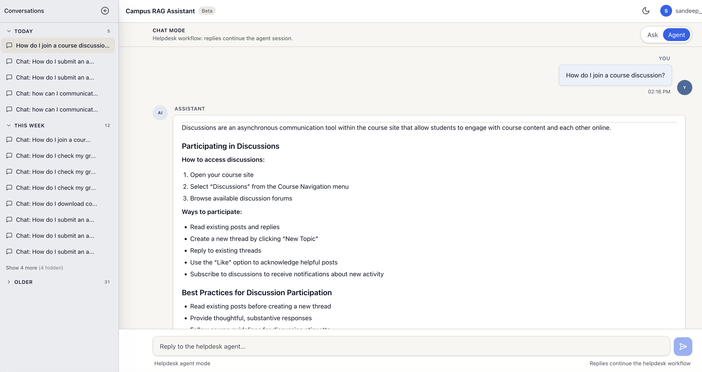

## Start here

| Goal | Start here |
|---|---|
| 90-second overview | [docs/REVIEWER_GUIDE.md](docs/REVIEWER_GUIDE.md) |
| Ownership and product judgment | [docs/PORTFOLIO_CASE_STUDY.md](docs/PORTFOLIO_CASE_STUDY.md) |
| System design | [docs/ARCHITECTURE.md](docs/ARCHITECTURE.md) + [docs/DESIGN.md](docs/DESIGN.md) |
| RAG quality | [docs/EVALUATION.md](docs/EVALUATION.md) + [docs/eval_baseline_v2.md](docs/eval_baseline_v2.md) |
| Agentic orchestration | [docs/helpdesk/index.md](docs/helpdesk/index.md) (overview) -> [docs/roadmap/CONVERSATION_FLOW.md](docs/roadmap/CONVERSATION_FLOW.md) (product spec) + [docs/roadmap/HELPDESK_AGENT.md](docs/roadmap/HELPDESK_AGENT.md) (engineering spec) + [ADR-005](docs/adr/ADR-005-bounded-helpdesk-agent.md) |
| Operations and security | [docs/operations-manual/](docs/operations-manual/index.md) |
| Release history | [docs/release-notes/](docs/release-notes/index.md) — v1.0 / v2.0 / v3.0.0 |

## Features

### Knowledge-base chat (default)

- **RAG over managed search** — AWS: Bedrock KB API → OpenSearch Serverless (vectors + keywords); Azure AI Search hybrid; grounded generation with cited sources
- **LangGraph pipeline** — `condense` → `multi_query` → `retrieve` → `rerank` → `generate` → `format` when `RAG_ENGINE=langgraph`
- **Legacy chain path** — `RAG_ENGINE=chain` (default) for true Bedrock token streaming via LangChain
- **Scoped topics** — declines off-topic questions via `SUPPORTED_TOPICS` / `tenant.rag_config`
- **Structured markdown** — summary, `##` sections, bullets, numbered steps
- **Sources panel** — KB article chips, scores, expandable excerpt (Sources / Content tabs)

### Web research (opt-in)

- **Per-message toggle** — `research_mode=web` (Vue + API); not silent open-web mode
- **Disclaimer banner** on web answers; sources labeled **WEB**
- **Providers** — mock for demos; **Tavily** when `WEB_SEARCH_PROVIDER=tavily` and `WEB_RESEARCH_ENABLED=true`

### App and platform

- **SSE streaming** — `POST /api/chat/stream` with buffered fallback to `POST /api/chat/chat`
- **Sessions** — multi-turn history; sidebar to create, switch, and delete chats
- **Feedback** — thumbs up/down on assistant messages
- **Auth** — email/password or **GitHub OAuth** (Google-ready); JWT in HTTP-only cookies; local dev uses API-port OAuth + handoff to Vue ([docs/operations-manual/operations.md — OAuth](docs/operations-manual/operations.md#oauth-and-authentication))
- **UI** — dark/light mode, mobile-friendly layout, copy answer
- **Ops** — rate limiting, `X-Request-ID`, Alembic migrations, optional Streamlit client on the same API

### Helpdesk agent (post-RAG escalation)

- **`metadata.kb_resolved`** signal — Vue surfaces escalation chips when the KB cannot answer.
- **ASK-mode actions** — one-shot `/summarize` and `/draft-ticket`; reviewed drafts are filed via `/create-issue` to a private demo GitHub repo (HITL-gated).
- **AGENT mode** — multi-turn LangGraph agent (`HELPDESK_AGENT_ENABLED`) with supervisor + clarifier/classifier/writer specialists, KB retry / web search / GitHub-search tools, SQLite checkpointer, SSE status, and four explicit outcomes (`resolved_by_agent`, `linked`, `filed`, `aborted`).
- **Privacy** — emails, JWTs, AWS keys, GitHub tokens, and bearer tokens are redacted before summarization or issue filing.
- Specs: [docs/roadmap/CONVERSATION_FLOW.md](docs/roadmap/CONVERSATION_FLOW.md), [docs/roadmap/HELPDESK_AGENT.md](docs/roadmap/HELPDESK_AGENT.md).

## Architecture

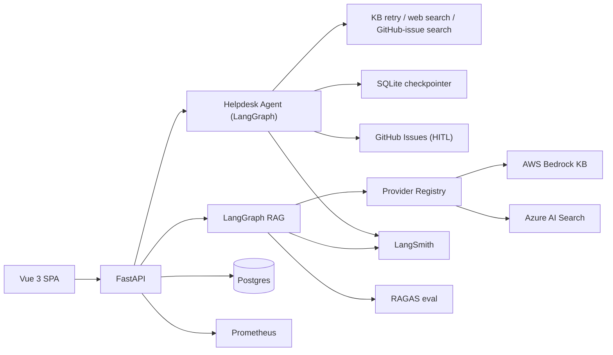

Design detail: [docs/DESIGN.md](docs/DESIGN.md) · [docs/ARCHITECTURE.md](docs/ARCHITECTURE.md)

Detailed architecture and design rationale: [docs/ARCHITECTURE.md](docs/ARCHITECTURE.md) · [docs/DESIGN.md](docs/DESIGN.md)

### Design

| Goals | Decisions |
|-------|-----------|
| Grounded answers from a **governed campus KB** (Canvas, ServiceNow, policies) | **Bedrock KB → OpenSearch Serverless** or **Azure AI Search** — app calls KB API, not OpenSearch directly |
| **Cited sources** and per-tenant prompts (`tenant.rag_config`) | **`RAG_ENGINE=chain`** for token streaming · **`langgraph`** for multi-query, rerank, explicit nodes |
| **Opt-in web research** with disclaimer — not silent fallback | Pluggable **`LLM_PROVIDER` / `RETRIEVER_PROVIDER`** (`aws` · `azure` · `mock`) |

Full goals, tradeoffs, boundaries, and ADRs: [docs/DESIGN.md](docs/DESIGN.md) · [docs/adr/](docs/adr/)

## Screenshots and traces

### Product UI

| Sign in | Chat (KB answer) |
|---------|------------------|
| 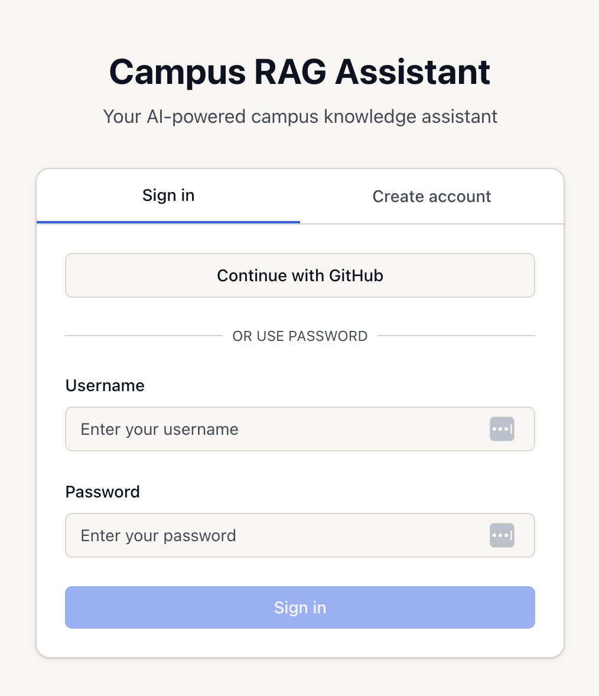 |  |

| Welcome + suggested prompts | KB sources (citations) |
|---------------------------|-------------------------|
| 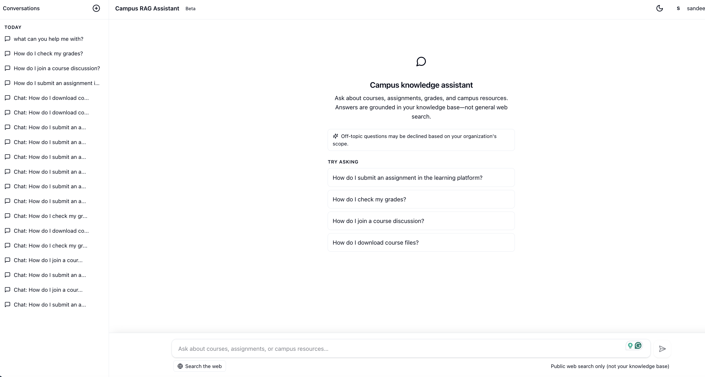 | 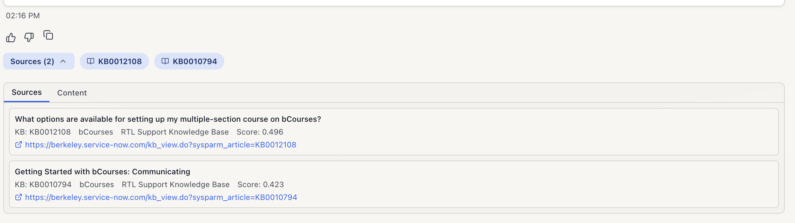 |

| Web research (opt-in) | Web sources |
|---------------------|-------------|
| 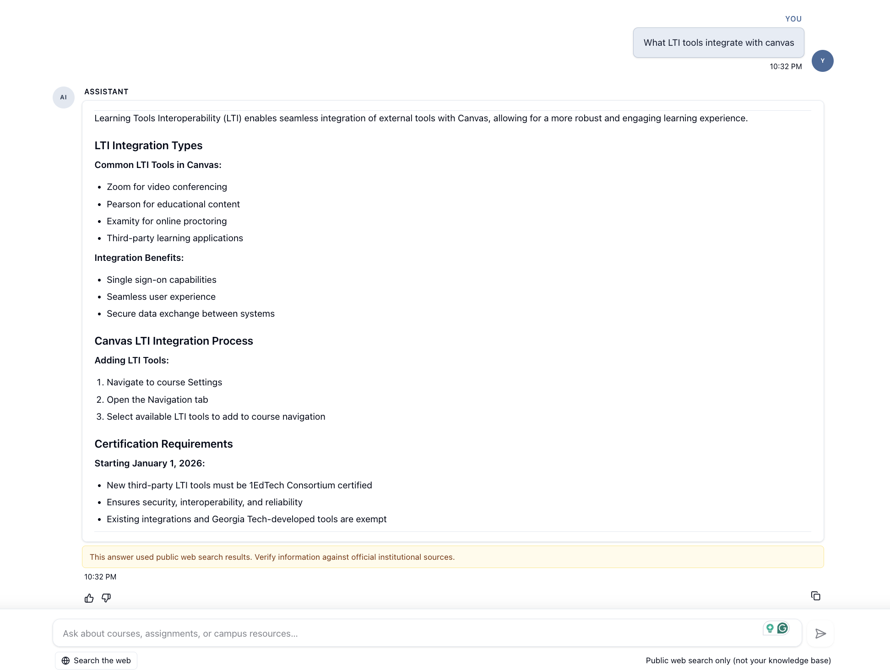 | 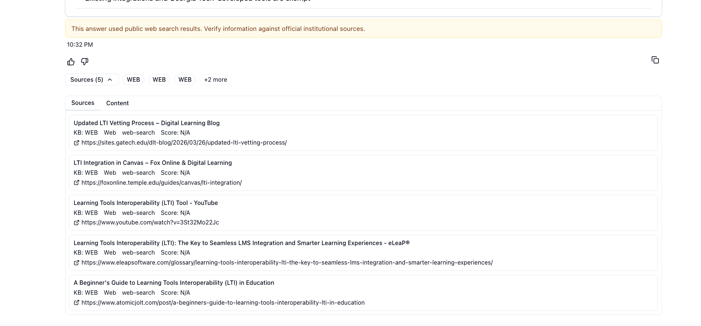 |

More assets (content tab, register): [docs/assets/README.md](docs/assets/README.md)

### Helpdesk agent (v3)

| Agent mode overview | No KB match — action chips |
|---------------------|----------------------------|
|  | 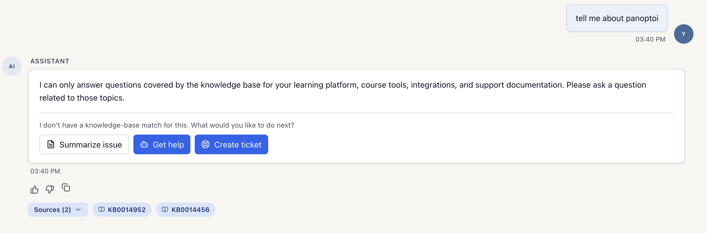 |

| HITL clarifying question | Proposed solution + outcome chips |
|--------------------------|-----------------------------------|
| 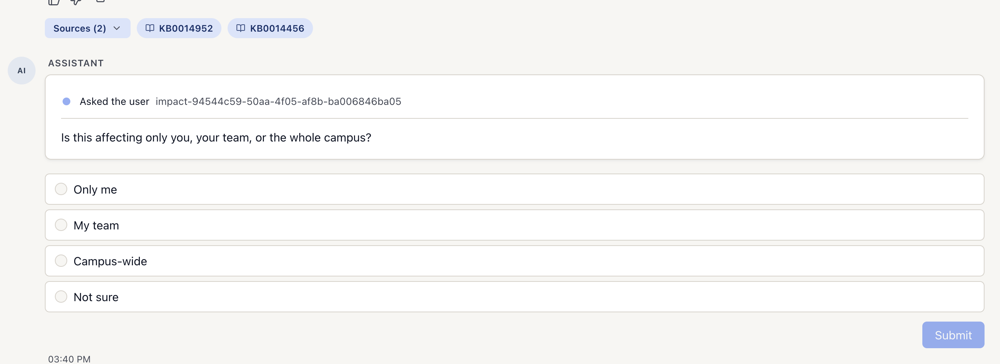 | 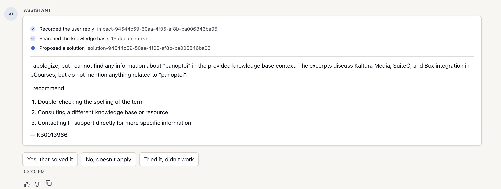 |

| Ticket review modal | GitHub Issues (filed) |
|---------------------|----------------------|
| 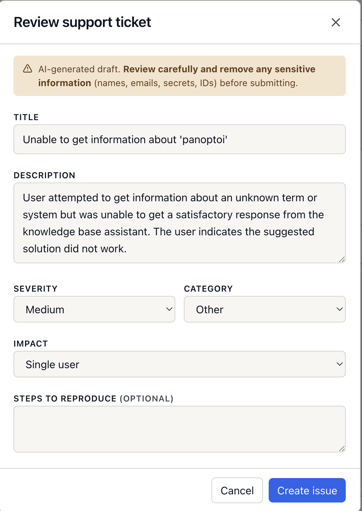 | 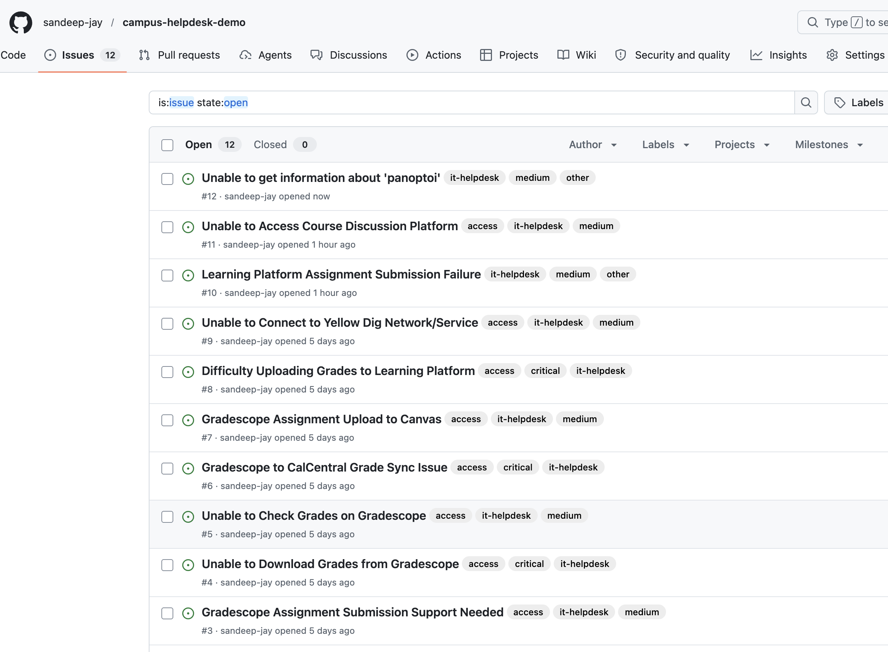 |

Agent specs: [docs/helpdesk/index.md](docs/helpdesk/index.md) · Next: [AGENTIC_HELPDESK_REBUILD.md](docs/roadmap/AGENTIC_HELPDESK_REBUILD.md)


### LangSmith traces

| KB path (LangGraph waterfall) | Web research path |
|------------------------------|-------------------|
|  |  |

Enable `LANGCHAIN_TRACING_V2`, `LANGCHAIN_API_KEY`, and `LANGCHAIN_PROJECT` in `.env`; filter runs by `chat-session-<id>`. Capture steps: [docs/EVALUATION.md](docs/EVALUATION.md#capture-a-trace-for-docs). More traces: [docs/assets/README.md](docs/assets/README.md)

## Quality baseline

The project includes a **RAGAS golden-set harness** and a documented baseline ([docs/eval_baseline_v2.md](docs/eval_baseline_v2.md)). Phase 5 retrieval tuning improved AWS **context_recall to 0.80** (passes gate). **Context precision** remains the main improvement target; next work focuses on ingestion/chunking and rerank tuning.

This is intentionally presented as an **engineering baseline**, not a marketing claim. Gates are **release controls** (`RAGAS_QUALITY_GATE=1` on milestones), not blockers for local demo or PR CI. Detail: [docs/EVALUATION.md](docs/EVALUATION.md).

## Stack

| Layer                 | Technologies                                                                                              |
| --------------------- | --------------------------------------------------------------------------------------------------------- |
| **Backend**           | FastAPI, SQLAlchemy, Alembic, JWT auth, rate limiting, Prometheus (`/api/metrics`)                        |
| **Frontend**          | Vue 3, TypeScript, Pinia, Tailwind, Vitest, Playwright (`frontend-vue/`)                                  |
| **RAG orchestration** | **LangGraph** (`RAG_ENGINE=langgraph`) or LangChain **ConversationalRetrievalChain** (`RAG_ENGINE=chain`) |
| **Retrieval**         | **Vector stores:** Bedrock KB → OpenSearch Serverless (vector/keyword/hybrid); Azure AI Search (vector + keyword/hybrid); multi-query + RRF; optional FlashRank / keyword rerank |
| **LLM**               | AWS Bedrock, Azure OpenAI, or **mock** (`LLM_PROVIDER` / `RETRIEVER_PROVIDER`)                            |
| **Web search**        | Mock or **Tavily** (`tavily-python`) behind `research_mode=web`                                           |
| **Helpdesk agent**    | LangGraph supervisor + tools, SQLite checkpointer, HITL ticket filing to a private demo GitHub repo (`HELPDESK_AGENT_ENABLED`) |
| **Eval**              | **RAGAS** harness (`backend/tests/eval/`), golden dataset, `tox -e eval`                                  |
| **Observability**     | **LangSmith** (`LANGCHAIN_TRACING_V2`), structured logs, first-token latency metric                       |
| **CI/CD**             | GitHub Actions — tox suite, gitleaks, dependency review, no tool attribution, docs build, and optional CD ([docs/operations-manual/ci-cd.md](docs/operations-manual/ci-cd.md))          |
| **Load tests**        | k6 ([docs/operations-manual/load-testing.md](docs/operations-manual/load-testing.md))                                                         |

Local demos: `RAG_FORCE_MOCK=true` with no cloud credentials. Design detail: [DESIGN.md — LangGraph KB path](docs/DESIGN.md#langgraph-kb-path-multi-query-retrieve-rerank), [DESIGN.md — Opt-in web research](docs/DESIGN.md#opt-in-web-research).

## Feature availability

| Configuration | What works |
|---------------|------------|
| **No cloud keys** (`RAG_FORCE_MOCK=true`) | Register/login, chat UX, streaming path, source panel, feedback, local tests |
| **AWS Bedrock KB** | Managed KB retrieval, Bedrock generation, LangGraph retrieval stages, LangSmith trace capture |
| **Azure OpenAI + AI Search** | Azure provider path with vector/keyword/hybrid retrieval and cited answers |
| **Web research enabled** | Per-message web mode with disclaimer UI and WEB-labeled sources (`mock` or Tavily) |
| **Helpdesk agent enabled** | ASK-mode escalation chips + multi-turn AGENT mode (`HELPDESK_ENABLED=true`, `HELPDESK_AGENT_ENABLED=true`); requires `GITHUB_TOKEN` + `GITHUB_REPO` for ticket filing |
| **OAuth configured** | GitHub OAuth handoff to Vue; Google-ready provider config |
| **Eval keys available** | RAGAS golden-set runs, release quality gates, LangSmith trace inspection |

## Prerequisites

- Python 3.11+
- Docker Desktop (local PostgreSQL runs via Docker Compose)
- Optional fallback: PostgreSQL 13+ outside Docker
- Node.js 20+ (Vue; see `frontend-vue/.nvmrc`)
- Optional: AWS (Bedrock Knowledge Base with OpenSearch-backed index) or Azure OpenAI + AI Search

## Quick start (mock RAG, no cloud)

```bash
python3 -m venv venv && source venv/bin/activate
pip install -r requirements.txt

cp .env.example .env
# RAG_FORCE_MOCK=true, LLM_PROVIDER=mock, RETRIEVER_PROVIDER=mock

docker compose --env-file /dev/null up -d db
alembic upgrade head

PIP_SYNC=0 ./scripts/run-backend-venv.sh          # terminal 1 — http://127.0.0.1:8000
cp frontend-vue/.env.example frontend-vue/.env.local
# VITE_API_URL=http://127.0.0.1:8000
# GitHub OAuth: VITE_OAUTH_API_URL=http://127.0.0.1:8000 — see docs/operations-manual/operations.md#oauth-and-authentication
./scripts/run-frontend-vue.sh          # terminal 2 — http://127.0.0.1:5173
```

Register a user and start a chat. Responses use the mock provider. The backend runner starts and health-checks the Compose `db` service by default; set `SKIP_DOCKER_DB=1` only when using an existing Homebrew/Postgres service. If another Postgres already owns port 5432, stop it before using the Compose database.

**Streamlit (optional):**

```bash
source venv/bin/activate
export API_URL=http://127.0.0.1:8000
streamlit run frontend-streamlit/app/main.py
```

## Cloud-backed RAG

Set `RAG_FORCE_MOCK=false` and configure providers in `.env` (see [docs/operations-manual/operations.md](docs/operations-manual/operations.md)).

| Variable                                      | Purpose                                                                             |
| --------------------------------------------- | ----------------------------------------------------------------------------------- |
| `RAG_ENGINE`                                  | `chain` (default, true streaming) or `langgraph` (graph + per-node LangSmith spans) |
| `LLM_PROVIDER`                                | `aws` \| `azure` \| `mock`                                                            |
| `RETRIEVER_PROVIDER`                          | `aws` \| `azure` \| `mock`                                                            |
| `BEDROCK_KNOWLEDGE_BASE_ID`                   | Bedrock KB ID (vectors usually in OpenSearch Serverless)                            |
| `RERANK_ENABLED`, `MULTI_QUERY_ENABLED`       | Phase 5 retrieval tuning — see `.env.example`                                       |
| `WEB_RESEARCH_ENABLED`, `WEB_SEARCH_PROVIDER` | Opt-in web mode (`mock` \| `tavily`)                                                 |
| Azure OpenAI / Search vars                    | Per `backend/app/config/` and `.env.example`                                        |

**Tuned eval profile (live AWS):** `./scripts/run_eval_phase5.sh` — see [docs/eval_baseline_v2.md](docs/eval_baseline_v2.md).

## Testing

**CI:** GitHub Actions on push to `main` and on PRs ([ci.yml](.github/workflows/ci.yml)). CD on `qa` / `release`: [docs/operations-manual/ci-cd.md](docs/operations-manual/ci-cd.md), [docs/operations-manual/release.md](docs/operations-manual/release.md).

**CI-style suite (local):**

```bash
tox -e lint,backend,frontend-streamlit,frontend-vue,secrets
```

**Optional suites:**

```bash
tox -e eval    # RAGAS golden-dataset eval (slow; judge LLM — docs/EVALUATION.md)
tox -e e2e     # Playwright; start API first: PIP_SYNC=0 ./scripts/run-backend-venv.sh
tox -e docs    # GitHub Pages / MkDocs strict build
```

```bash
pytest backend/tests/ -m "not slow"
pytest backend/tests/eval/ -m slow
cd frontend-vue && npm run e2e
```

Load tests: [docs/operations-manual/load-testing.md](docs/operations-manual/load-testing.md).

## Quality and observability

| Tool          | Role                                                                       |
| ------------- | -------------------------------------------------------------------------- |
| **RAGAS**     | Regression **quality metrics** on a golden dataset (`backend/tests/eval/`) |
| **LangSmith** | **Traces** per chat turn and LangGraph node (`LANGCHAIN_TRACING_V2=true`)  |

```bash
tox -e eval
RAGAS_QUALITY_GATE=1 tox -e eval   # strict gates (release / local milestone)
```

Golden set (**10** rows), thresholds, and baseline scores: [docs/EVALUATION.md](docs/EVALUATION.md) · [docs/eval_baseline_v2.md](docs/eval_baseline_v2.md). Example traces: [Overview → LangSmith traces](#langsmith-traces).

| Item                | Where                                                                    |
| ------------------- | ------------------------------------------------------------------------ |
| Request correlation | `X-Request-ID` header (echoed on responses)                              |
| Metrics             | `GET /api/metrics` (Prometheus)                                          |
| Mock vs live RAG    | `RAG_FORCE_MOCK`, `LLM_PROVIDER`, `RETRIEVER_PROVIDER` in `.env.example` |

## Case study and role alignment

Hiring-manager narrative, role-fit context, decisions, outcomes, and limits: [docs/PORTFOLIO_CASE_STUDY.md](docs/PORTFOLIO_CASE_STUDY.md)

Origin summary: extended from the public upstream [ets-berkeley-edu/chabot](https://github.com/ets-berkeley-edu/chabot) into a source-reviewable AI platform with Vue, FastAPI, multicloud providers, LangGraph RAG, agentic helpdesk orchestration, RAGAS evaluation, and production-oriented docs.

## What changed from upstream

Extended from the public upstream [ets-berkeley-edu/chabot](https://github.com/ets-berkeley-edu/chabot) into a source-reviewable AI platform:

- **Vue 3 SPA** — streaming chat, sessions, source panels, feedback, OAuth handoff
- **Provider registry** — AWS Bedrock KB, Azure AI Search/OpenAI, mock mode for CI/local
- **LangGraph RAG pipeline** — condense → multi-query → retrieve → rerank → generate → format
- **Tenant-hydrated prompts** — `tenant.rag_config` in Postgres
- **RAGAS + LangSmith** — golden-set regression evals and per-node traces
- **Production ops** — Prometheus, request IDs, rate limits, k6, Alembic, GitHub Actions CI/CD
- **Helpdesk agent** — LangGraph multi-turn agent with KB retry, web search, GitHub-issue search, HITL ticket filing, and SQLite checkpointer
- **v3 architecture + agent UI** — versioned diagrams and screenshots under `docs/assets/`; [agentic rebuild roadmap](docs/roadmap/AGENTIC_HELPDESK_REBUILD.md) for LLM-driven supervisor (current agent is deterministic — see ADR-005 target state)

## What's next

Optional follow-ups: **LangGraph-native SSE** (Phase 6a), stricter RAGAS gates after ingestion improvements, campus-scale ops. Status: [docs/roadmap/PRODUCT_ROADMAP.md](docs/roadmap/PRODUCT_ROADMAP.md). Production hardening backlog: [docs/operations-manual/production-hardening.md](docs/operations-manual/production-hardening.md).

## License

Software in this repository is licensed under the [Regents of the University of California](LICENSE) terms (educational/research use; commercial use requires an agreement with [UC OTL](http://ipira.berkeley.edu/industry-info)). See [NOTICE](NOTICE) for attribution details.

### Attribution

- **Original Chabot** — © The Regents of the University of California. Upstream: [ets-berkeley-edu/chabot](https://github.com/ets-berkeley-edu/chabot). Sole implementation author while engaged with Berkeley ETS: [sandeep-jay](https://github.com/sandeep-jay).
- **This extension** — Independently authored by [sandeep-jay](https://github.com/sandeep-jay): multicloud providers, Vue SPA, LangGraph, streaming chat, Alembic, tox/CI, RAGAS + LangSmith eval, and related extensions. Distributed under the UC Regents [LICENSE](LICENSE); see [NOTICE](NOTICE). Not an official UC product — configure corpus and branding for your own campus deployment.
