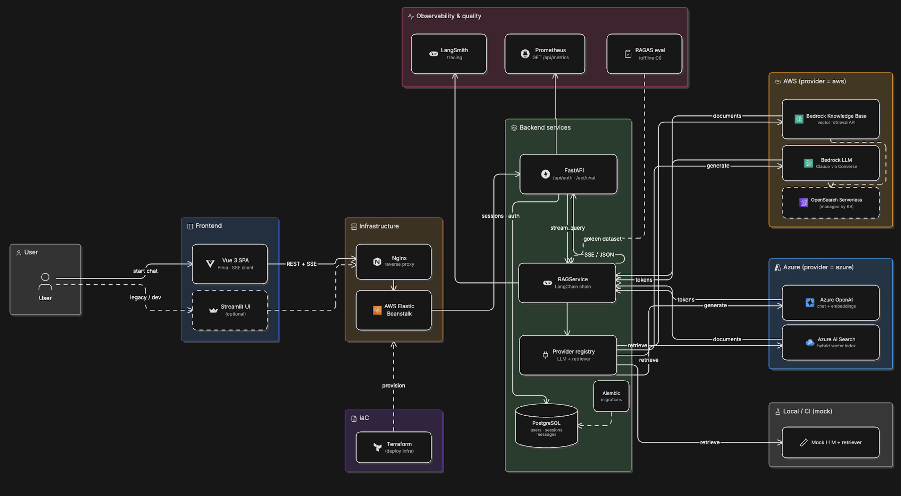
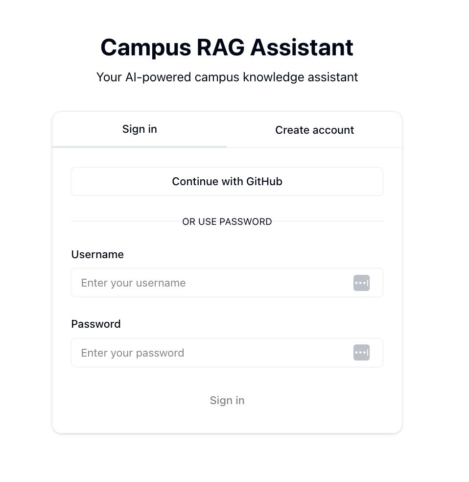
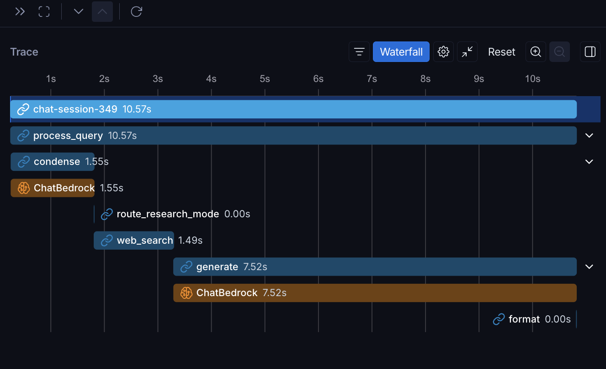

# Campus RAG Assistant

[](https://github.com/sandeep-jay/campus-rag-assistant/actions/workflows/ci.yml)

Production-style **retrieval-augmented chat** over a campus knowledge base (Canvas LMS & LTI tool guides, ServiceNow IT knowledge articles, and institutional policies—retrieved via **Bedrock Knowledge Base** (typically **OpenSearch Serverless** behind the index) or **Azure AI Search**), with **tenant-hydrated** prompts (`tenant.rag_config` in Postgres). **FastAPI** backend, **Vue 3** SPA, pluggable **AWS / Azure / mock** providers, and a **LangGraph** RAG pipeline with evaluation and observability built in.

Ask questions in natural language; the app retrieves relevant docs, streams a cited answer, and keeps conversation history per user.

System design: [Overview](#overview) · [docs/DESIGN.md](docs/DESIGN.md) · [docs/ARCHITECTURE.md](docs/ARCHITECTURE.md)

## Problem and approach

Campus staff and students spend time searching scattered documentation—Canvas LMS and LTI tools, accessibility and inclusive teaching resources, ServiceNow IT knowledge articles, and institutional policies. This application answers **in natural language** while **showing which articles were used**, so users can verify and follow links.

**Approach:** retrieve from a governed corpus first (Bedrock KB over OpenSearch on AWS, or Azure AI Search), generate a structured answer, and keep multi-turn sessions per user. Off-topic questions are declined via configurable topic scope. Open-web search is **opt-in per message**, with a visible disclaimer—not a silent fallback when retrieval is weak.

Design goals, tradeoffs, and non-goals: [docs/DESIGN.md](docs/DESIGN.md).

## Highlights

- **Full-stack** — Vue 3 + FastAPI + PostgreSQL (Alembic), JWT auth, GitHub OAuth, Prometheus metrics
- **LangGraph RAG** — `RAG_ENGINE=langgraph`: condense → multi-query → retrieve → rerank → generate (KB path); optional web branch
- **Retrieval quality** — vector + keyword/hybrid indexes (OpenSearch Serverless, Azure AI Search); multi-query fusion (RRF), metadata filters, FlashRank / keyword rerank
- **Opt-in web research** — per-message `research_mode=web`, disclaimer UI, optional Tavily
- **Eval discipline** — RAGAS golden set (10 rows), baseline scores, optional CI gates; LangSmith per-node traces
- **Local and CI friendly** — mock providers run without cloud credentials; live AWS/Azure via `.env`; demo script in [docs/assets/](docs/assets/README.md)

## Overview

Architecture, design rationale, product UI, and observability traces.

### Architecture

| Overview | Detailed (v2) |
|----------|----------------|
|  |  |

Upstream v1 comparison and request flows: [docs/ARCHITECTURE.md](docs/ARCHITECTURE.md)

### Design

| Goals | Decisions |
|-------|-----------|
| Grounded answers from a **governed campus KB** (Canvas, ServiceNow, policies) | **Bedrock KB → OpenSearch Serverless** or **Azure AI Search** — app calls KB API, not OpenSearch directly |
| **Cited sources** and per-tenant prompts (`tenant.rag_config`) | **`RAG_ENGINE=chain`** for token streaming · **`langgraph`** for multi-query, rerank, explicit nodes |
| **Opt-in web research** with disclaimer — not silent fallback | Pluggable **`LLM_PROVIDER` / `RETRIEVER_PROVIDER`** (`aws` · `azure` · `mock`) |

Full goals, tradeoffs, boundaries, and eval approach: [docs/DESIGN.md](docs/DESIGN.md)

### Screenshots

| Sign in | Chat (KB answer) |
|---------|------------------|
|  |  |

| Welcome + suggested prompts | KB sources (citations) |
|---------------------------|-------------------------|
|  |  |

| Web research (opt-in) | Web sources |
|---------------------|-------------|
|  |  |

More assets (content tab, register): [docs/assets/README.md](docs/assets/README.md)

**Demo script (~2–3 min):** [docs/assets/README.md#product-demo-script-23-min](docs/assets/README.md#product-demo-script-23-min)

### LangSmith traces

| KB path (LangGraph waterfall) | Web research path |
|------------------------------|-------------------|
|  |  |

Enable `LANGCHAIN_TRACING_V2`, `LANGCHAIN_API_KEY`, and `LANGCHAIN_PROJECT` in `.env`; filter runs by `chat-session-<id>`. Capture steps: [docs/EVALUATION.md](docs/EVALUATION.md#capture-a-trace-for-docs). More traces: [docs/assets/README.md](docs/assets/README.md)

## Features

### Knowledge-base chat (default)

- **RAG over managed search** — AWS: Bedrock KB API → OpenSearch Serverless (vectors + keywords); Azure AI Search hybrid; grounded generation with cited sources
- **LangGraph pipeline** — `condense` → `multi_query` → `retrieve` → `rerank` → `generate` → `format` when `RAG_ENGINE=langgraph`
- **Legacy chain path** — `RAG_ENGINE=chain` (default) for true Bedrock token streaming via LangChain
- **Scoped topics** — declines off-topic questions via `SUPPORTED_TOPICS` / `tenant.rag_config`
- **Structured markdown** — summary, `##` sections, bullets, numbered steps
- **Sources panel** — KB article chips, scores, expandable excerpt (Sources / Content tabs)

### Web research (opt-in)

- **Per-message toggle** — `research_mode=web` (Vue + API); not silent open-web mode
- **Disclaimer banner** on web answers; sources labeled **WEB**
- **Providers** — mock for demos; **Tavily** when `WEB_SEARCH_PROVIDER=tavily` and `WEB_RESEARCH_ENABLED=true`

### App and platform

- **SSE streaming** — `POST /api/chat/stream` with buffered fallback to `POST /api/chat/chat`
- **Sessions** — multi-turn history; sidebar to create, switch, and delete chats
- **Feedback** — thumbs up/down on assistant messages
- **Auth** — email/password or **GitHub OAuth** (Google-ready); JWT in HTTP-only cookies; local dev uses API-port OAuth + handoff to Vue ([docs/PRODUCTION_TLS.md](docs/PRODUCTION_TLS.md))
- **UI** — dark/light mode, mobile-friendly layout, copy answer
- **Ops** — rate limiting, `X-Request-ID`, Alembic migrations, optional Streamlit client on the same API

## Stack


| Layer                 | Technologies                                                                                              |
| --------------------- | --------------------------------------------------------------------------------------------------------- |
| **Backend**           | FastAPI, SQLAlchemy, Alembic, JWT auth, rate limiting, Prometheus (`/api/metrics`)                        |
| **Frontend**          | Vue 3, TypeScript, Pinia, Tailwind, Vitest, Playwright (`frontend-vue/`)                                  |
| **RAG orchestration** | **LangGraph** (`RAG_ENGINE=langgraph`) or LangChain **ConversationalRetrievalChain** (`RAG_ENGINE=chain`) |
| **Retrieval**         | **Vector stores:** Bedrock KB → OpenSearch Serverless (vector/keyword/hybrid); Azure AI Search (vector + keyword/hybrid); multi-query + RRF; optional FlashRank / keyword rerank |
| **LLM**               | AWS Bedrock, Azure OpenAI, or **mock** (`LLM_PROVIDER` / `RETRIEVER_PROVIDER`)                            |
| **Web search**        | Mock or **Tavily** (`tavily-python`) behind `research_mode=web`                                           |
| **Eval**              | **RAGAS** harness (`backend/tests/eval/`), golden dataset, `tox -e eval`                                  |
| **Observability**     | **LangSmith** (`LANGCHAIN_TRACING_V2`), structured logs, first-token latency metric                       |
| **CI/CD**             | GitHub Actions — `tox -e lint,backend,frontend-vue` on PRs and `main` ([docs/CI.md](docs/CI.md))          |
| **Load tests**        | k6 ([docs/LOAD_TESTING.md](docs/LOAD_TESTING.md))                                                         |


Local demos: `RAG_FORCE_MOCK=true` with no cloud credentials. Design detail: [docs/roadmap/LANGGRAPH.md](docs/roadmap/LANGGRAPH.md), [docs/roadmap/WEB_RESEARCH.md](docs/roadmap/WEB_RESEARCH.md).

## Prerequisites

- Python 3.11+
- PostgreSQL 13+
- Node.js 20+ (Vue; see `frontend-vue/.nvmrc`)
- Optional: AWS (Bedrock Knowledge Base with OpenSearch-backed index) or Azure OpenAI + AI Search

## Quick start (mock RAG, no cloud)

```bash
python3 -m venv venv && source venv/bin/activate
pip install -r requirements.txt

cp .env.example .env
# RAG_FORCE_MOCK=true, LLM_PROVIDER=mock, RETRIEVER_PROVIDER=mock

createdb chatbot_dev   # or name from POSTGRES_DB in .env
alembic upgrade head

./scripts/run-backend-venv.sh          # terminal 1 — http://127.0.0.1:8000
cp frontend-vue/.env.example frontend-vue/.env.local
# VITE_API_URL=http://127.0.0.1:8000
# GitHub OAuth: VITE_OAUTH_API_URL=http://127.0.0.1:8000 — see docs/PRODUCTION_TLS.md
./scripts/run-frontend-vue.sh          # terminal 2 — http://127.0.0.1:5173
```

Register a user and start a chat. Responses use the mock provider.

**Streamlit (optional):**

```bash
source venv/bin/activate
export API_URL=http://127.0.0.1:8000
streamlit run frontend-streamlit/app/main.py
```

## Cloud-backed RAG

Set `RAG_FORCE_MOCK=false` and configure providers in `.env` (see [docs/OPERATIONS.md](docs/OPERATIONS.md)).


| Variable                                      | Purpose                                                                             |
| --------------------------------------------- | ----------------------------------------------------------------------------------- |
| `RAG_ENGINE`                                  | `chain` (default, true streaming) or `langgraph` (graph + per-node LangSmith spans) |
| `LLM_PROVIDER`                                | `aws` | `azure` | `mock`                                                            |
| `RETRIEVER_PROVIDER`                          | `aws` | `azure` | `mock`                                                            |
| `BEDROCK_KNOWLEDGE_BASE_ID`                   | Bedrock KB ID (vectors usually in OpenSearch Serverless)                            |
| `RERANK_ENABLED`, `MULTI_QUERY_ENABLED`       | Phase 5 retrieval tuning — see `.env.example`                                       |
| `WEB_RESEARCH_ENABLED`, `WEB_SEARCH_PROVIDER` | Opt-in web mode (`mock` | `tavily`)                                                 |
| Azure OpenAI / Search vars                    | Per `backend/app/config/` and `.env.example`                                        |


**Tuned eval profile (live AWS):** `./scripts/run_eval_phase5.sh` — see [docs/eval_baseline_2026-05-19.md](docs/eval_baseline_2026-05-19.md).

## Testing

**CI:** GitHub Actions on push to `main` and on PRs (`[ci.yml](.github/workflows/ci.yml)`). CD on `qa` / `release`: [docs/CI.md](docs/CI.md), [docs/RELEASE.md](docs/RELEASE.md).

**CI-style suite (local):**

```bash
tox -e lint,backend,frontend-vue
```

**Optional suites:**

```bash
tox -e eval    # RAGAS golden-dataset eval (slow; judge LLM — docs/EVALUATION.md)
tox -e e2e     # Playwright; start API first: ./scripts/run-backend-venv.sh
tox -e lint,backend,frontend-streamlit,frontend-vue   # include Streamlit client
```

```bash
pytest backend/tests/ -m "not slow"
pytest backend/tests/eval/ -m slow
cd frontend-vue && npm run e2e
```

Load tests: [docs/LOAD_TESTING.md](docs/LOAD_TESTING.md).

## Quality and observability

### Measured quality (RAGAS)

Regression testing uses a **10-question golden set** and RAGAS metrics ([docs/EVALUATION.md](docs/EVALUATION.md)). The [2026-05-19 baseline](docs/eval_baseline_2026-05-19.md) records live AWS scores under the tuned retrieval profile: **context_recall** meets the gate; faithfulness, answer relevancy, and context precision are documented below target—honest baselines for further ingestion and tuning work, not blockers for local demo.

Two complementary tools — see [docs/EVALUATION.md](docs/EVALUATION.md).


| Tool          | Role                                                                       |
| ------------- | -------------------------------------------------------------------------- |
| **RAGAS**     | Regression **quality metrics** on a golden dataset (`backend/tests/eval/`) |
| **LangSmith** | **Traces** per chat turn and LangGraph node (`LANGCHAIN_TRACING_V2=true`)  |


### RAGAS

```bash
tox -e eval
RAGAS_QUALITY_GATE=1 tox -e eval   # strict gates (release / local milestone)
```

Golden set (**10** rows), thresholds, bootstrap, and baseline scores: [docs/EVALUATION.md](docs/EVALUATION.md) and [docs/eval_baseline_2026-05-19.md](docs/eval_baseline_2026-05-19.md).

### LangSmith

Enable `LANGCHAIN_TRACING_V2`, `LANGCHAIN_API_KEY`, and `LANGCHAIN_PROJECT` in `.env`; filter runs by `chat-session-<id>`. Per-node spans with `RAG_ENGINE=langgraph`. Example traces: [Overview → LangSmith traces](#langsmith-traces). Capture steps: [EVALUATION.md — LangSmith](docs/EVALUATION.md#capture-a-trace-for-docs).

### Ops quick reference


| Item                | Where                                                                    |
| ------------------- | ------------------------------------------------------------------------ |
| Request correlation | `X-Request-ID` header (echoed on responses)                              |
| Metrics             | `GET /api/metrics` (Prometheus)                                          |
| Mock vs live RAG    | `RAG_FORCE_MOCK`, `LLM_PROVIDER`, `RETRIEVER_PROVIDER` in `.env.example` |


## What's next

Optional follow-ups: **LangGraph-native SSE** (Phase 6a), stricter RAGAS gates after ingestion improvements, campus-scale ops (Redis HA, EB). Status: [docs/roadmap/PRODUCT_ROADMAP.md](docs/roadmap/PRODUCT_ROADMAP.md).

## Documentation


| Doc                                                                  | Description                                   |
| -------------------------------------------------------------------- | --------------------------------------------- |
| [docs/README.md](docs/README.md)                                     | Documentation index                           |
| [docs/DESIGN.md](docs/DESIGN.md)                                     | Design goals, major decisions, capability map |
| [docs/ARCHITECTURE.md](docs/ARCHITECTURE.md)                         | System design, chat/SSE flow, API surface     |
| [docs/assets/README.md](docs/assets/README.md)                       | Screenshots catalog + demo script             |
| [docs/EVALUATION.md](docs/EVALUATION.md)                             | RAGAS vs LangSmith, bootstrap, CI gates       |
| [docs/eval_baseline_2026-05-19.md](docs/eval_baseline_2026-05-19.md) | RAGAS baseline scores                         |
| [docs/roadmap/PRODUCT_ROADMAP.md](docs/roadmap/PRODUCT_ROADMAP.md)   | Product phases — shipped vs optional          |
| [docs/CI.md](docs/CI.md)                                             | GitHub Actions, branch gates                  |
| [docs/PRODUCTION_TLS.md](docs/PRODUCTION_TLS.md)                     | HTTPS, OAuth (API-port + handoff)             |
| [docs/OPERATIONS.md](docs/OPERATIONS.md)                             | Runbooks, metrics, migrations                 |
| [changelog/CHANGELOG.md](changelog/CHANGELOG.md)                     | Release history                               |


## License

Software in this repository is licensed under the [Regents of the University of California](LICENSE) terms (educational/research use; commercial use requires an agreement with [UC OTL](http://ipira.berkeley.edu/industry-info)).

### Attribution

- **Original Chabot** — © The Regents of the University of California. Upstream: [ets-berkeley-edu/chabot](https://github.com/ets-berkeley-edu/chabot).
- **Author & maintainer** — [sandeep-jay](https://github.com/sandeep-jay) developed from the upstream [chabot](https://github.com/ets-berkeley-edu/chabot) campus chatbot and authored this **independent fork** (multicloud providers, Vue SPA, LangGraph, streaming chat, Alembic, tox/CI, RAGAS + LangSmith eval, and related extensions). This repo is **not** an official product of any single institution—configure corpus and branding for your own campus deployment.

