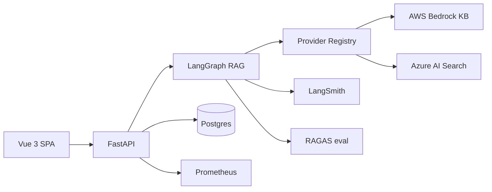

# Campus RAG Assistant

[](https://github.com/sandeep-jay/campus-rag-assistant/actions/workflows/ci.yml)

**Production-style enterprise RAG platform** for governed campus knowledge.

This project extends an institutional chatbot into a multicloud AI platform: **AWS Bedrock KB**, **Azure AI Search**, **LangGraph** orchestration, cited answers, tenant-aware prompts, **RAGAS** evals, **LangSmith** traces, CI/CD, load testing, and a **Vue 3** product UI.

**Portfolio focus:** Lead AI Engineering and AI Platform Architecture.


## Why this project matters

- Turns scattered institutional docs (Canvas LMS, ServiceNow, policies) into **cited, natural-language answers** users can verify.
- Shows **production RAG** concerns: retrieval quality, observability, auth, streaming, evals, and deployment—not a weekend chatbot.
- Demonstrates **platform architecture**: AWS/Azure/mock providers, tenant config, feature flags, and CI-safe local mode.

## Role alignment

This project is designed to demonstrate strengths relevant to:

- Lead AI Engineer
- Lead Data & AI Platform Architect
- Senior / Staff Applied AI Engineer
- GenAI Platform Engineer

## Portfolio highlights

| Signal | Evidence |
|--------|----------|
| **Product thinking** | Governed KB-first chat, cited sources, opt-in web research, feedback loop |
| **AI engineering** | LangGraph RAG pipeline, multi-query retrieval, rerank, RAGAS evals |
| **Platform architecture** | AWS/Azure/mock provider registry, tenant config, feature flags |
| **Production discipline** | CI/CD, Alembic, Prometheus metrics, k6 load tests, security docs |
| **UX delivery** | Vue 3 SPA, sessions, streaming answers, source panel, OAuth |

## System at a glance



Design detail: [docs/DESIGN.md](docs/DESIGN.md) · [docs/ARCHITECTURE.md](docs/ARCHITECTURE.md)

## What changed from upstream

Extended from upstream [ets-berkeley-edu/chabot](https://github.com/ets-berkeley-edu/chabot) into a portfolio-grade AI platform:

- **Vue 3 SPA** — streaming chat, sessions, source panels, feedback, OAuth handoff
- **Provider registry** — AWS Bedrock KB, Azure AI Search/OpenAI, mock mode for CI/local
- **LangGraph RAG pipeline** — condense → multi-query → retrieve → rerank → generate → format
- **Tenant-hydrated prompts** — `tenant.rag_config` in Postgres
- **RAGAS + LangSmith** — golden-set regression evals and per-node traces
- **Production ops** — Prometheus, request IDs, rate limits, k6, Alembic, GitHub Actions CI/CD

## Quality baseline

The project includes a **RAGAS golden-set harness** and a documented baseline ([docs/eval_baseline_2026-05-19.md](docs/eval_baseline_2026-05-19.md)). Phase 5 retrieval tuning improved AWS **context_recall to 0.80** (passes gate). **Context precision** remains the main improvement target; next work focuses on ingestion/chunking and rerank tuning.

This is intentionally presented as an **engineering baseline**, not a marketing claim. Gates are **release controls** (`RAGAS_QUALITY_GATE=1` on milestones), not blockers for local demo or PR CI. Detail: [docs/EVALUATION.md](docs/EVALUATION.md).

## Demo (~2–3 min)

Walkthrough script: [docs/assets/README.md#product-demo-script-23-min](docs/assets/README.md#product-demo-script-23-min)

## Portfolio case study

Hiring-manager narrative (problem, architecture, decisions, outcomes, limits): [docs/PORTFOLIO_CASE_STUDY.md](docs/PORTFOLIO_CASE_STUDY.md)

---

## Overview

Architecture, design rationale, product UI, and observability traces.

### Architecture

| Overview | Detailed (v2) |
|----------|----------------|
|  |  |

Upstream v1 comparison and request flows: [docs/ARCHITECTURE.md](docs/ARCHITECTURE.md)

### Design

| Goals | Decisions |
|-------|-----------|
| Grounded answers from a **governed campus KB** (Canvas, ServiceNow, policies) | **Bedrock KB → OpenSearch Serverless** or **Azure AI Search** — app calls KB API, not OpenSearch directly |
| **Cited sources** and per-tenant prompts (`tenant.rag_config`) | **`RAG_ENGINE=chain`** for token streaming · **`langgraph`** for multi-query, rerank, explicit nodes |
| **Opt-in web research** with disclaimer — not silent fallback | Pluggable **`LLM_PROVIDER` / `RETRIEVER_PROVIDER`** (`aws` · `azure` · `mock`) |

Full goals, tradeoffs, boundaries, and ADRs: [docs/DESIGN.md](docs/DESIGN.md) · [docs/adr/](docs/adr/)

### Screenshots

| Sign in | Chat (KB answer) |
|---------|------------------|
|  |  |

| Welcome + suggested prompts | KB sources (citations) |
|---------------------------|-------------------------|
|  |  |

| Web research (opt-in) | Web sources |
|---------------------|-------------|
|  |  |

More assets (content tab, register): [docs/assets/README.md](docs/assets/README.md)

### LangSmith traces

| KB path (LangGraph waterfall) | Web research path |
|------------------------------|-------------------|
|  |  |

Enable `LANGCHAIN_TRACING_V2`, `LANGCHAIN_API_KEY`, and `LANGCHAIN_PROJECT` in `.env`; filter runs by `chat-session-<id>`. Capture steps: [docs/EVALUATION.md](docs/EVALUATION.md#capture-a-trace-for-docs). More traces: [docs/assets/README.md](docs/assets/README.md)

## Features

### Knowledge-base chat (default)

- **RAG over managed search** — AWS: Bedrock KB API → OpenSearch Serverless (vectors + keywords); Azure AI Search hybrid; grounded generation with cited sources
- **LangGraph pipeline** — `condense` → `multi_query` → `retrieve` → `rerank` → `generate` → `format` when `RAG_ENGINE=langgraph`
- **Legacy chain path** — `RAG_ENGINE=chain` (default) for true Bedrock token streaming via LangChain
- **Scoped topics** — declines off-topic questions via `SUPPORTED_TOPICS` / `tenant.rag_config`
- **Structured markdown** — summary, `##` sections, bullets, numbered steps
- **Sources panel** — KB article chips, scores, expandable excerpt (Sources / Content tabs)

### Web research (opt-in)

- **Per-message toggle** — `research_mode=web` (Vue + API); not silent open-web mode
- **Disclaimer banner** on web answers; sources labeled **WEB**
- **Providers** — mock for demos; **Tavily** when `WEB_SEARCH_PROVIDER=tavily` and `WEB_RESEARCH_ENABLED=true`

### App and platform

- **SSE streaming** — `POST /api/chat/stream` with buffered fallback to `POST /api/chat/chat`
- **Sessions** — multi-turn history; sidebar to create, switch, and delete chats
- **Feedback** — thumbs up/down on assistant messages
- **Auth** — email/password or **GitHub OAuth** (Google-ready); JWT in HTTP-only cookies; local dev uses API-port OAuth + handoff to Vue ([docs/PRODUCTION_TLS.md](docs/PRODUCTION_TLS.md))
- **UI** — dark/light mode, mobile-friendly layout, copy answer
- **Ops** — rate limiting, `X-Request-ID`, Alembic migrations, optional Streamlit client on the same API

## Stack

| Layer                 | Technologies                                                                                              |
| --------------------- | --------------------------------------------------------------------------------------------------------- |
| **Backend**           | FastAPI, SQLAlchemy, Alembic, JWT auth, rate limiting, Prometheus (`/api/metrics`)                        |
| **Frontend**          | Vue 3, TypeScript, Pinia, Tailwind, Vitest, Playwright (`frontend-vue/`)                                  |
| **RAG orchestration** | **LangGraph** (`RAG_ENGINE=langgraph`) or LangChain **ConversationalRetrievalChain** (`RAG_ENGINE=chain`) |
| **Retrieval**         | **Vector stores:** Bedrock KB → OpenSearch Serverless (vector/keyword/hybrid); Azure AI Search (vector + keyword/hybrid); multi-query + RRF; optional FlashRank / keyword rerank |
| **LLM**               | AWS Bedrock, Azure OpenAI, or **mock** (`LLM_PROVIDER` / `RETRIEVER_PROVIDER`)                            |
| **Web search**        | Mock or **Tavily** (`tavily-python`) behind `research_mode=web`                                           |
| **Eval**              | **RAGAS** harness (`backend/tests/eval/`), golden dataset, `tox -e eval`                                  |
| **Observability**     | **LangSmith** (`LANGCHAIN_TRACING_V2`), structured logs, first-token latency metric                       |
| **CI/CD**             | GitHub Actions — `tox -e lint,backend,frontend-vue` on PRs and `main` ([docs/CI.md](docs/CI.md))          |
| **Load tests**        | k6 ([docs/LOAD_TESTING.md](docs/LOAD_TESTING.md))                                                         |

Local demos: `RAG_FORCE_MOCK=true` with no cloud credentials. Design detail: [docs/roadmap/LANGGRAPH.md](docs/roadmap/LANGGRAPH.md), [docs/roadmap/WEB_RESEARCH.md](docs/roadmap/WEB_RESEARCH.md).

## Prerequisites

- Python 3.11+
- PostgreSQL 13+
- Node.js 20+ (Vue; see `frontend-vue/.nvmrc`)
- Optional: AWS (Bedrock Knowledge Base with OpenSearch-backed index) or Azure OpenAI + AI Search

## Quick start (mock RAG, no cloud)

```bash
python3 -m venv venv && source venv/bin/activate
pip install -r requirements.txt

cp .env.example .env
# RAG_FORCE_MOCK=true, LLM_PROVIDER=mock, RETRIEVER_PROVIDER=mock

createdb chatbot_dev   # or name from POSTGRES_DB in .env
alembic upgrade head

./scripts/run-backend-venv.sh          # terminal 1 — http://127.0.0.1:8000
cp frontend-vue/.env.example frontend-vue/.env.local
# VITE_API_URL=http://127.0.0.1:8000
# GitHub OAuth: VITE_OAUTH_API_URL=http://127.0.0.1:8000 — see docs/PRODUCTION_TLS.md
./scripts/run-frontend-vue.sh          # terminal 2 — http://127.0.0.1:5173
```

Register a user and start a chat. Responses use the mock provider.

**Streamlit (optional):**

```bash
source venv/bin/activate
export API_URL=http://127.0.0.1:8000
streamlit run frontend-streamlit/app/main.py
```

## Cloud-backed RAG

Set `RAG_FORCE_MOCK=false` and configure providers in `.env` (see [docs/OPERATIONS.md](docs/OPERATIONS.md)).

| Variable                                      | Purpose                                                                             |
| --------------------------------------------- | ----------------------------------------------------------------------------------- |
| `RAG_ENGINE`                                  | `chain` (default, true streaming) or `langgraph` (graph + per-node LangSmith spans) |
| `LLM_PROVIDER`                                | `aws` \| `azure` \| `mock`                                                            |
| `RETRIEVER_PROVIDER`                          | `aws` \| `azure` \| `mock`                                                            |
| `BEDROCK_KNOWLEDGE_BASE_ID`                   | Bedrock KB ID (vectors usually in OpenSearch Serverless)                            |
| `RERANK_ENABLED`, `MULTI_QUERY_ENABLED`       | Phase 5 retrieval tuning — see `.env.example`                                       |
| `WEB_RESEARCH_ENABLED`, `WEB_SEARCH_PROVIDER` | Opt-in web mode (`mock` \| `tavily`)                                                 |
| Azure OpenAI / Search vars                    | Per `backend/app/config/` and `.env.example`                                        |

**Tuned eval profile (live AWS):** `./scripts/run_eval_phase5.sh` — see [docs/eval_baseline_2026-05-19.md](docs/eval_baseline_2026-05-19.md).

## Testing

**CI:** GitHub Actions on push to `main` and on PRs ([ci.yml](.github/workflows/ci.yml)). CD on `qa` / `release`: [docs/CI.md](docs/CI.md), [docs/RELEASE.md](docs/RELEASE.md).

**CI-style suite (local):**

```bash
tox -e lint,backend,frontend-vue
```

**Optional suites:**

```bash
tox -e eval    # RAGAS golden-dataset eval (slow; judge LLM — docs/EVALUATION.md)
tox -e e2e     # Playwright; start API first: ./scripts/run-backend-venv.sh
tox -e lint,backend,frontend-streamlit,frontend-vue   # include Streamlit client
```

```bash
pytest backend/tests/ -m "not slow"
pytest backend/tests/eval/ -m slow
cd frontend-vue && npm run e2e
```

Load tests: [docs/LOAD_TESTING.md](docs/LOAD_TESTING.md).

## Quality and observability

| Tool          | Role                                                                       |
| ------------- | -------------------------------------------------------------------------- |
| **RAGAS**     | Regression **quality metrics** on a golden dataset (`backend/tests/eval/`) |
| **LangSmith** | **Traces** per chat turn and LangGraph node (`LANGCHAIN_TRACING_V2=true`)  |

```bash
tox -e eval
RAGAS_QUALITY_GATE=1 tox -e eval   # strict gates (release / local milestone)
```

Golden set (**10** rows), thresholds, and baseline scores: [docs/EVALUATION.md](docs/EVALUATION.md) · [docs/eval_baseline_2026-05-19.md](docs/eval_baseline_2026-05-19.md). Example traces: [Overview → LangSmith traces](#langsmith-traces).

| Item                | Where                                                                    |
| ------------------- | ------------------------------------------------------------------------ |
| Request correlation | `X-Request-ID` header (echoed on responses)                              |
| Metrics             | `GET /api/metrics` (Prometheus)                                          |
| Mock vs live RAG    | `RAG_FORCE_MOCK`, `LLM_PROVIDER`, `RETRIEVER_PROVIDER` in `.env.example` |

## What's next

Optional follow-ups: **LangGraph-native SSE** (Phase 6a), stricter RAGAS gates after ingestion improvements, campus-scale ops. Status: [docs/roadmap/PRODUCT_ROADMAP.md](docs/roadmap/PRODUCT_ROADMAP.md). Production hardening backlog: [docs/PRODUCTION_HARDENING.md](docs/PRODUCTION_HARDENING.md).

## Documentation

| Doc                                                                  | Description                                   |
| -------------------------------------------------------------------- | --------------------------------------------- |
| [docs/PORTFOLIO_CASE_STUDY.md](docs/PORTFOLIO_CASE_STUDY.md)         | Portfolio narrative for hiring reviewers      |
| [docs/README.md](docs/README.md)                                     | Documentation index                           |
| [docs/DESIGN.md](docs/DESIGN.md)                                     | Design goals, major decisions, capability map |
| [docs/ARCHITECTURE.md](docs/ARCHITECTURE.md)                         | System design, chat/SSE flow, API surface     |
| [docs/adr/](docs/adr/)                                               | Architecture decision records                 |
| [docs/PRODUCTION_HARDENING.md](docs/PRODUCTION_HARDENING.md)         | Scale and ops backlog                         |
| [docs/assets/README.md](docs/assets/README.md)                       | Screenshots catalog + demo script             |
| [docs/EVALUATION.md](docs/EVALUATION.md)                             | RAGAS vs LangSmith, bootstrap, CI gates       |
| [docs/eval_baseline_2026-05-19.md](docs/eval_baseline_2026-05-19.md) | RAGAS baseline scores                         |
| [docs/roadmap/PRODUCT_ROADMAP.md](docs/roadmap/PRODUCT_ROADMAP.md)   | Product phases — shipped vs optional          |
| [docs/CI.md](docs/CI.md)                                             | GitHub Actions, branch gates                  |
| [docs/PRODUCTION_TLS.md](docs/PRODUCTION_TLS.md)                     | HTTPS, OAuth (API-port + handoff)             |
| [docs/OPERATIONS.md](docs/OPERATIONS.md)                             | Runbooks, metrics, migrations                 |
| [changelog/CHANGELOG.md](changelog/CHANGELOG.md)                     | Release history                               |

## License

Software in this repository is licensed under the [Regents of the University of California](LICENSE) terms (educational/research use; commercial use requires an agreement with [UC OTL](http://ipira.berkeley.edu/industry-info)).

### Attribution

- **Original Chabot** — © The Regents of the University of California. Upstream: [ets-berkeley-edu/chabot](https://github.com/ets-berkeley-edu/chabot).
- **Author & maintainer** — [sandeep-jay](https://github.com/sandeep-jay) developed from the upstream [chabot](https://github.com/ets-berkeley-edu/chabot) campus chatbot and authored this **independent fork** (multicloud providers, Vue SPA, LangGraph, streaming chat, Alembic, tox/CI, RAGAS + LangSmith eval, and related extensions). This repo is **not** an official product of any single institution—configure corpus and branding for your own campus deployment.
