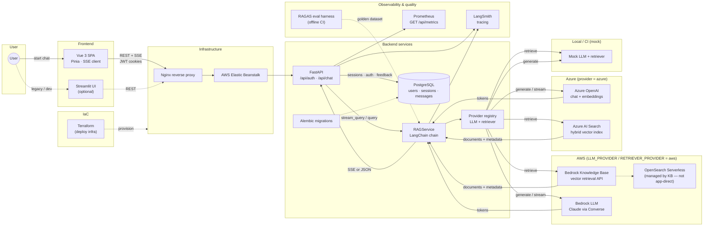
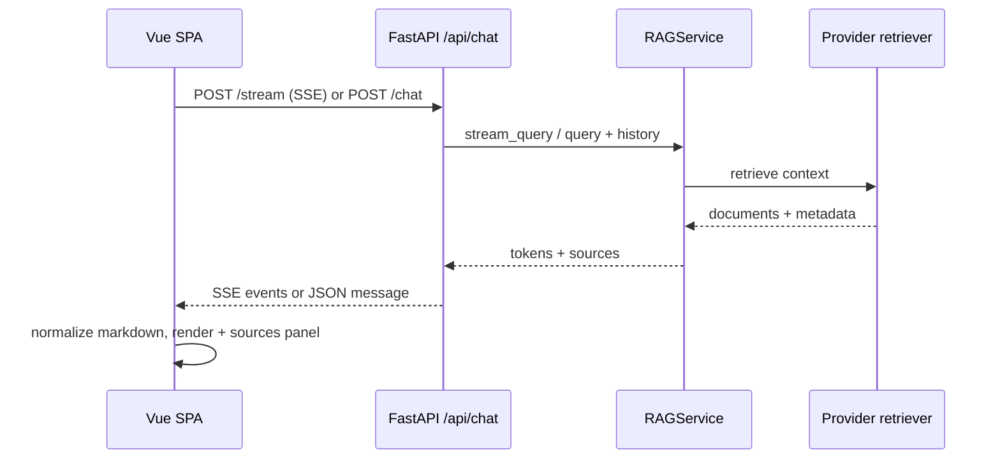

# Architecture

**Campus RAG Assistant** is a retrieval-augmented chat product: a **FastAPI** backend, a **Vue 3** SPA (`frontend-vue/`), and an optional **Streamlit** client on the same REST API.

Evolution from upstream [ets-berkeley-edu/chabot](https://github.com/ets-berkeley-edu/chabot): dual frontends, pluggable **AWS / Azure / mock** providers, **Bedrock Knowledge Base** retrieval (replacing direct OpenSearch client calls), SSE streaming, JWT cookie auth, Alembic migrations, and Prometheus metrics.

## System architecture

### Diagram notes

| Area | Upstream chabot | Campus RAG Assistant (this repo) |
|------|-----------------|----------------------------------|
| **UI** | Streamlit only | **Vue 3 SPA** (primary); Streamlit optional, same API |
| **API** | Chat endpoints | **SSE** `POST /api/chat/stream`, sessions CRUD, feedback, sources |
| **Auth** | — | **JWT** in HTTP-only cookies (`/api/auth/*`) |
| **Retrieval (AWS)** | LangChain → **OpenSearch** directly | LangChain → **Bedrock Knowledge Base** (`AmazonKnowledgeBasesRetriever`); OpenSearch may back the KB in AWS but is not called from app code |
| **Retrieval (Azure)** | — | **Azure AI Search** hybrid + Azure OpenAI embeddings |
| **LLM** | Bedrock only | **Bedrock** or **Azure OpenAI** or **mock** via `LLM_PROVIDER` |
| **DB** | PostgreSQL | PostgreSQL + **Alembic** (no `create_all` in production) |
| **Ops** | LangSmith | LangSmith + **Prometheus** (`/api/metrics`, pool snapshot) |
| **Quality** | — | **RAGAS** harness (`backend/tests/eval/`), k6 load tests |
| **Deploy** | EB + Nginx + Terraform | Same pattern; `run_services.sh` starts API (+ Streamlit on EB); Vue often hosted separately (CDN/static) with `FRONTEND_URL` / CORS |

## Chat request flow

- **Streaming (preferred):** `POST /api/chat/stream` emits Server-Sent Events (`token`, then `done` with sources). The Vue store appends tokens live, then persists the final message.
- **Buffered fallback:** `POST /api/chat/chat` returns the full assistant message when streaming fails or is disabled.
- **Sessions:** Messages belong to a `ChatSession` per user; history is passed into the LangChain conversational chain for follow-up questions.
- **Answer shape:** The model is instructed via `backend/app/templates/prompt_prefix.txt` to use a consistent Markdown template (summary → `##` sections → bold lead-ins → bullets / numbered steps). Backend and frontend apply **light sanitization only** (drop prompt leakage, optional `**Title**` → `## Title`); they do not rewrite structure with topic-specific heuristics.

## Backend

- **Entry**: [`backend/app/main.py`](../backend/app/main.py) builds the FastAPI app; runs SQLAlchemy `create_all` only in dev/test (production uses Alembic); configures CORS, and mounts routers under `/api/auth` and `/api/chat`.
- **Configuration**: Pydantic settings in [`backend/app/config/default.py`](../backend/app/config/default.py), loaded via [`backend/app/core/config_manager.py`](../backend/app/core/config_manager.py) from layered `.env` files (`APP_ENV`, repo root `.env`, `.env.{APP_ENV}`).
- **Auth**: JWT plus HTTP-only cookies (`/api/auth/login-json`, etc.). Cookie `Secure` and `SameSite` follow `AUTH_COOKIE_*` settings (see `.env.example`).
- **RAG**: [`backend/app/services/rag.py`](../backend/app/services/rag.py) builds a LangChain conversational retrieval chain. **One shared instance** is returned by `get_rag_service()` (thread-safe singleton) for all chat handlers.
- **Providers**: [`backend/app/services/providers/`](../backend/app/services/providers/) registers LLM and retriever implementations (`aws`, `azure`, `mock`) selected by `LLM_PROVIDER`, `RETRIEVER_PROVIDER`, optional `RAG_PROVIDER`, and `RAG_FORCE_MOCK`. When both `LLM_PROVIDER` and `RETRIEVER_PROVIDER` are set, they take precedence over `RAG_PROVIDER`.

### Chat API surface (summary)

| Endpoint | Purpose |
|----------|---------|
| `POST /api/chat/stream` | SSE streaming reply |
| `POST /api/chat/chat` | Buffered reply |
| `GET/POST/DELETE /api/chat/sessions` | Conversation CRUD |
| `POST /api/chat/feedback` | Thumbs up/down |
| `GET /api/chat/messages/{id}/sources` | Source metadata for a message |

## Frontend (`frontend-vue/`)

- **Data flow**: Axios client (`src/api/`) → Pinia stores (`src/stores/`) → views/components. Cookies sent with `withCredentials`.
- **Chat UI**: `ChatView` + sidebar session list, `MessageBubble` (Markdown via `markdown.ts` + `normalizeAssistantContent.ts`), `SourcesPanel`, `MessageFeedback`, streaming placeholder with typing indicator.
- **Routing**: Vue Router guards call `fetchCurrentUser` for protected routes.
- **Testing**: Vitest + MSW (`src/mocks/`) for unit/integration tests; Playwright under `e2e/` (see [E2E.md](./E2E.md)).

## Production-oriented behavior

When `ENVIRONMENT` is `production` or `prod` (configurable via `.env`):

- `ENABLE_DEV_API_ROUTES` defaults to **false** (hides `/api/auth/debug-auth`, `/api/chat/test_langsmith`).
- `ENABLE_OPENAPI_DOCS` defaults to **false** (no Swagger/ReDoc/OpenAPI JSON).
- `AUTH_COOKIE_SECURE` defaults to **true**.

Override any of these explicitly in `.env` when needed.

## CORS

- If `BACKEND_CORS_ORIGINS` is `*`, the app allows a fixed list of local origins plus `FRONTEND_URL`.
- For production, set `BACKEND_CORS_ORIGINS` to an explicit comma-separated list of allowed origins (see `.env.example`).

## Testing note

Integration tests mock RAG by patching **`backend.app.api.chat.get_rag_service`** (the name bound in the chat router module), not only `backend.app.services.rag.get_rag_service`, because the router imports that function by reference at load time.

## Rate limiting

- `backend/app/core/rate_limit.py` — process-local sliding windows on auth/chat (`RATE_LIMIT_ENABLED`). Use Redis-backed limits for multi-instance production.
