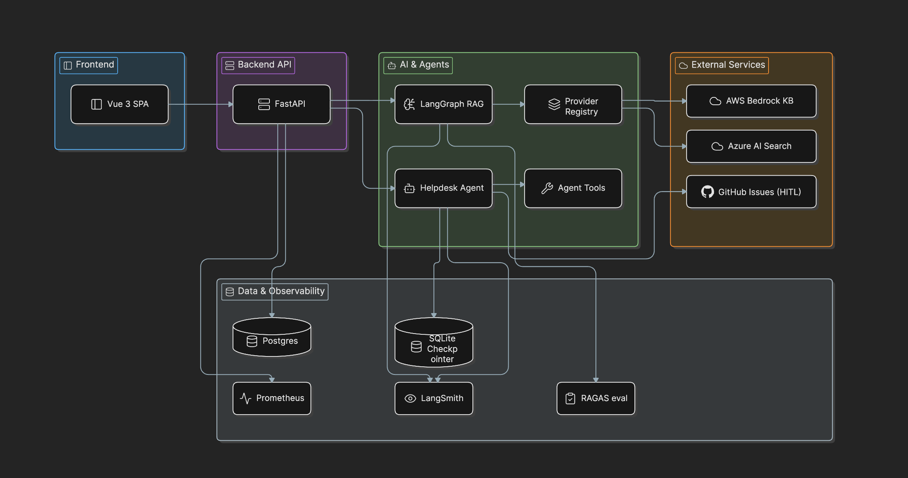
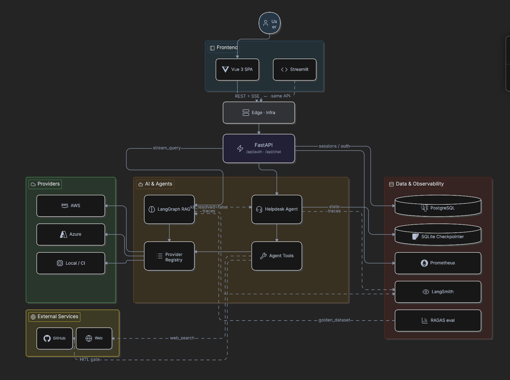
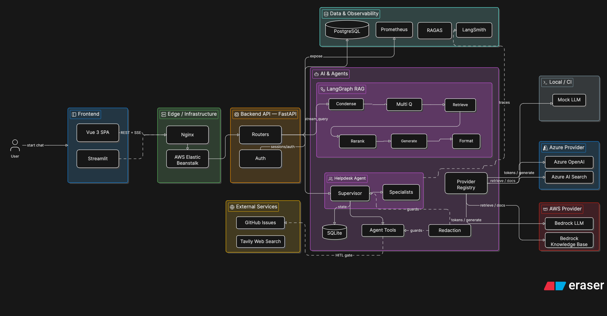
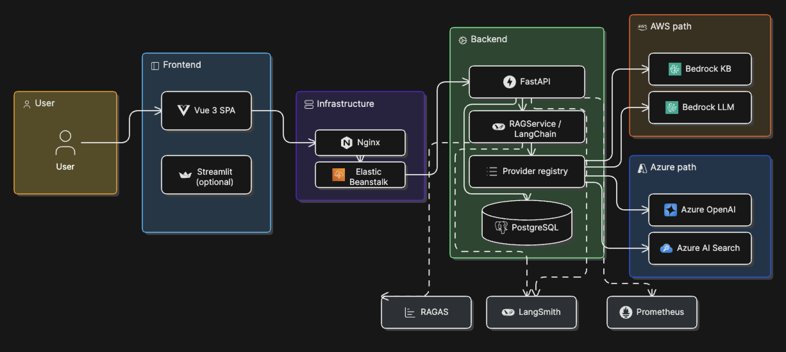
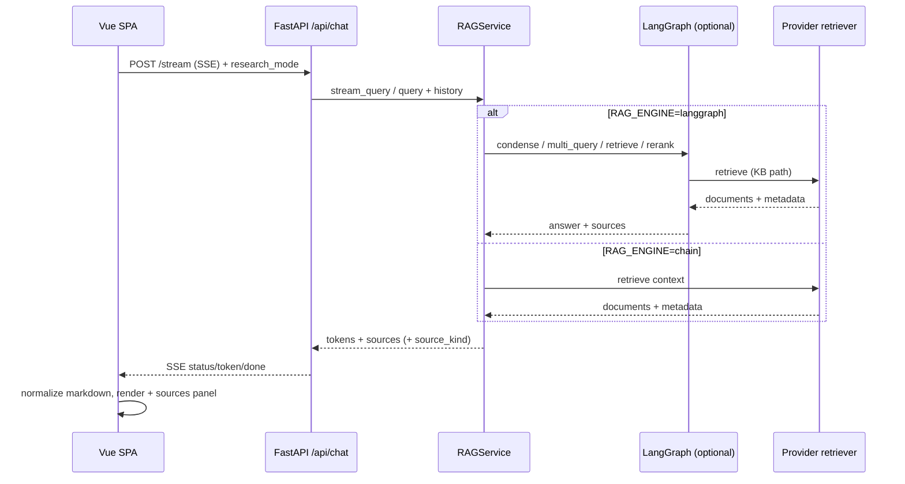
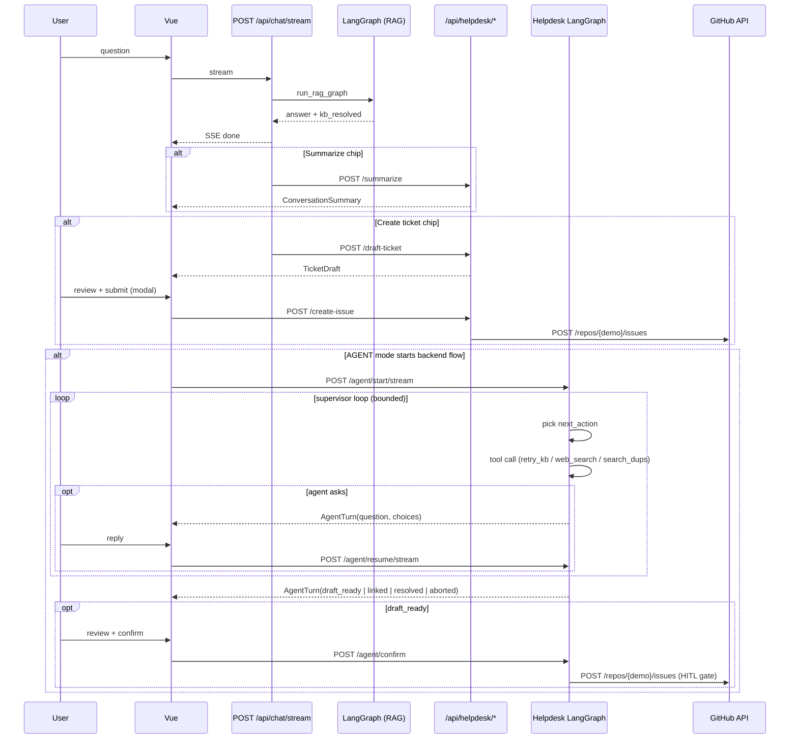

# Architecture

Campus RAG Assistant is a source-reviewable AI platform for governed campus knowledge. It combines a
cited-answer RAG path with a HITL-gated helpdesk escalation loop: when the knowledge base cannot
resolve a question, the system can retry retrieval, use controlled web research, search GitHub issues
for duplicates, draft a ticket, and file to GitHub only after human confirmation. The system runs
behind one FastAPI backend and Vue 3 SPA with AWS / Azure / mock providers, RAGAS evaluation,
LangSmith and Prometheus observability, CI/security gates, redaction, and responsible-AI guardrails.

This page describes the current system architecture first, then keeps earlier versions as collapsed drill-downs so reviewers can understand the evolution without reconstructing the live architecture from release history.

For design goals and decision rationale, see [DESIGN.md](./DESIGN.md). For release-by-release summaries, see [release-notes/](./release-notes/index.md).

## Current architecture

| Layer | Current shape |
|------|---------------|
| **Client** | Vue 3 SPA is primary; Streamlit remains an optional client on the same REST API |
| **API** | FastAPI under `/api/auth`, `/api/chat`, and `/api/helpdesk`; JWT auth in HTTP-only cookies; SSE for chat and agent status streams |
| **RAG orchestration** | `RAG_ENGINE=chain` for token streaming and CI default; `RAG_ENGINE=langgraph` for explicit `condense -> multi_query -> retrieve -> rerank -> generate -> format` graph nodes |
| **Providers** | Pluggable LLM and retriever registry: AWS, Azure, or mock via `LLM_PROVIDER`, `RETRIEVER_PROVIDER`, and `RAG_FORCE_MOCK` |
| **AWS retrieval** | Bedrock Knowledge Base retrieve API backed by OpenSearch Serverless; the app does not call OpenSearch directly |
| **Azure retrieval** | Azure AI Search fills the same retriever contract for vector / hybrid search |
| **Helpdesk agent** | Bounded multi-turn AGENT mode with retry-KB, web search, duplicate-issue search, draft-ticket, HITL confirm, four terminal outcomes, redaction, and Prometheus metrics |
| **Persistence** | PostgreSQL + Alembic for application data; helpdesk agent checkpoints currently use SQLite keyed by chat session |
| **Observability and quality** | LangSmith traces, Prometheus metrics, RAGAS baseline checks, k6 load validation, and CI mock-provider coverage |

### Primary request paths

- **Ask mode:** Vue sends `POST /api/chat/stream`; FastAPI runs the configured RAG path, streams answer tokens/status, persists the message, and returns source metadata for the citation panel.
- **Agent mode:** When RAG is unresolved, Vue can start `/api/helpdesk/agent/start/stream`; the backend runs a bounded helpdesk loop, pauses for clarifying input when needed, and requires `/agent/confirm` before filing a GitHub issue.
- **Operations path:** Health, metrics, release, CI/CD, security, and load-testing runbooks live in the [Operations Manual](./operations-manual/index.md).

### Overview diagram



### Detailed diagram



### Full topology

RAG pipeline subgraph (`condense` -> `multi_query` -> `retrieve` -> `rerank` -> `generate` -> `format`) plus helpdesk agent subgraph (supervisor -> specialists -> tools -> HITL gate):



The topology image is the reviewer map for the whole current architecture: the RAG path, helpdesk agent path, external services, persistence, and observability surfaces are shown together before historical versions.

??? info "Evolution from v2 (RAG platform)"
    v2 introduced the Vue SPA, provider registry, LangGraph RAG pipeline, RAGAS eval, and GitHub Actions CI/CD. v3 keeps that platform and adds a bounded helpdesk agent.

    | Area | v2 (RAG platform) | v3 (+ helpdesk agent) |
    |------|-------------------|------------------------|
    | **UI** | Vue 3 SPA with KB chat, sources, web toggle | **Ask / Agent mode** switch, agent activity timeline, ticket review modal |
    | **API** | `/api/chat/*`, `/api/helpdesk/{summarize,draft-ticket,create-issue}` | **`/api/helpdesk/agent/*`** — start, resume, confirm, abort + SSE streams |
    | **Orchestration** | LangGraph RAG only | RAG + **helpdesk LangGraph** (supervisor, specialists, tools) |
    | **Checkpointing** | — | SQLite checkpointer (Postgres planned — [AGENTIC_HELPDESK_REBUILD](./roadmap/AGENTIC_HELPDESK_REBUILD.md)) |
    | **External actions** | — | **GitHub Issues** (HITL-gated), Tavily web search |
    | **Observability** | LangSmith + Prometheus | + `chatbot_helpdesk_agent_*` metrics, agent funnel counters |

    

    ### Detailed (v2)

    

    | Asset | Description |
    |-------|-------------|
    | [`architecture/v2/overview.png`](./assets/architecture/v2/overview.png) | v2 high-level overview |
    | [`architecture/v2/detailed.png`](./assets/architecture/v2/detailed.png) | v2 component detail |

??? info "Upstream baseline (v1)"
    Original upstream [ets-berkeley-edu/chabot](https://github.com/ets-berkeley-edu/chabot) architecture (Streamlit-only UI, LangChain → OpenSearch + Bedrock directly):

    

    | Area | Upstream chabot (v1) | Campus RAG Assistant (v2+) |
    |------|----------------------|------------------------------|
    | **UI** | Streamlit only | **Vue 3 SPA** (primary); Streamlit optional, same API |
    | **API** | Chat endpoints | **SSE** `POST /api/chat/stream`, sessions CRUD, feedback, sources |
    | **Auth** | — | **JWT** in HTTP-only cookies (`/api/auth/*`) |
    | **Retrieval (AWS)** | LangChain → **OpenSearch** directly | **Bedrock Knowledge Base** API; **OpenSearch Serverless** behind the KB |
    | **Retrieval (Azure)** | — | **Azure AI Search** vector + keyword/hybrid index |
    | **LLM** | Bedrock only | **Bedrock** or **Azure OpenAI** or **mock** via `LLM_PROVIDER` |
    | **DB** | PostgreSQL | PostgreSQL + **Alembic** |
    | **Ops** | LangSmith | LangSmith + **Prometheus** — [OPERATIONS.md — Shipped performance guardrails](operations-manual/operations.md#shipped-performance-guardrails-campus-phase-0) |
    | **Quality** | — | **RAGAS** harness, k6 load tests |

## Chat request flow



- **Streaming (preferred):** `POST /api/chat/stream` emits Server-Sent Events (`token`, then `done` with sources). The Vue store appends tokens live, then persists the final message.
- **Buffered fallback:** `POST /api/chat/chat` returns the full assistant message when streaming fails or is disabled.
- **Sessions:** Messages belong to a `ChatSession` per user; history is passed into the LangChain conversational chain for follow-up questions.
- **Answer shape:** The model is instructed via `backend/app/templates/prompt_prefix.txt` to use a consistent Markdown template (summary → `##` sections → bold lead-ins → bullets / numbered steps). Backend and frontend apply **light sanitization only** (drop prompt leakage, optional `**Title**` → `## Title`); they do not rewrite structure with topic-specific heuristics.

## Helpdesk capabilities (post-RAG)

The shipped ASK-mode escalation path offers one-shot recap, draft, and
GitHub issue creation when RAG marks a response unresolved. Vue also exposes
an opt-in AGENT mode on top of the `HELPDESK_AGENT_ENABLED` backend, rendering
each multi-turn helpdesk journey as one assistant bubble with an activity timeline.
Product spec: [CONVERSATION_FLOW.md](./roadmap/CONVERSATION_FLOW.md). Agent
engineering spec: [HELPDESK_AGENT.md](./roadmap/HELPDESK_AGENT.md).

### Endpoint surface

| Endpoint | Purpose | Available in |
|---|---|---|
| `POST /api/helpdesk/summarize` | Narrative conversation recap (utility, no side effects) | ASK escalation |
| `POST /api/helpdesk/draft-ticket` | One-shot structured ticket draft (no agent loop) | ASK escalation / legacy modal fallback |
| `POST /api/helpdesk/create-issue` | File reviewed draft on GitHub (idempotent, HITL-gated) | ASK escalation / legacy modal fallback |
| `POST /api/helpdesk/agent/start` | Start multi-turn helpdesk agent session | AGENT mode |
| `POST /api/helpdesk/agent/start/stream` | SSE status stream for start, ending with `AgentTurn` | AGENT mode preferred path |
| `POST /api/helpdesk/agent/resume` | Resume paused agent with the user's reply | AGENT mode |
| `POST /api/helpdesk/agent/resume/stream` | SSE status stream for resume, ending with `AgentTurn` | AGENT mode preferred path |
| `POST /api/helpdesk/agent/confirm` | User confirms draft -> internal call to `create-issue` | AGENT mode |
| `POST /api/helpdesk/agent/abort` | Cancel an in-flight agent session | AGENT mode |

### `kb_resolved` heuristic

When the KB path cannot resolve a question, the API sets
`metadata.kb_resolved=false` on the assistant message (fuzzy match against
the hydrated out-of-scope message, optional rerank score floor). The Vue
chat UI uses this signal to surface escalation chips on the last assistant
reply; AGENT mode swaps those actions for `Get help` and continues the journey inline.

### Backend agent flow



### Properties

- **HITL gate**: the agent never files an issue without an explicit user
  "File it" confirmation. The `file_ticket` tool is reachable only through
  `/agent/confirm`.
- **Multi-turn state**: agent sessions persist via LangGraph `SqliteSaver`
  keyed by chat `session_id`. Checkpoints TTL'd after 24h.
- **Defense in depth**: redaction applied on every LLM input *and* again
  immediately before posting to GitHub.
- **Bounded budgets**: hard caps on supervisor steps, clarifying questions,
  KB retries, web searches, duplicate searches, per-session tokens, and
  per-user-per-day sessions. See [HELPDESK_AGENT.md](./roadmap/HELPDESK_AGENT.md).
- **Mock-mode parity**: with `provider.is_mock`, the supervisor follows a
  deterministic scripted plan tied to the sentinel query
  `Oracle Financials 403 error on budget reports` so the full agent flow
  is demo-able without AWS or GitHub credentials.
- **Frontend state:** Vue stores one in-memory/persisted bubble per `agent_session_id`; streamed status updates drive the typing indicator and final `AgentTurn` updates the same card.
- **Scope:** Vue frontend only (Streamlit unchanged).
- **Secrets:** `GITHUB_TOKEN` + `GITHUB_REPO` (private demo repo); see
  `.env.example` and [SECURITY.md](operations-manual/security.md).

## AWS retrieval: Bedrock Knowledge Base and OpenSearch

On AWS, the application calls the **Bedrock Knowledge Base** retrieve API via LangChain's `AmazonKnowledgeBasesRetriever` — not OpenSearch HTTP endpoints directly. In a typical deployment:

```text
App (AmazonKnowledgeBasesRetriever)
  → Bedrock Knowledge Base (retrieve, metadata filters)
    → OpenSearch Serverless (vector index + chunk storage)
```

| Component | Role |
|-----------|------|
| **Bedrock Knowledge Base** | Managed RAG entry point: sync connectors, chunking, retrieve API, citation metadata |
| **OpenSearch Serverless** | Vector (and often hybrid) index backing the KB; ingestion and index lifecycle owned by AWS |
| **ServiceNow / LMS corpus** | Source content ingested into the KB (e.g. knowledge articles synced to the index) |

The application owns one retriever interface in the provider registry — `RETRIEVER_PROVIDER=aws` selects the KB path with optional metadata filters via `build_bedrock_vector_filter` in `backend/app/services/retrieval.py`. Index lifecycle, chunking, and ingestion connectors stay managed by AWS, so the app does not run OpenSearch client code.

## Azure retrieval: Azure AI Search

On Azure, the application owns the retrieval call directly: it computes the query embedding with `AzureOpenAIEmbeddings` and calls Azure AI Search via the `azure-search-documents` `SearchClient`. There is no managed retrieval API like Bedrock Knowledge Base in this path.

```text
App (AzureHybridRetriever)
  -> AzureOpenAIEmbeddings (query vector)
  -> Azure AI Search (hybrid: vector_queries + search_text/BM25)
```

| Component | Role |
|-----------|------|
| **Azure AI Search index** | Vector + keyword index storing chunked content; `text_vector` carries embeddings while textual fields support BM25 matching |
| **AzureOpenAIEmbeddings** | App calls the Azure OpenAI embedding deployment to vectorize the user query at retrieval time |
| **AzureHybridRetriever** | App-owned LangChain retriever that issues one hybrid search and yields `Document` objects with `kb_*` citation metadata (`backend/app/services/providers/retriever/azure.py`) |
| **Azure OpenAI chat deployment** | LLM provider when `LLM_PROVIDER=azure`, configured separately from the embedding deployment |

`RETRIEVER_PROVIDER=azure` selects `AzureHybridRetriever`. Unlike the AWS path, ingestion, chunking, and index lifecycle are not abstracted by a managed retrieval API; the app issues the hybrid search and the index is populated and refreshed outside the app process.

## Backend

- **Entry**: [`backend/app/main.py`](../backend/app/main.py) builds the FastAPI app; runs SQLAlchemy `create_all` only in dev/test (production uses Alembic); configures CORS, and mounts routers under `/api/auth` and `/api/chat`.
- **Configuration**: Pydantic settings in [`backend/app/config/default.py`](../backend/app/config/default.py), loaded via [`backend/app/core/config_manager.py`](../backend/app/core/config_manager.py) from layered `.env` files (`APP_ENV`, repo root `.env`, `.env.{APP_ENV}`).
- **Auth**: JWT plus HTTP-only cookies (`/api/auth/login-json`, register, **OAuth** via `/api/auth/oauth/{provider}/…`; dev uses API-port callback (`OAUTH_REDIRECT_BASE_URL` on `:8000`) and one-time redirect to Vue `/oauth/handoff` — [OPERATIONS.md — OAuth and authentication](operations-manual/operations.md#oauth-and-authentication). Cookie `Secure` and `SameSite` follow `AUTH_COOKIE_*` settings (see `.env.example`, [OPERATIONS.md — Production HTTPS](operations-manual/operations.md#production-https-and-http2)).
- **RAG**: [`backend/app/services/rag.py`](../backend/app/services/rag.py) — `RAG_ENGINE=chain` (default in tests via conftest) uses a LangChain conversational retrieval chain; `RAG_ENGINE=langgraph` runs [`backend/app/services/graph/`](../backend/app/services/graph/) with KB path **condense → multi_query → retrieve → rerank → generate → format** (web path skips rerank; see [DESIGN.md — LangGraph KB path](./DESIGN.md#langgraph-kb-path-multi-query-retrieve-rerank) and [Opt-in web research](./DESIGN.md#opt-in-web-research)).
- **LangGraph streaming:** When `RAG_ENGINE=langgraph`, `/api/chat/stream` emits a `status` event, runs the graph in a worker thread, then streams the buffered answer in paced chunks (not token-level Bedrock streaming). Use `RAG_ENGINE=chain` for `astream_events` TTFT.
- **Research mode:** Optional `research_mode=web` on chat requests when `WEB_RESEARCH_ENABLED=true`; responses include `source_kind` and a web disclaimer when applicable.
- **Singleton:** `get_rag_service()` returns one shared `RAGService` instance (thread-safe) for all chat handlers.
- **Providers**: [`backend/app/services/providers/`](../backend/app/services/providers/) registers LLM and retriever implementations (`aws`, `azure`, `mock`) selected by `LLM_PROVIDER`, `RETRIEVER_PROVIDER`, optional `RAG_PROVIDER`, and `RAG_FORCE_MOCK`. When both `LLM_PROVIDER` and `RETRIEVER_PROVIDER` are set, they take precedence over `RAG_PROVIDER`.

### Chat API surface (summary)

| Endpoint | Purpose |
|----------|---------|
| `POST /api/chat/stream` | SSE streaming reply |
| `POST /api/chat/chat` | Buffered reply |
| `GET/POST/DELETE /api/chat/sessions` | Conversation CRUD |
| `POST /api/chat/feedback` | Thumbs up/down |
| `GET /api/auth/oauth/{provider}/start` | OAuth redirect (e.g. `github`) |
| `GET /api/auth/oauth/{provider}/callback` | OAuth callback on API origin; dev handoff to Vue `/oauth/handoff` |
| `GET /api/chat/messages/{id}/sources` | Source metadata for a message |
| `POST /api/helpdesk/summarize` | Narrative conversation recap from the last N chat turns (auth + rate limit) |
| `POST /api/helpdesk/draft-ticket` | Structured ticket draft from the last N chat turns (auth + rate limit) |
| `POST /api/helpdesk/create-issue` | File reviewed draft to GitHub (idempotent, demo repo) |

## Frontend (`frontend-vue/`)

- **Data flow**: Axios client (`src/api/`) → Pinia stores (`src/stores/`) → views/components. Cookies sent with `withCredentials`.
- **Chat UI**: `ChatView` + sidebar session list; `MessageBubble` (Markdown, user/assistant lanes, accessible accent); `SourcesPanel` / `SourcesSummary` below assistant replies; `MessageFeedback`; SSE streaming with typing/status indicator. Dev server: `http://127.0.0.1:5173`.
- **Routing**: Vue Router guards call `fetchCurrentUser` for protected routes.
- **Testing**: Vitest + MSW (`src/mocks/`) for unit/integration tests; Playwright under `e2e/` (see [OPERATIONS.md — Playwright E2E](operations-manual/operations.md#playwright-e2e-frontend-vue)).

## Production-oriented behavior

When `APP_ENV` is `production` or `prod` (configurable via `.env`):

- `ENABLE_DEV_API_ROUTES` defaults to **false** (hides `/api/auth/debug-auth`, `/api/chat/test_langsmith`).
- `ENABLE_OPENAPI_DOCS` defaults to **false** (no Swagger/ReDoc/OpenAPI JSON).
- `AUTH_COOKIE_SECURE` defaults to **true**.

Override any of these explicitly in `.env` when needed.

## CORS

- If `BACKEND_CORS_ORIGINS` is `*`, the app allows a fixed list of local origins plus `FRONTEND_URL`.
- For production, set `BACKEND_CORS_ORIGINS` to an explicit comma-separated list of allowed origins (see `.env.example`).

## Rate limiting

- `backend/app/core/rate_limit.py` — process-local sliding windows on auth/chat (`RATE_LIMIT_ENABLED`). Use Redis-backed limits for multi-instance production.

## Testing note

Integration tests mock RAG by patching **`backend.app.api.chat.get_rag_service`** (the name bound in the chat router module), not only `backend.app.services.rag.get_rag_service`, because the router imports that function by reference at load time.
