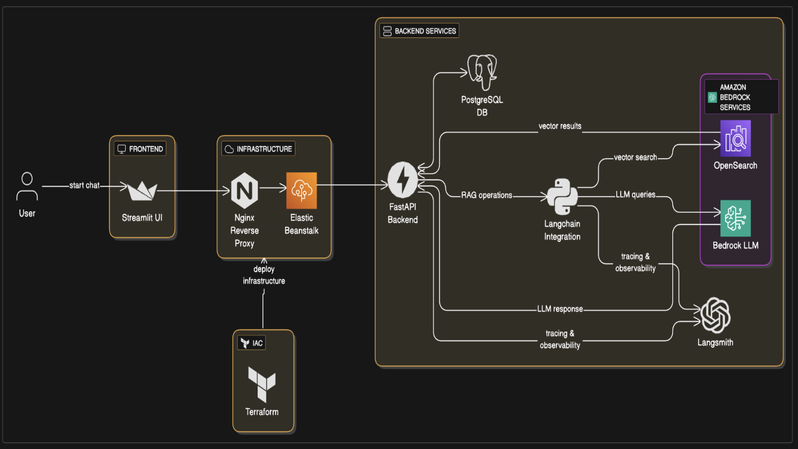
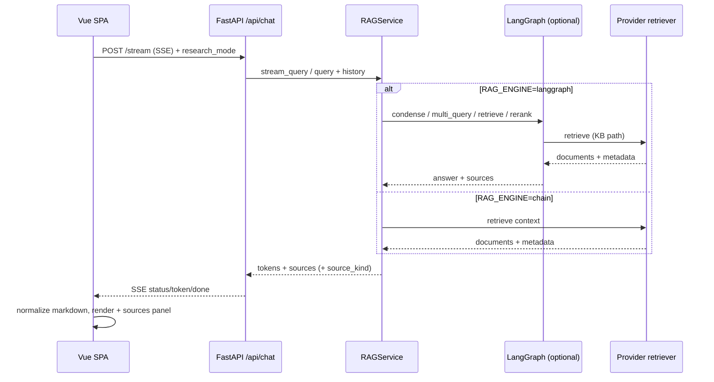
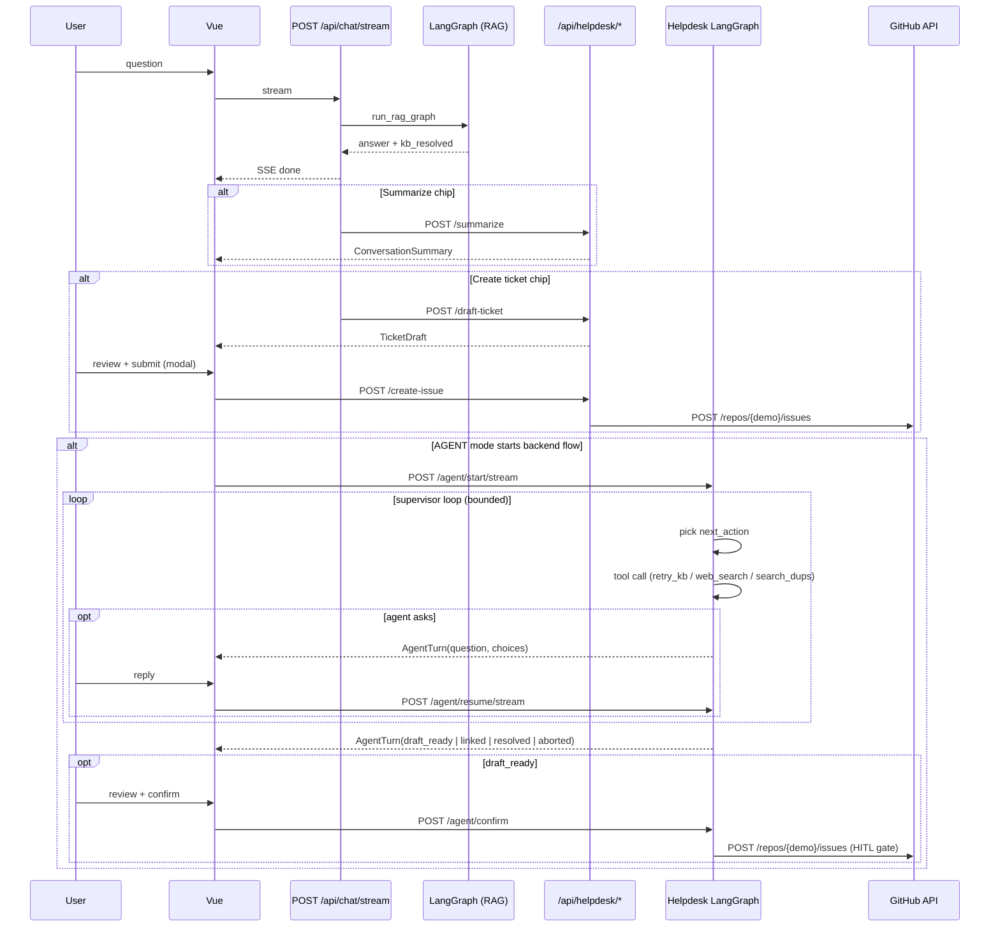

# Architecture

**Campus RAG Assistant** is a retrieval-augmented chat product: a **FastAPI** backend, a **Vue 3** SPA (`frontend-vue/`), and an optional **Streamlit** client on the same REST API.

For design goals and decision rationale, see [DESIGN.md](./DESIGN.md).

Evolution from upstream [ets-berkeley-edu/chabot](https://github.com/ets-berkeley-edu/chabot): dual frontends, pluggable **AWS / Azure / mock** providers, **Bedrock Knowledge Base** retrieval over **OpenSearch Serverless** (replacing direct OpenSearch client calls from the app), SSE streaming, JWT cookie auth, Alembic migrations, and Prometheus metrics.

## System architecture

Diagrams live in [`docs/assets/`](./assets/). The **v2 overview** is in the root [README](../README.md#architecture). Below: **detailed v2**, then **v1** (upstream [ets-berkeley-edu/chabot](https://github.com/ets-berkeley-edu/chabot)) for comparison.

### Detailed (v2)


### Upstream reference (v1)

Original upstream chabot architecture (Streamlit-only UI, LangChain → OpenSearch + Bedrock directly):



### Diagram notes

| Area | Upstream chabot (v1) | Campus RAG Assistant (v2) |
|------|----------------------|---------------------------|
| **UI** | Streamlit only | **Vue 3 SPA** (primary); Streamlit optional, same API |
| **API** | Chat endpoints | **SSE** `POST /api/chat/stream`, sessions CRUD, feedback, sources |
| **Auth** | — | **JWT** in HTTP-only cookies (`/api/auth/*`) |
| **Retrieval (AWS)** | LangChain → **OpenSearch** directly | **Bedrock Knowledge Base** API (`AmazonKnowledgeBasesRetriever`); **vector store:** **OpenSearch Serverless** (vector/keyword/hybrid index) behind the KB |
| **Retrieval (Azure)** | — | **Azure AI Search** vector + keyword/hybrid index; Azure OpenAI embeddings |
| **LLM** | Bedrock only | **Bedrock** or **Azure OpenAI** or **mock** via `LLM_PROVIDER` |
| **DB** | PostgreSQL | PostgreSQL + **Alembic** (no `create_all` in production) |
| **Ops** | LangSmith | LangSmith + **Prometheus** (`/api/metrics`, pool snapshot, first-token histogram); chat history capped via `CHAT_HISTORY_MAX_MESSAGES` — [PERFORMANCE.md](./PERFORMANCE.md) |
| **Quality** | — | **RAGAS** harness (`backend/tests/eval/`), k6 load tests |
| **Deploy** | EB + Nginx + Terraform | Same pattern; `run_services.sh` starts API (+ Streamlit on EB); Vue often hosted separately (CDN/static) with `FRONTEND_URL` / CORS |

| Asset | Description |
|-------|-------------|
| [`architecture_v2.png`](./assets/architecture_v2.png) | High-level overview — shown in [README](../README.md#architecture) |
| [`architecture_detailed_v2.png`](./assets/architecture_detailed_v2.png) | Current architecture with component detail |
| [`architecture_v1.png`](./assets/architecture_v1.png) | Upstream chabot (historical reference) |

### AWS retrieval: Bedrock Knowledge Base and OpenSearch

On AWS, the application calls the **Bedrock Knowledge Base** retrieve API—not OpenSearch HTTP endpoints directly. In a typical deployment:

```text
App (LangChain AmazonKnowledgeBasesRetriever)
  → Bedrock Knowledge Base (retrieve, metadata filters)
    → OpenSearch Serverless (vector index + chunk storage)
```

| Component | Role |
|-----------|------|
| **Bedrock Knowledge Base** | Managed RAG entry point: sync connectors, chunking, retrieve API, citation metadata |
| **OpenSearch Serverless** | Vector (and often hybrid) index backing the KB; ingestion and index lifecycle owned by AWS |
| **ServiceNow / LMS corpus** | Source content ingested into the KB (e.g. knowledge articles synced to the index) |

**v1 (upstream chabot)** invoked OpenSearch from application code. **v2** keeps OpenSearch in the platform stack but routes retrieval through the KB API for simpler ops and consistent metadata filters (`build_bedrock_vector_filter` in `backend/app/services/retrieval.py`).

Azure path uses **Azure AI Search** instead of OpenSearch—same provider pattern, different backing service.

## Chat request flow



- **Streaming (preferred):** `POST /api/chat/stream` emits Server-Sent Events (`token`, then `done` with sources). The Vue store appends tokens live, then persists the final message.
- **Buffered fallback:** `POST /api/chat/chat` returns the full assistant message when streaming fails or is disabled.
- **Sessions:** Messages belong to a `ChatSession` per user; history is passed into the LangChain conversational chain for follow-up questions.
- **Answer shape:** The model is instructed via `backend/app/templates/prompt_prefix.txt` to use a consistent Markdown template (summary → `##` sections → bold lead-ins → bullets / numbered steps). Backend and frontend apply **light sanitization only** (drop prompt leakage, optional `**Title**` → `## Title`); they do not rewrite structure with topic-specific heuristics.

## Backend

- **Entry**: [`backend/app/main.py`](../backend/app/main.py) builds the FastAPI app; runs SQLAlchemy `create_all` only in dev/test (production uses Alembic); configures CORS, and mounts routers under `/api/auth` and `/api/chat`.
- **Configuration**: Pydantic settings in [`backend/app/config/default.py`](../backend/app/config/default.py), loaded via [`backend/app/core/config_manager.py`](../backend/app/core/config_manager.py) from layered `.env` files (`APP_ENV`, repo root `.env`, `.env.{APP_ENV}`).
- **Auth**: JWT plus HTTP-only cookies (`/api/auth/login-json`, register, **OAuth** via `/api/auth/oauth/{provider}/…`; dev uses API-port callback (`OAUTH_REDIRECT_BASE_URL` on `:8000`) and one-time redirect to Vue `/oauth/handoff` — [PRODUCTION_TLS.md](./PRODUCTION_TLS.md). Cookie `Secure` and `SameSite` follow `AUTH_COOKIE_*` settings (see `.env.example`, [PRODUCTION_TLS.md](./PRODUCTION_TLS.md)).
- **RAG**: [`backend/app/services/rag.py`](../backend/app/services/rag.py) — `RAG_ENGINE=chain` (default in tests via conftest) uses a LangChain conversational retrieval chain; `RAG_ENGINE=langgraph` runs [`backend/app/services/graph/`](../backend/app/services/graph/) with KB path **condense → multi_query → retrieve → rerank → generate → format** (web path skips rerank; see [LANGGRAPH.md](./roadmap/LANGGRAPH.md), [WEB_RESEARCH.md](./roadmap/WEB_RESEARCH.md)).
- **LangGraph streaming:** When `RAG_ENGINE=langgraph`, `/api/chat/stream` emits a `status` event, runs the graph in a worker thread, then streams the buffered answer in paced chunks (not token-level Bedrock streaming). Use `RAG_ENGINE=chain` for `astream_events` TTFT.
- **Research mode:** Optional `research_mode=web` on chat requests when `WEB_RESEARCH_ENABLED=true`; responses include `source_kind` and a web disclaimer when applicable.
- **Singleton:** `get_rag_service()` returns one shared `RAGService` instance (thread-safe) for all chat handlers.
- **Providers**: [`backend/app/services/providers/`](../backend/app/services/providers/) registers LLM and retriever implementations (`aws`, `azure`, `mock`) selected by `LLM_PROVIDER`, `RETRIEVER_PROVIDER`, optional `RAG_PROVIDER`, and `RAG_FORCE_MOCK`. When both `LLM_PROVIDER` and `RETRIEVER_PROVIDER` are set, they take precedence over `RAG_PROVIDER`.

### Chat API surface (summary)

| Endpoint | Purpose |
|----------|---------|
| `POST /api/chat/stream` | SSE streaming reply |
| `POST /api/chat/chat` | Buffered reply |
| `GET/POST/DELETE /api/chat/sessions` | Conversation CRUD |
| `POST /api/chat/feedback` | Thumbs up/down |
| `GET /api/auth/oauth/{provider}/start` | OAuth redirect (e.g. `github`) |
| `GET /api/auth/oauth/{provider}/callback` | OAuth callback on API origin; dev handoff to Vue `/oauth/handoff` |
| `GET /api/chat/messages/{id}/sources` | Source metadata for a message |
| `POST /api/helpdesk/summarize` | Narrative conversation recap from the last N chat turns (auth + rate limit) |
| `POST /api/helpdesk/draft-ticket` | Structured ticket draft from the last N chat turns (auth + rate limit) |
| `POST /api/helpdesk/create-issue` | File reviewed draft to GitHub (idempotent, demo repo) |

## Frontend (`frontend-vue/`)

- **Data flow**: Axios client (`src/api/`) → Pinia stores (`src/stores/`) → views/components. Cookies sent with `withCredentials`.
- **Chat UI**: `ChatView` + sidebar session list; `MessageBubble` (Markdown, user/assistant lanes, accessible accent); `SourcesPanel` / `SourcesSummary` below assistant replies; `MessageFeedback`; SSE streaming with typing/status indicator. Dev server: `http://127.0.0.1:5173`.
- **Routing**: Vue Router guards call `fetchCurrentUser` for protected routes.
- **Testing**: Vitest + MSW (`src/mocks/`) for unit/integration tests; Playwright under `e2e/` (see [E2E.md](./E2E.md)).

## Production-oriented behavior

When `APP_ENV` is `production` or `prod` (configurable via `.env`):

- `ENABLE_DEV_API_ROUTES` defaults to **false** (hides `/api/auth/debug-auth`, `/api/chat/test_langsmith`).
- `ENABLE_OPENAPI_DOCS` defaults to **false** (no Swagger/ReDoc/OpenAPI JSON).
- `AUTH_COOKIE_SECURE` defaults to **true**.

Override any of these explicitly in `.env` when needed.

## CORS

- If `BACKEND_CORS_ORIGINS` is `*`, the app allows a fixed list of local origins plus `FRONTEND_URL`.
- For production, set `BACKEND_CORS_ORIGINS` to an explicit comma-separated list of allowed origins (see `.env.example`).

## Testing note

Integration tests mock RAG by patching **`backend.app.api.chat.get_rag_service`** (the name bound in the chat router module), not only `backend.app.services.rag.get_rag_service`, because the router imports that function by reference at load time.


## Helpdesk capabilities (post-RAG)

The shipped ASK-mode escalation path offers one-shot recap, draft, and
GitHub issue creation when RAG marks a response unresolved. Vue also exposes
an opt-in AGENT mode on top of the `HELPDESK_AGENT_ENABLED` backend, rendering
each multi-turn helpdesk journey as one assistant bubble with an activity timeline.
Product spec: [CONVERSATION_FLOW.md](./roadmap/CONVERSATION_FLOW.md). Agent
engineering spec: [HELPDESK_AGENT.md](./roadmap/HELPDESK_AGENT.md).

### Endpoint surface

| Endpoint | Purpose | Available in |
|---|---|---|
| `POST /api/helpdesk/summarize` | Narrative conversation recap (utility, no side effects) | ASK escalation |
| `POST /api/helpdesk/draft-ticket` | One-shot structured ticket draft (no agent loop) | ASK escalation / legacy modal fallback |
| `POST /api/helpdesk/create-issue` | File reviewed draft on GitHub (idempotent, HITL-gated) | ASK escalation / legacy modal fallback |
| `POST /api/helpdesk/agent/start` | Start multi-turn helpdesk agent session | AGENT mode |
| `POST /api/helpdesk/agent/start/stream` | SSE status stream for start, ending with `AgentTurn` | AGENT mode preferred path |
| `POST /api/helpdesk/agent/resume` | Resume paused agent with the user's reply | AGENT mode |
| `POST /api/helpdesk/agent/resume/stream` | SSE status stream for resume, ending with `AgentTurn` | AGENT mode preferred path |
| `POST /api/helpdesk/agent/confirm` | User confirms draft -> internal call to `create-issue` | AGENT mode |
| `POST /api/helpdesk/agent/abort` | Cancel an in-flight agent session | AGENT mode |

### `kb_resolved` heuristic

When the KB path cannot resolve a question, the API sets
`metadata.kb_resolved=false` on the assistant message (fuzzy match against
the hydrated out-of-scope message, optional rerank score floor). The Vue
chat UI uses this signal to surface escalation chips on the last assistant
reply; AGENT mode swaps those actions for `Get help` and continues the journey inline.

### Backend agent flow



### Properties

- **HITL gate**: the agent never files an issue without an explicit user
  "File it" confirmation. The `file_ticket` tool is reachable only through
  `/agent/confirm`.
- **Multi-turn state**: agent sessions persist via LangGraph `SqliteSaver`
  keyed by chat `session_id`. Checkpoints TTL'd after 24h.
- **Defense in depth**: redaction applied on every LLM input *and* again
  immediately before posting to GitHub.
- **Bounded budgets**: hard caps on supervisor steps, clarifying questions,
  KB retries, web searches, duplicate searches, per-session tokens, and
  per-user-per-day sessions. See [HELPDESK_AGENT.md](./roadmap/HELPDESK_AGENT.md).
- **Mock-mode parity**: with `provider.is_mock`, the supervisor follows a
  deterministic scripted plan tied to the sentinel query
  `Oracle Financials 403 error on budget reports` so the full agent flow
  is demo-able without AWS or GitHub credentials.
- **Frontend state:** Vue stores one in-memory/persisted bubble per `agent_session_id`; streamed status updates drive the typing indicator and final `AgentTurn` updates the same card.
- **Scope:** Vue frontend only (Streamlit unchanged).
- **Secrets:** `GITHUB_TOKEN` + `GITHUB_REPO` (private demo repo); see
  `.env.example` and [SECURITY.md](./SECURITY.md).

## Rate limiting

- `backend/app/core/rate_limit.py` — process-local sliding windows on auth/chat (`RATE_LIMIT_ENABLED`). Use Redis-backed limits for multi-instance production.
