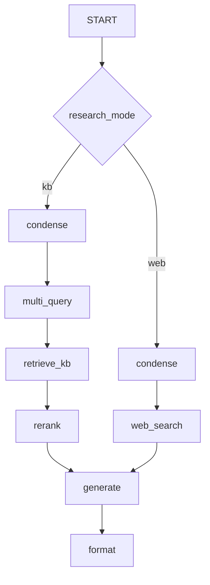

# Design and architecture decisions

This document records **why** the system is shaped the way it is. For component diagrams and request flows, see [ARCHITECTURE.md](./ARCHITECTURE.md). For release-by-release summaries, see [release-notes/](./release-notes/index.md).

**Last updated:** 2026-05-31

---

## Product scope

Campus RAG Assistant is a **retrieval-augmented chat application** for **campus teaching, learning, and education IT knowledge** (for example Canvas LMS and LTI tooling, accessibility and inclusive teaching guidance, and ServiceNow IT knowledge articles). Users ask natural-language questions; the system retrieves grounded context, generates a structured answer with citations, and keeps per-user chat history.

It is an independent extension of the upstream [chabot](https://github.com/ets-berkeley-edu/chabot) codebase: same problem domain (institutional knowledge), expanded platform surface (Vue SPA, provider registry, LangGraph pipeline, formal evaluation).

---


## Product boundaries

### In scope

- Q&A over **institutional knowledge** — Canvas LMS, LTI tools, accessibility, inclusive teaching and learning, ServiceNow IT articles, and institutional policies.
- **Cited answers** with expandable source excerpts in the UI.
- **Multi-turn chat** with session history and thumbs-up/down feedback.
- **Per-tenant** prompt and topic configuration (`tenant.rag_config`).
- **Operator controls**: feature flags for retrieval tuning, web research, and RAG engine selection.

### Out of scope (by design)

- **General-purpose chat** without retrieval grounding (KB path always retrieves first).
- **Silent open-web answers** — web mode requires an explicit user toggle and shows a disclaimer.
- **Unbounded agent tool loops** — orchestration is a **fixed LangGraph** with optional bounded rewrite (Phase 6), not open-ended multi-agent autonomy.
- **Clinical or HIPAA-regulated use** — this codebase targets **education IT knowledge**; do not deploy against PHI without a separate compliance program.

### Success signals

| Signal | Mechanism |
|--------|-----------|
| Answer usefulness | User feedback on messages; qualitative review of traces |
| Grounding | Source panel + RAGAS **faithfulness** on golden set |
| Retrieval coverage | RAGAS **context_recall** vs curated `ground_truth` |
| Operability | CI green on mock RAG; Prometheus metrics; LangSmith per-node spans on graph path |

---

## Design goals

| Goal | How we approach it |
|------|-------------------|
| **Grounded answers** | Retrieval before generation; sources returned to the client and shown in the UI |
| **Operable in dev and prod** | Mock providers for local/CI; AWS/Azure paths for live KB; health and metrics endpoints |
| **Observable RAG** | LangSmith traces (per-node with LangGraph); RAGAS golden-set regression; Prometheus on the API |
| **Safe extension** | Explicit graph nodes and feature flags; opt-in web research with disclaimer; topic scoping via config |
| **Deployable incrementally** | Alembic migrations; `main` → `qa` → `release` CD; optional strict eval gates on release |

---

## Major decisions

### Dual RAG engines (`chain` vs `langgraph`)

| | `RAG_ENGINE=chain` | `RAG_ENGINE=langgraph` |
|---|-------------------|------------------------|
| **Implementation** | LangChain `ConversationalRetrievalChain` | Compiled graph in `backend/app/services/graph/` |
| **Streaming** | True token streaming via `astream_events` | Status event + paced chunks after `graph.invoke()` |
| **Observability** | Chain-level LangSmith runs | **Per-node** spans (condense, multi_query, retrieve, rerank, …) |
| **Retrieval tuning** | Chain retriever settings | Multi-query, metadata filters, rerank as **explicit nodes** |
| **Default in tests** | **Yes** (`conftest` forces `chain` so CI needs no AWS) | Local/live when configured in `.env` |

**Rationale:** The chain path preserves low-latency SSE and a simple mental model. LangGraph adds a testable orchestration layer and room for retrieval stages without growing a monolithic chain class. Both paths share the same provider registry and response shape so the API and UI stay engine-agnostic.

**Code:** `backend/app/services/rag.py`, `backend/app/services/graph/`.

---

### Bedrock Knowledge Base with OpenSearch (AWS)

**AWS stack:** **Bedrock Knowledge Base** (retrieve API) + **OpenSearch Serverless** (typical vector store behind the KB). The app uses `AmazonKnowledgeBasesRetriever`—not direct OpenSearch client calls.

```text
retrieve node → Bedrock KB API → OpenSearch Serverless index
```

| Piece | Responsibility |
|-------|----------------|
| **OpenSearch Serverless** | Chunk embeddings, vector/hybrid search, index storage |
| **Bedrock Knowledge Base** | Connectors, sync, retrieve orchestration, result metadata for citations |
| **This application** | `RETRIEVER_PROVIDER=aws`, `BEDROCK_KNOWLEDGE_BASE_ID`, optional Bedrock metadata filters |

**Azure stack:** **Azure AI Search** fills the same role (no OpenSearch)—`RETRIEVER_PROVIDER=azure`.

**Rationale:** v1 (upstream chabot) coupled the app to OpenSearch queries. v2 keeps OpenSearch in the platform architecture but uses the KB API so ingestion, index policies, and retrieve semantics stay managed by AWS—one retriever interface in the provider registry for both clouds.

**Code:** `backend/app/services/providers/retriever/aws.py`, `backend/app/services/retrieval.py` (metadata filters).

**Code (registry):** `backend/app/services/providers/` (AWS/Azure/mock).

---

### Azure AI Search (Azure)

The Azure retrieval path uses **Azure AI Search** directly instead of a managed retrieval API. `RETRIEVER_PROVIDER=azure` selects `AzureHybridRetriever`, which embeds the user query with `AzureOpenAIEmbeddings` and sends one hybrid request to Azure AI Search (`vector_queries` plus `search_text`).

This keeps the app contract aligned with AWS and mock providers while making the Azure-specific boundary explicit:

- Azure AI Search owns the vector + keyword index.
- The app owns query embedding, hybrid search construction, and result-to-citation mapping.
- Index ingestion and refresh happen outside the app process.
- Azure OpenAI chat and embedding deployments are configured separately.

This is intentionally different from AWS Bedrock Knowledge Base: Azure gives the application more direct control over hybrid query shape, while AWS delegates retrieval orchestration and index lifecycle behind the KB retrieve API.

### Provider registry (LLM + retriever)

`LLM_PROVIDER` and `RETRIEVER_PROVIDER` select `aws`, `azure`, or `mock` implementations. `RAG_FORCE_MOCK=true` forces mock for demos and CI.

**Rationale:** Same API and UI across environments; tox and new contributors run without cloud credentials. Explicit env vars beat implicit “whatever is in .env” for support and docs.

**Code:** `backend/app/services/providers/`, `backend/app/config/default.py`, `.env.example`.

---

### LangGraph KB path: multi-query → retrieve → rerank

```text
condense → multi_query → retrieve → rerank → generate → format
```

| Stage | Purpose | Flag(s) |
|-------|---------|---------|
| **condense** | Turn follow-up questions into a standalone retrieval query | always on (graph path) |
| **multi_query** | Expand queries; fuse results (RRF) for better recall | `MULTI_QUERY_ENABLED`, `MULTI_QUERY_COUNT` |
| **retrieve** | Bedrock KB → OpenSearch Serverless or Azure AI Search (vector + keyword/hybrid); optional metadata filters; fetch `RERANK_CANDIDATE_K` docs when reranking | `METADATA_FILTER_*` |
| **rerank** | FlashRank or keyword backend to trim noise before generation | `RERANK_ENABLED`, `RERANK_BACKEND` (`flashrank` \| `keyword`), `RERANK_TOP_N`, `RERANK_CANDIDATE_K`, `RERANK_PREFILTER_MAX`, `RERANK_MIN_KEYWORD_OVERLAP` |
| **generate** | LLM answer grounded on selected chunks | provider-specific (`LLM_PROVIDER`) |
| **format** | Normalize metadata (`sources`, `source_kind`, markdown shape) | always on |

LangChain runs **inside each node** (`llm.invoke`, `retriever.invoke`); the graph orchestrates, the LLM does not pick `next_action`. This is deterministic RAG orchestration — see [helpdesk/index.md](./helpdesk/index.md) for the multi-turn agent that does pick actions, and [ADR-002](./adr/ADR-002-langgraph-vs-chain.md) for the chain-vs-LangGraph tradeoff.

```text
backend/app/services/graph/
  state.py
  nodes.py
  graph.py
  runner.py
backend/app/services/tools/
  web_search.py
```

**Streaming.** With `RAG_ENGINE=langgraph` the API emits a `status` SSE event, runs the graph in a worker thread, then streams the buffered answer in paced chunks (not token-level Bedrock streaming). True token streaming (`astream_events` from the chain) is `RAG_ENGINE=chain`. LangGraph-native SSE (Phase 6a) is an optional next step tracked in [PRODUCT_ROADMAP.md](./roadmap/PRODUCT_ROADMAP.md).

**Latency (LangSmith on AWS).** Typical run ~4–8s — `generate` dominates; `retrieve` ~0.5s. Tuned profile: `./scripts/run_eval_phase5.sh` (see [eval_baseline_v2.md](./eval_baseline_v2.md)).

**Rationale:** Recall and precision are tuned in retrieval, not only in the prompt. Each stage is flag-gated so operators can compare profiles. Each node is a LangSmith span, making A/B comparisons traceable.

**Code:** `backend/app/services/graph/nodes.py`, `backend/app/services/retrieval.py`, `backend/app/services/rerank.py`.

Web path intentionally **skips rerank**: `condense → web_search → generate → format` — see the [Opt-in web research](#opt-in-web-research) section below.

---

### Opt-in web research

Web search is **per message** (`research_mode=web`), gated by `WEB_RESEARCH_ENABLED`, with a **disclaimer** in the UI and `source_kind=web` in metadata. Users choose KB (default) or web per message — not silent open-web mode.



**API.**

```json
{ "content": "...", "research_mode": "kb" }
```

Metadata: `source_kind` (`kb` \| `web`), optional `disclaimer` for web answers.

**Config.**

```bash
WEB_RESEARCH_ENABLED=false
WEB_SEARCH_PROVIDER=mock          # mock | tavily
TAVILY_API_KEY=
WEB_SEARCH_MAX_RESULTS=5
```

**Security.** Opt-in only; disclaimer banner shown on every web answer; rate limits apply; no arbitrary URL fetch in v1.

**Rationale:** Campus KB answers should default to governed corpus content. Open web is a deliberate user choice, not silent fallback when retrieval is weak. Decision rationale: [ADR-003](./adr/ADR-003-opt-in-web-research.md).

**Code:** `backend/app/services/tools/web_search.py`, graph routing in `services/graph/nodes.py`, Vue `ChatInput` / stores.

---

### Two evaluation layers (RAGAS + LangSmith)

| Tool | Role |
|------|------|
| **RAGAS** | Offline **quality metrics** on a fixed golden dataset (`backend/tests/eval/`); optional strict gates via `RAGAS_QUALITY_GATE` |
| **LangSmith** | Online **trace inspection** per session and per graph node |

**Rationale:** RAGAS answers “did we regress on known questions?” LangSmith answers “what happened on this slow or wrong turn?” CI runs unit tests with mock RAG; full RAGAS is slow and AWS-dependent, so it is optional locally and on `release` when configured ([EVALUATION.md](./EVALUATION.md)).

---

### API-port OAuth with SPA handoff

GitHub OAuth callback runs on the **API origin** (`OAUTH_REDIRECT_BASE_URL`, typically `:8000`), then redirects to Vue `/oauth/handoff` with a one-time code.

**Rationale:** OAuth `state` and cookies stay on one origin during the provider round-trip; avoids `state_mismatch` when the browser hits both Vite (`:5173`) and the API during login.

**Code:** `backend/app/api/auth/oauth_handoff.py` (or equivalent), [OPERATIONS.md — Local OAuth](operations-manual/operations.md#local-oauth-vite-github).

---

### Helpdesk agent (post-RAG escalation)

> **At-a-glance overview:** [docs/helpdesk/index.md](./helpdesk/index.md). Full UX contract: [Conversation Flow](./roadmap/CONVERSATION_FLOW.md). Engineering detail: [Helpdesk Agent](./roadmap/HELPDESK_AGENT.md). Decision rationale: [ADR-005](./adr/ADR-005-bounded-helpdesk-agent.md) (shipped slice) and [ADR-006](./adr/ADR-006-live-llm-supervisor-migration.md) (LLM supervisor migration plan — see [Agentic Rebuild](./roadmap/AGENTIC_HELPDESK_REBUILD.md)).

When KB retrieval cannot resolve a question (`metadata.kb_resolved=false`), the product offers escalation paths:

- **ASK mode** ships three LLM endpoints — `/api/helpdesk/summarize`, `/api/helpdesk/draft-ticket`, `/api/helpdesk/create-issue` — gated by `HELPDESK_ENABLED`. The Vue chat surfaces them as inline chips and a structured `TicketDraft` review modal that files to a private demo GitHub repo (HITL).
- **AGENT mode** (`HELPDESK_AGENT_ENABLED=true`) wraps these endpoints in a real LangGraph agent: supervisor LLM chooses actions, tools (KB retry, web search, duplicate-issue search, file-ticket) execute and return observations, and a SQLite checkpointer persists state across pauses for clarifying questions. Each session terminates with one of four explicit outcomes: `resolved_by_agent`, `linked`, `filed`, or `aborted`.
- **Privacy** — `services/helpdesk/redaction.py` strips emails, JWT-like tokens, AWS keys, GitHub tokens, bearer tokens, and keyed secrets before summarization or issue filing.
- **Boundary** — the agent loop is bounded (no unbounded multi-agent autonomy); tool budgets and a kill switch (`HELPDESK_AGENT_KILL_SWITCH`) cap blast radius.
- Specs: [Conversation Flow](./roadmap/CONVERSATION_FLOW.md) (UX contract) and [Helpdesk Agent](./roadmap/HELPDESK_AGENT.md) (engineering spec).

### Tenant-hydrated prompts

Prompts and topic guardrails are **generic by default** and **hydrated per tenant** from environment variables and optional `tenant.rag_config` (JSONB in Postgres).

**Resolution order**

1. **`tenant.rag_config`** (database) — per-tenant overrides when the user has `tenant_id`
2. **Environment / settings** — `ASSISTANT_NAME`, `SUPPORTED_TOPICS`, `OUT_OF_SCOPE_MESSAGE` in `.env`
3. **Template files** — `backend/app/templates/prompt_prefix.txt` uses `{{assistant_name}}`, `{{supported_topics}}`, `{{out_of_scope_message}}`

**`tenant.rag_config` JSON shape**

```json
{
  "assistant_name": "Acme LMS Support",
  "supported_topics": "Acme LMS, video hosting, accessibility tools",
  "out_of_scope_message": "I can only answer questions about Acme LMS and related tools.",
  "few_shot_examples": [
    {
      "input": "How do I enroll?",
      "output": ["1. Sign in.", "2. Open Courses.", "3. Click Enroll."]
    }
  ]
}
```

Apply after migration `0002`: `alembic upgrade head`. Example campus sample (optional): [samples/acme-university/tenant_rag_config.json](../samples/acme-university/tenant_rag_config.json) — generic campus profile (Canvas LMS, LTI, accessibility, inclusive teaching). Copy into a tenant's `rag_config` or use as a seed; not loaded automatically.

Live answers come from your **Bedrock Knowledge Base** (vectors in **OpenSearch Serverless**) or **Azure AI Search** index — point provider env vars at your corpus; prompts do not embed institution-specific articles in the repo.

**Rationale:** One deployment serving multiple logical tenants or campuses without separate builds. Isolation guarantees (enforce `tenant_id` on all queries) are tracked in [PRODUCTION_HARDENING.md](operations-manual/production-hardening.md).

**Code:** `backend/app/services/tenant_config.py` (or equivalent resolver), Alembic migration `0002`.

---

### History and performance guardrails

Chat history is capped (`CHAT_HISTORY_MAX_MESSAGES`) to bound prompt size and cost. Prometheus exposes pool and first-token style metrics — see [OPERATIONS.md — Shipped performance guardrails](operations-manual/operations.md#shipped-performance-guardrails-campus-phase-0).

**Rationale:** Long sessions should not silently blow context windows or latency SLOs.

---

## Capability map (where to read more)

- Helpdesk agent: [CONVERSATION_FLOW.md](./roadmap/CONVERSATION_FLOW.md), [HELPDESK_AGENT.md](./roadmap/HELPDESK_AGENT.md), [ARCHITECTURE.md helpdesk section](./ARCHITECTURE.md#helpdesk-capabilities-post-rag).

| Capability | Primary doc | Implementation |
|------------|-------------|----------------|
| Chat + SSE | [ARCHITECTURE.md](./ARCHITECTURE.md) | `backend/app/api/chat.py`, `frontend-vue/src/stores/chat.ts` |
| LangGraph pipeline | [LangGraph KB path](#langgraph-kb-path-multi-query-retrieve-rerank) (this doc) | `backend/app/services/graph/` |
| Web research | [Opt-in web research](#opt-in-web-research) (this doc) | `backend/app/services/tools/web_search.py` |
| Auth / OAuth | [OPERATIONS.md — OAuth and authentication](operations-manual/operations.md#oauth-and-authentication) | `backend/app/api/auth/` |
| Evaluation | [EVALUATION.md](./EVALUATION.md) | `backend/tests/eval/`, `scripts/run_eval_phase5.sh` |
| CI/CD | [CI.md](operations-manual/ci-cd.md), [RELEASE.md](operations-manual/release.md) | `.github/workflows/` |
| Operations | [OPERATIONS.md](operations-manual/operations.md) | Alembic, metrics, run scripts |
| Delivery phases | [roadmap/PRODUCT_ROADMAP.md](./roadmap/PRODUCT_ROADMAP.md) | Shipped vs optional work |

---

## Alternatives considered (short)

| Topic | Alternative | Why not (for this codebase) |
|-------|-------------|-------------------------------|
| Orchestration | Open-ended multi-agent (CrewAI, etc.) | Harder to test and observe; prefer explicit graph for production RAG |
| Retrieval | App-managed chunking + direct OpenSearch only | Bedrock KB + OpenSearch Serverless: managed sync and retrieve API; app avoids index client ops |
| Streaming | Only buffered responses | Chain path keeps true SSE; graph path trades TTFT for span clarity until Phase 6a |
| Web | Always-on web augmentation | Conflicts with KB trust model; opt-in + disclaimer is clearer |
| DB schema | `create_all` in production | Alembic-only in prod for repeatable deploys |

---

## Extension points (planned or optional)

Documented in [roadmap/PRODUCT_ROADMAP.md](./roadmap/PRODUCT_ROADMAP.md):

- **LangGraph-native SSE** — stream from `astream_events` instead of post-invoke chunking (Phase 6a in [PRODUCT_ROADMAP.md](./roadmap/PRODUCT_ROADMAP.md))
- **Bounded rewrite loop** — `RAG_AGENTIC_ENABLED` (quality retry without open agents)
- **Campus scale** — Redis rate limits, HA, EB hardening ([archive/PHASED_IMPROVEMENT_ROADMAP.md](./roadmap/archive/PHASED_IMPROVEMENT_ROADMAP.md))

---

## Related

- [ARCHITECTURE.md](./ARCHITECTURE.md) — diagrams, API summary, frontend layout
- [release-notes/](./release-notes/index.md) — high-level summaries per tag
- [changelog/CHANGELOG.md](../changelog/CHANGELOG.md) — fine-grained per-PR changelog
