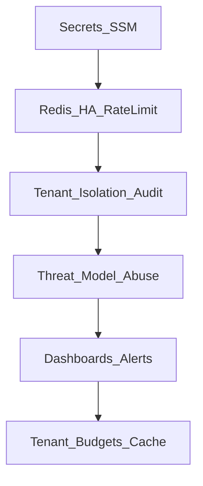

# Production hardening backlog

**Last updated:** 2026-05-19

Optional work to move from portfolio-grade reference architecture to campus-scale production. Shipped product phases: [roadmap/PRODUCT_ROADMAP.md](./roadmap/PRODUCT_ROADMAP.md). Campus-scale detail: [roadmap/archive/PHASED_IMPROVEMENT_ROADMAP.md](./roadmap/archive/PHASED_IMPROVEMENT_ROADMAP.md).

Priority: **P1** (before multi-tenant production) · **P2** (scale / cost) · **P3** (maturity / polish)

---

## Backlog

| Item | Priority | Risk if deferred | Mitigation | Status |
|------|----------|----------------|------------|--------|
| **Managed Redis HA** + distributed rate limits | P1 | Single-node rate limits; no shared session/cache at scale | Deploy ElastiCache / Azure Cache; wire `REDIS_URL`; extend rate-limit middleware | Planned — [PHASED_IMPROVEMENT_ROADMAP](./roadmap/archive/PHASED_IMPROVEMENT_ROADMAP.md) |
| **Secrets management** (SSM / Key Vault vs `.env` on EB) | P1 | Credential leakage, rotation pain | Move secrets to parameter store; document rotation runbook | Partial — `.env` + EB today |
| **Tenant isolation guarantees** | P1 | Cross-tenant data bleed in shared DB | Enforce `tenant_id` on all queries; audit routes; optional schema-per-tenant | Logical isolation today — [TENANT_CONFIG.md](./TENANT_CONFIG.md) |
| **Threat model + abuse controls** | P1 | Auth brute-force, chat spam, cost blowout | Document threat model in [SECURITY.md](./SECURITY.md); per-user quotas beyond IP rate limit | Partial — rate limits, HTTP-only cookies |
| **PII policy + log redaction audit** | P1 | Compliance exposure in logs/traces | Formal PII classification; verify redaction on chat/JWT fields; LangSmith data retention policy | Partial — redaction shipped in logging pass |
| **Observability dashboards + alerts** | P2 | Slow incident response | Grafana from Prometheus; alert on p95 latency, 5xx, pool exhaustion | Metrics endpoint shipped; dashboards optional |
| **Per-tenant token / cost budgets** | P2 | Runaway LLM spend | Budget counters in Redis; route to cheaper model on threshold | Planned — campus track Phase 4 |
| **Exact + semantic response cache** | P2 | Repeated queries hit Bedrock every time | Redis cache keyed by `(tenant_id, normalized_question)` with TTL | Planned — campus track Phase 1 |
| **IaC (Terraform / CDK)** | P2 | Drift between EB `.ebextensions` and prod | Codify VPC, EB, OpenSearch, Bedrock KB wiring | Partial — EB config in repo |
| **Async ingestion / KB sync cadence** | P2 | Stale corpus; recall drops | Scheduled sync jobs; invalidation hooks for cache | AWS-managed via Bedrock KB connectors |
| **Queueing for long RAG paths** | P2 | Timeouts under load | Background worker for eval/heavy retrieve; SSE keep-alive | Not started |
| **Postgres DR / backup posture** | P2 | Data loss on failure | Automated backups, restore drill, RPO/RTO doc | Operator-dependent |
| **LangGraph-native SSE** (Phase 6a) | P3 | Higher TTFT on graph path | `astream_events` from graph; same SSE contract as chain | Optional — [LANGGRAPH.md](./roadmap/LANGGRAPH.md) |
| **Expand RAGAS golden set** (10 → 30–50) | P3 | Thin regression signal | Bootstrap + manual curation; tag by topic/difficulty | 10 rows today |
| **RAG service lifecycle** (singleton vs per-request) | P3 | Latency / connection churn | Document tradeoff; optional app-state singleton with config refresh | Per-request construction today |
| **Chain vs LangGraph consolidation** | P3 | Dual maintenance | Keep both until 6a; deprecate chain when graph streams | Explicit ADR — [ADR-002](./adr/ADR-002-langgraph-vs-chain.md) |

---

## Suggested hardening sequence

1. **Secrets + Redis** — foundation for distributed limits and cache.
2. **Tenant audit + threat model** — governance before wider rollout.
3. **Observability + cost** — operability at scale.

---

## Portfolio polish follow-ups (not code)

Tracked here so hiring readers see intentional scope boundaries:

| Follow-up | Why deferred | Owner action |
|-----------|--------------|--------------|
| **90-second demo GIF/video** | Needs running app + recording | Record login → chat → sources → web toggle → LangSmith |
| **Polished UI screenshot set** | Current shots are functional, not marketing-polished | Clean session history; deliberate sample questions |
| **Golden set 10 → 30–50** | Requires live AWS + judge LLM time | `./scripts/bootstrap_golden_dataset.py` + review |

---

## Related

- [OPERATIONS.md](./OPERATIONS.md) — runbooks, metrics, migrations
- [SECURITY.md](./SECURITY.md) — dependency audit, production notes
- [PERFORMANCE.md](./PERFORMANCE.md) — history caps, latency metrics
- [LOAD_TESTING.md](./LOAD_TESTING.md) — k6 profiles
- [PORTFOLIO_CASE_STUDY.md](./PORTFOLIO_CASE_STUDY.md) — what ships today vs backlog
