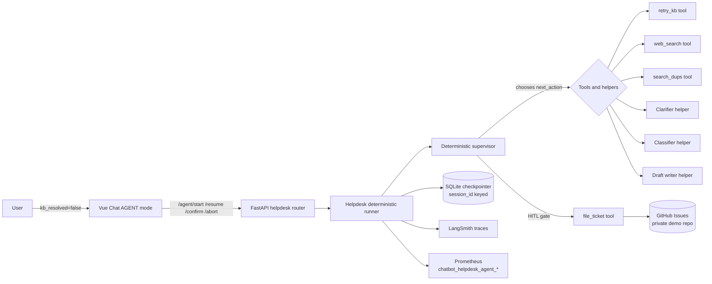

# Helpdesk Agent

A bounded **multi-turn helpdesk capability** that picks up where RAG cannot, exposed in the Vue UI as **AGENT mode** on top of the same FastAPI backend and RAG provider stack.

> **Why this section exists separately.** The helpdesk capability is a deliberate piece of agentic engineering, not a roadmap item. The two specs below — product UX contract and engineering spec — are the canonical references. The summary on this page is the entry point.

## What it does

When the KB path cannot resolve a question, instead of dead-ending the user the system can:

1. **Retry retrieval** with a rewritten query (`retry_kb`).
2. **Search the open web** for verified guidance (`web_search`).
3. **Search existing GitHub issues** for an in-flight fix or duplicate (`search_dups`).
4. **Pause and ask** a clarifying question if information is missing.
5. **Draft a structured ticket** and gate filing on **explicit human review** (HITL).
6. **File the ticket** to a private demo GitHub repo via `POST /api/helpdesk/agent/confirm` — never silently.

Every session terminates in exactly one of four explicit outcomes: `resolved_by_agent`, `linked`, `filed`, or `aborted`.

## Architecture at a glance

## Bounded by design

| Boundary | Mechanism |
|---|---|
| **Loop length** | Hard turn cap (`HELPDESK_AGENT_MAX_TURNS`) |
| **Clarifying questions** | Per-session cap (`HELPDESK_AGENT_MAX_QUESTIONS`) |
| **KB / web retries** | Read-tool attempt cap (`HELPDESK_AGENT_MAX_TOOL_RETRIES`) |
| **Token spend / deadline** | Per-session token estimate and wall-clock caps |
| **Per-user quota** | Per-user-per-day session cap |
| **Kill switch** | `HELPDESK_AGENT_KILL_SWITCH` disables all agent endpoints with a single env flip |
| **HITL** | `file_ticket` reachable only via `/agent/confirm` — never auto-files |
| **Privacy** | `services/helpdesk/redaction.py` strips emails / JWTs / cloud keys / GitHub tokens both before LLM calls and again immediately before posting to GitHub |

## Today vs target state

The shipped helpdesk loop is real, observable, multi-turn, and HITL-gated, but the supervisor that picks `next_action` is currently a **deterministic 3-branch routine** (not an LLM). The [Agentic Helpdesk Rebuild](../roadmap/AGENTIC_HELPDESK_REBUILD.md) is the live forward-looking plan that swaps the routine for a real LLM supervisor + Pydantic-structured-output specialists on top of a compiled `StateGraph` + `AsyncPostgresSaver` checkpointer.

| Capability | Shipped on `main` (v3.0.0) | Target (Agentic Rebuild) |
|---|---|---|
| Tool calls (`retry_kb`, `web_search`, `search_dups`, `file_ticket`) | Yes | Yes — wrapped as LangGraph `@tool` |
| Multi-turn pause / resume via clarifying questions | Yes | Yes — via LangGraph `interrupt()` |
| HITL gate on `file_ticket` (only via `/agent/confirm`) | Yes | Yes (invariant) |
| Four terminal outcomes (`resolved_by_agent` / `linked` / `filed` / `aborted`) | Yes | Yes |
| Redaction of PII / cloud keys / GitHub tokens before LLM + before GitHub | Yes | Yes (Phase 0 extends to all tool inputs) |
| Prometheus metrics (`chatbot_helpdesk_agent_*`) | Yes | Yes (Phase 3 adds decision / latency / tokens histograms) |
| LangSmith spans | Yes (canned SSE status) | Phase 3 — real `astream_events` per node + tool |
| Supervisor picks `next_action` | Deterministic 3-branch routine | LLM supervisor with `with_structured_output(SupervisorDecision)` (Phase 2) |
| Specialists (Clarifier / Classifier / Writer / Solution) | Hand-coded helpers | LLM nodes with focused prompts (Phase 2) |
| `StateGraph` compiled with conditional edges | No — hand-coded `runner.py` | Phase 1a |
| Checkpointer | Custom JSON-on-SQLite | `AsyncPostgresSaver` keyed by `chat_session_id`, schema owned by Alembic (Phase 1b) |
| Hard budget enforcement (turns, questions, retries, tokens, deadline) | Yes — Phase 0 guardrails | Phase 3 adds provider token accounting and richer metrics |
| Trajectory eval (`test_helpdesk_agent_scenarios.py`) | Scenario rig as designed | Phase 4 — mock-CI gate + live-nightly comparison |
| Campus router (`classify_domain`) | Not built | Phase 5 — LLM domain router with capability registry |

Roadmap source of truth: [docs/roadmap/AGENTIC_HELPDESK_REBUILD.md](../roadmap/AGENTIC_HELPDESK_REBUILD.md). Decision record: [ADR-005](../adr/ADR-005-bounded-helpdesk-agent.md) (original commitment) and [ADR-006](../adr/ADR-006-live-llm-supervisor-migration.md) (rebuild supersession).

## Where to read more

| Goal | Doc |
|---|---|
| Product / UX contract (ASK vs AGENT, intent routing, modal review) | [Conversation Flow](../roadmap/CONVERSATION_FLOW.md) |
| Engineering detail (graph, supervisor, tools, specialists, budgets, eval rig) | [Helpdesk Agent — engineering spec](../roadmap/HELPDESK_AGENT.md) |
| Live API surface | [Architecture — Helpdesk capabilities (post-RAG)](../ARCHITECTURE.md#helpdesk-capabilities-post-rag) |
| Architecture decision and tradeoffs | [ADR-005 — Bounded helpdesk agent](../adr/ADR-005-bounded-helpdesk-agent.md) |
| Privacy / kill switch / redaction | [Security](../operations-manual/security.md) |
| Runtime flags and metrics | [Operations](../operations-manual/operations.md) |
| Scenario-based evaluation | [Evaluation — Helpdesk agent evaluation](../EVALUATION.md#helpdesk-agent-evaluation) |

## Try it without cloud credentials

The supervisor follows a **deterministic scripted plan** in mock mode (`provider.is_mock`) tied to the sentinel query:

> `Oracle Financials 403 error on budget reports`

This makes the full multi-turn flow — clarifying question, draft, HITL confirm, ticket filing to a fake GitHub stub — demo-able with `RAG_FORCE_MOCK=true` and no AWS or GitHub credentials. See the [engineering spec](../roadmap/HELPDESK_AGENT.md) for the exact scripted transitions.
