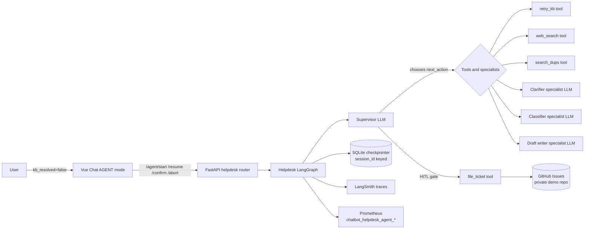

# Helpdesk Agent

A bounded **LangGraph multi-turn agent** that picks up where RAG cannot. Implemented on `main` (PRs #37–#43) and exposed in the Vue UI as **AGENT mode**.

> **Why this section exists separately.** The helpdesk capability is a deliberate piece of agentic engineering, not a roadmap item. The two specs below — product UX contract and engineering spec — are the canonical references. The summary on this page is the entry point.

## What it does

When the KB path cannot resolve a question, instead of dead-ending the user the system can:

1. **Retry retrieval** with a rewritten query (`retry_kb`).
2. **Search the open web** for verified guidance (`web_search`).
3. **Search existing GitHub issues** for an in-flight fix or duplicate (`search_dups`).
4. **Pause and ask** a clarifying question if information is missing.
5. **Draft a structured ticket** and gate filing on **explicit human review** (HITL).
6. **File the ticket** to a private demo GitHub repo via `POST /api/helpdesk/agent/confirm` — never silently.

Every session terminates in exactly one of four explicit outcomes: `resolved_by_agent`, `linked`, `filed`, or `aborted`.

## Architecture at a glance

## Bounded by design

| Boundary | Mechanism |
|---|---|
| **Loop length** | Hard supervisor-step cap (`HELPDESK_AGENT_MAX_STEPS`) |
| **Clarifying questions** | Per-session cap |
| **KB / web / dup retries** | Independent per-tool budgets |
| **Token spend** | Per-session token cap |
| **Per-user quota** | Per-user-per-day session cap |
| **Kill switch** | `HELPDESK_AGENT_KILL_SWITCH` disables all agent endpoints with a single env flip |
| **HITL** | `file_ticket` reachable only via `/agent/confirm` — never auto-files |
| **Privacy** | `services/helpdesk/redaction.py` strips emails / JWTs / cloud keys / GitHub tokens both before LLM calls and again immediately before posting to GitHub |

## Where to read more

| Goal | Doc |
|---|---|
| Product / UX contract (ASK vs AGENT, intent routing, modal review) | [Conversation Flow](../roadmap/CONVERSATION_FLOW.md) |
| Engineering detail (graph, supervisor, tools, specialists, budgets, eval rig) | [Helpdesk Agent — engineering spec](../roadmap/HELPDESK_AGENT.md) |
| Live API surface | [Architecture — Helpdesk capabilities (post-RAG)](../ARCHITECTURE.md#helpdesk-capabilities-post-rag) |
| Architecture decision and tradeoffs | [ADR-005 — Bounded helpdesk agent](../adr/ADR-005-bounded-helpdesk-agent.md) |
| Privacy / kill switch / redaction | [Security](../SECURITY.md) |
| Runtime flags and metrics | [Operations](../OPERATIONS.md) |
| Scenario-based evaluation | [Evaluation — Helpdesk agent evaluation](../EVALUATION.md#helpdesk-agent-evaluation) |

## Try it without cloud credentials

The supervisor follows a **deterministic scripted plan** in mock mode (`provider.is_mock`) tied to the sentinel query:

> `Oracle Financials 403 error on budget reports`

This makes the full multi-turn flow — clarifying question, draft, HITL confirm, ticket filing to a fake GitHub stub — demo-able with `RAG_FORCE_MOCK=true` and no AWS or GitHub credentials. See the [engineering spec](../roadmap/HELPDESK_AGENT.md) for the exact scripted transitions.
