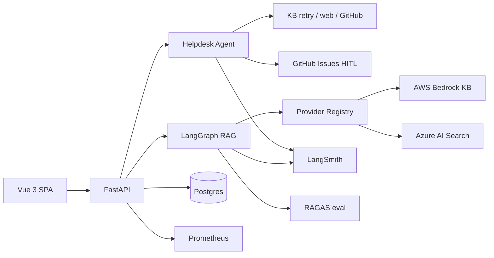

# Campus RAG Assistant

[](https://github.com/sandeep-jay/campus-rag-assistant/actions/workflows/ci.yml)
[](https://sandeep-jay.github.io/campus-rag-assistant/)
[](license.md)
[](https://github.com/sandeep-jay/campus-rag-assistant/blob/main/pyproject.toml)
[](https://github.com/sandeep-jay/campus-rag-assistant/blob/main/frontend-vue/.nvmrc)
[](https://github.com/sandeep-jay/campus-rag-assistant/blob/main/backend/app/main.py)
[](DESIGN.md#langgraph-kb-path-multi-query-retrieve-rerank)
[](EVALUATION.md)

Campus RAG Assistant is a source-reviewable AI platform for governed campus knowledge. It combines a
cited-answer RAG path with LangGraph agentic helpdesk orchestration: when the knowledge base cannot
resolve a question, the agent can retry retrieval, use controlled web research, search GitHub issues
for duplicates, draft a ticket, and file to GitHub only after human confirmation. The system runs
behind one FastAPI backend and Vue 3 SPA with AWS / Azure / mock providers, RAGAS evaluation,
LangSmith and Prometheus observability, CI/security gates, redaction, and HITL guardrails for
responsible AI.

!!! note "Review model"
    Review it as an engineering artifact: source code, architecture, screenshots, evaluation
    results, observability, CI/CD, security posture, and release hygiene. It is not
    presented as a hosted public product.

**[View source on GitHub ->](https://github.com/sandeep-jay/campus-rag-assistant)**


## Start here

| Goal | Start here |
|---|---|
| 90-second overview | [Reviewer Guide](REVIEWER_GUIDE.md) |
| Ownership and product judgment | [Case Study](PORTFOLIO_CASE_STUDY.md) |
| System design | [Architecture](ARCHITECTURE.md) + [Design Notes](DESIGN.md) |
| RAG quality | [Evaluation](EVALUATION.md) + [Baseline](eval_baseline_v2.md) |
| Agentic orchestration | [Helpdesk overview](helpdesk/index.md) + [ADR-005](adr/ADR-005-bounded-helpdesk-agent.md) + [ADR-006](adr/ADR-006-live-llm-supervisor-migration.md) |
| Operations and security | [Operations Manual](operations-manual/index.md) |

## What this shows

| Capability | What it shows | Evidence |
|---|---|---|
| **Cited RAG path** | LangGraph retrieval stages, KB-first answers, multi-query retrieval, rerank hooks, source contracts, and opt-in web research | [DESIGN.md](DESIGN.md) · [EVALUATION.md](EVALUATION.md) · [ADR-001](adr/ADR-001-provider-registry.md) · [ADR-003](adr/ADR-003-opt-in-web-research.md) |
| **Agentic helpdesk orchestration** | Bounded LangGraph escalation with KB retry, web research, GitHub duplicate search, GitHub ticket drafting/filing, clarifying turns, redaction, HITL confirmation, and four explicit outcomes | [Helpdesk overview](helpdesk/index.md) · [ADR-005](adr/ADR-005-bounded-helpdesk-agent.md) · [ADR-006](adr/ADR-006-live-llm-supervisor-migration.md) |
| **AI platform architecture** | One FastAPI + Vue product surface over AWS / Azure / mock providers, tenant configuration, feature flags, migrations, and CI-safe local mode | [ARCHITECTURE.md](ARCHITECTURE.md) · [ADR-001](adr/ADR-001-provider-registry.md) |
| **Evaluation, observability, and responsible AI** | RAGAS baseline, LangSmith traces, Prometheus metrics, k6 load profiles, gitleaks, protected branches, redaction, and human approval before side effects | [eval_baseline_v2.md](eval_baseline_v2.md) · [operations-manual/index.md](operations-manual/index.md) · [ADR-004](adr/ADR-004-eval-gating-policy.md) |

## Architecture



Design detail: [Architecture](ARCHITECTURE.md) and [Design Notes](DESIGN.md).

## Screenshots

### Knowledge-base answer


### Source transparency


### Opt-in web research


### LangSmith trace


### Helpdesk agent (v3)


More assets: [screenshots catalog](assets/README.md).

## Quality baseline

The project includes a **RAGAS golden-set harness** and a documented v2 retrieval baseline. Phase 5 retrieval tuning improved AWS **context recall to 0.800**, passing the retrieval coverage gate. **Context precision** remains the main improvement target.

This is an engineering baseline, not a marketing claim. Strict RAGAS gates are release controls, not blockers for local demo or ordinary PR CI.

Read more: [Evaluation approach](EVALUATION.md) and [baseline scores](eval_baseline_v2.md).

## Stack

| Layer | Technologies |
|-------|--------------|
| **Backend** | FastAPI, SQLAlchemy, Alembic, JWT auth, rate limiting, Prometheus metrics |
| **Frontend** | Vue 3, TypeScript, Pinia, Tailwind, Vitest, Playwright |
| **RAG orchestration** | LangGraph (`RAG_ENGINE=langgraph`) or LangChain `ConversationalRetrievalChain` (`RAG_ENGINE=chain`) |
| **Retrieval** | Bedrock KB / OpenSearch Serverless, Azure AI Search, multi-query + RRF, optional rerank |
| **LLM** | AWS Bedrock, Azure OpenAI, or mock provider |
| **Web search** | Mock or Tavily behind `research_mode=web` |
| **Eval** | RAGAS golden dataset, `tox -e eval`, LangSmith traces |
| **CI/CD** | GitHub Actions, tox, gitleaks, dependency review, no tool attribution, optional EB deploy |

## Feature availability

| Configuration | What works |
|---------------|------------|
| **No cloud keys** (`RAG_FORCE_MOCK=true`) | Register/login, chat UX, streaming path, source panel, feedback, local tests |
| **AWS Bedrock KB** | Managed KB retrieval, Bedrock generation, LangGraph retrieval stages, LangSmith trace capture |
| **Azure OpenAI + AI Search** | Azure provider path with vector/keyword/hybrid retrieval and cited answers |
| **Web research enabled** | Per-message web mode with disclaimer UI and WEB-labeled sources (`mock` or Tavily) |
| **OAuth configured** | GitHub OAuth handoff to Vue; Google-ready provider config |
| **Eval keys available** | RAGAS golden-set runs, release quality gates, LangSmith trace inspection |

## Getting started

```bash
python3 -m venv venv && source venv/bin/activate
pip install -r requirements.txt
cp .env.example .env
# set RAG_FORCE_MOCK=true, LLM_PROVIDER=mock, RETRIEVER_PROVIDER=mock
createdb chatbot_dev
alembic upgrade head
PIP_SYNC=0 ./scripts/run-backend-venv.sh          # http://127.0.0.1:8000
./scripts/run-frontend-vue.sh          # http://127.0.0.1:5173
```

Register a user and start a chat. Responses use the mock provider unless you configure live AWS/Azure providers.

## Origin and Scope

This repository builds from the public [`ets-berkeley-edu/chabot`](https://github.com/ets-berkeley-edu/chabot) codebase and substantially extends it as an independent portfolio and educational project. The work here focuses on the AI platform surface: Vue product UI, provider abstraction, LangGraph orchestration, RAGAS evaluation, LangSmith observability, CI/CD, load testing, and operational documentation. It is not an official UC Berkeley or UC product.

See [Notice](notice.md) for attribution details.

## License

Software in this repository is licensed under the [Regents of the University of California](license.md) terms. See [Notice](notice.md) for attribution details. Commercial use requires an agreement with UC OTL.
