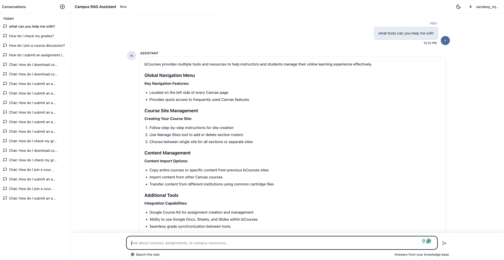
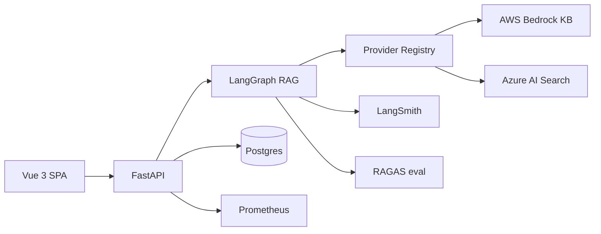
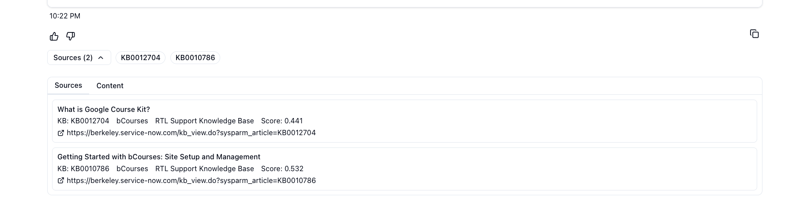
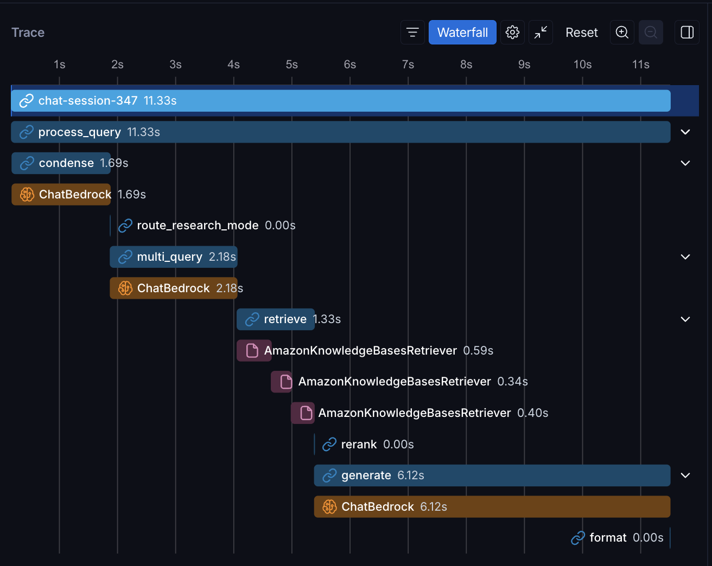

# Campus RAG Assistant

[](https://github.com/sandeep-jay/campus-rag-assistant/actions/workflows/ci.yml)
[](license.md)
[](https://github.com/sandeep-jay/campus-rag-assistant/blob/main/pyproject.toml)
[](https://github.com/sandeep-jay/campus-rag-assistant/blob/main/frontend-vue/.nvmrc)
[](https://github.com/sandeep-jay/campus-rag-assistant/blob/main/backend/app/main.py)
[](roadmap/LANGGRAPH.md)
[](EVALUATION.md)

**Production-style enterprise RAG platform for governed campus knowledge.**

Campus RAG Assistant demonstrates how institutional knowledge can be served through a measurable, observable, citation-first RAG platform plus bounded **agentic orchestration** (a multi-turn helpdesk agent with HITL ticket filing). It combines a Vue product UI, FastAPI backend, AWS / Azure / mock provider boundaries, LangGraph orchestration, RAGAS evaluation, LangSmith traces, CI/CD, load testing, and operational hardening docs.

**Portfolio focus:** Lead AI Engineering and AI Platform Architecture. The full surface area is designed to demonstrate strengths relevant to:

- Higher Education / EdTech AI Strategist
- Lead Data & AI Platform Architect
- Lead / Senior / Staff AI Engineer
- GenAI Platform Engineer
- Applied ML / LLMOps Engineer
- Full Stack Engineer

!!! note "Review model"
    This project is evaluated through source code, architecture docs, screenshots, evaluation results, and operational artifacts. It is not presented as a hosted public product.

**[View source on GitHub ->](https://github.com/sandeep-jay/campus-rag-assistant)**



## Start here

| If you are... | Read |
|---|---|
| Short on time | [Reviewer Guide](REVIEWER_GUIDE.md) |
| Evaluating ownership and judgment | [Case Study](PORTFOLIO_CASE_STUDY.md) |
| Reviewing architecture | [Architecture](ARCHITECTURE.md) + [Design Notes](DESIGN.md) |
| Reviewing AI quality | [Evaluation](EVALUATION.md) + [Baseline](eval_baseline_2026-05-19.md) |
| Reviewing agentic orchestration | [Helpdesk Agent overview](helpdesk/index.md) -> [Conversation Flow](roadmap/CONVERSATION_FLOW.md) (product spec) + [Engineering Spec](roadmap/HELPDESK_AGENT.md) + [ADR-005](adr/ADR-005-bounded-helpdesk-agent.md) |
| Reviewing production maturity | [CI/CD](CI.md) + [Operations](OPERATIONS.md) + [Security](SECURITY.md) |

## Senior engineering signals

| Area | Signal |
|---|---|
| Platform architecture | Provider registry isolates AWS, Azure, and mock execution modes |
| RAG orchestration | LangGraph exposes retrieval stages for tuning and traceability |
| Evaluation | RAGAS baseline is documented honestly, with gates used as release controls |
| Observability | LangSmith spans, Prometheus metrics, request IDs, structured logs |
| Product judgment | KB-first answers, cited sources, opt-in web research, visible disclaimer |
| Agentic depth | Bounded LangGraph helpdesk agent with HITL ticket filing — [Conversation Flow](roadmap/CONVERSATION_FLOW.md), [Helpdesk Agent](roadmap/HELPDESK_AGENT.md) |
| CI safety | Mock providers allow tests without cloud credentials |

## What this shows

| Layer | What is demonstrated |
|-------|----------------------|
| **Product** | Governed KB-first chat, cited sources, opt-in web research, feedback loop, and campus-ready UX |
| **RAG engineering** | LangGraph retrieval stages, multi-query retrieval, rerank hooks, fallback chain streaming, and explicit source contracts |
| **Platform architecture** | AWS/Azure/mock provider registry, tenant config, feature flags, Alembic migrations, and CI-safe local mode |
| **Evaluation** | RAGAS golden-set regression harness, documented Phase 5 baseline, and LangSmith traces for KB/web paths |
| **Helpdesk agent** | Multi-turn LangGraph escalation with KB retry, web search, duplicate-issue search, and HITL ticket filing to a demo GitHub repo |
| **Operations** | GitHub Actions, gitleaks, dependency review, no tool attribution, Prometheus metrics, k6 load tests, release docs, and runbooks |

## Quality baseline

The project includes a **RAGAS golden-set harness** and a documented baseline. Phase 5 retrieval tuning improved AWS **context recall to 0.800**, passing the retrieval coverage gate. **Context precision** remains the main improvement target; next work focuses on ingestion/chunking and rerank tuning.

This is intentionally presented as an engineering baseline, not a marketing claim. Strict RAGAS gates are release controls, not blockers for local demo or ordinary PR CI.

Read more: [Evaluation approach](EVALUATION.md) and [baseline scores](eval_baseline_2026-05-19.md).

## Architecture



Design detail: [Architecture](ARCHITECTURE.md) and [Design Notes](DESIGN.md).

## Documentation

| Visitor | Best entry point |
|---------|------------------|
| New here | This page |
| Hiring / portfolio reviewer | [Case Study](PORTFOLIO_CASE_STUDY.md) |
| Architecture reviewer | [Architecture](ARCHITECTURE.md), [Design Notes](DESIGN.md), [ADRs](adr/README.md) |
| Agentic orchestration reviewer | [Helpdesk Agent overview](helpdesk/index.md), [Conversation Flow](roadmap/CONVERSATION_FLOW.md), [Engineering Spec](roadmap/HELPDESK_AGENT.md), [ADR-005](adr/ADR-005-bounded-helpdesk-agent.md) |
| Evaluation reviewer | [Evaluation Approach](EVALUATION.md), [Evaluation Baseline](eval_baseline_2026-05-19.md) |
| Operations reviewer | [Operations](OPERATIONS.md), [CI/CD](CI.md), [Release](RELEASE.md), [Security](SECURITY.md) |
| Product demo reviewer | [Screenshots and demo script](assets/README.md) |
| Roadmap reviewer | [Product Roadmap](roadmap/PRODUCT_ROADMAP.md) |

## Screenshots

### Knowledge-base answer


### Source transparency



### Opt-in web research


### LangSmith trace



More assets: [screenshots catalog](assets/README.md).

## Stack

| Layer | Technologies |
|-------|--------------|
| **Backend** | FastAPI, SQLAlchemy, Alembic, JWT auth, rate limiting, Prometheus metrics |
| **Frontend** | Vue 3, TypeScript, Pinia, Tailwind, Vitest, Playwright |
| **RAG orchestration** | LangGraph (`RAG_ENGINE=langgraph`) or LangChain `ConversationalRetrievalChain` (`RAG_ENGINE=chain`) |
| **Retrieval** | Bedrock KB / OpenSearch Serverless, Azure AI Search, multi-query + RRF, optional rerank |
| **LLM** | AWS Bedrock, Azure OpenAI, or mock provider |
| **Web search** | Mock or Tavily behind `research_mode=web` |
| **Eval** | RAGAS golden dataset, `tox -e eval`, LangSmith traces |
| **CI/CD** | GitHub Actions, tox, gitleaks, dependency review, no tool attribution, optional EB deploy |

## Feature availability

| Configuration | What works |
|---------------|------------|
| **No cloud keys** (`RAG_FORCE_MOCK=true`) | Register/login, chat UX, streaming path, source panel, feedback, local tests |
| **AWS Bedrock KB** | Managed KB retrieval, Bedrock generation, LangGraph retrieval stages, LangSmith trace capture |
| **Azure OpenAI + AI Search** | Azure provider path with vector/keyword/hybrid retrieval and cited answers |
| **Web research enabled** | Per-message web mode with disclaimer UI and WEB-labeled sources (`mock` or Tavily) |
| **OAuth configured** | GitHub OAuth handoff to Vue; Google-ready provider config |
| **Eval keys available** | RAGAS golden-set runs, release quality gates, LangSmith trace inspection |

## Getting started

```bash
python3 -m venv venv && source venv/bin/activate
pip install -r requirements.txt
cp .env.example .env
# set RAG_FORCE_MOCK=true, LLM_PROVIDER=mock, RETRIEVER_PROVIDER=mock
createdb chatbot_dev
alembic upgrade head
PIP_SYNC=0 ./scripts/run-backend-venv.sh          # http://127.0.0.1:8000
./scripts/run-frontend-vue.sh          # http://127.0.0.1:5173
```

Register a user and start a chat. Responses use the mock provider unless you configure live AWS/Azure providers.

## Review artifacts

| Artifact | Status |
|---|---|
| Source code | Implemented |
| Vue product UI screenshots | Included |
| Local mock execution path | Implemented |
| AWS Bedrock KB path | Implemented |
| Azure AI Search / OpenAI path | Implemented |
| RAGAS baseline | Documented |
| LangSmith traces | Captured in screenshots |
| Public hosted product | Not claimed |
| Official campus deployment | Not claimed |

## Origin and Scope

This repository builds from the public [`ets-berkeley-edu/chabot`](https://github.com/ets-berkeley-edu/chabot) codebase and substantially extends it as an independent portfolio and educational project. The work here focuses on the AI platform surface: Vue product UI, provider abstraction, LangGraph orchestration, RAGAS evaluation, LangSmith observability, CI/CD, load testing, and operational documentation. It is not an official UC Berkeley or UC product.

See [Notice](notice.md) for attribution details.

## License

Software in this repository is licensed under the [Regents of the University of California](license.md) terms. See [Notice](notice.md) for attribution details. Commercial use requires an agreement with UC OTL.
