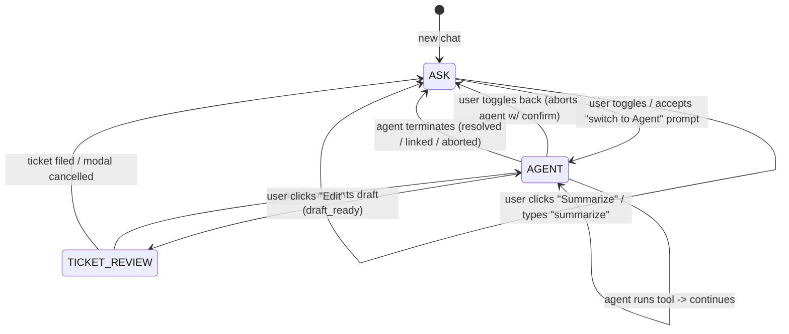

# Conversation flow — modes, intent, and cross-mode behavior

Product spec for the end-to-end chatbot experience. The helpdesk agent is one
capability inside this shape, not the shape itself. Engineering details for
the agent live in [HELPDESK_AGENT.md](./HELPDESK_AGENT.md).

**Status (2026-05-27):** Implemented on `main` (PRs #37–#43). This document is the product/UX contract for ASK vs AGENT behavior.

---

## Why two modes

Today the chatbot is a single mode: "ask questions, get RAG answers." Adding
helpdesk capabilities raises a UX question — should helpdesk actions
(filing tickets, searching the web, multi-turn troubleshooting) live in the
same mode as plain Q&A?

Best practice (Cursor, GitHub Copilot Chat, Claude Desktop) is to split when
capabilities have **meaningfully different side effects, cost, or latency**.
Here they do:

| | Plain Q&A | Helpdesk |
|---|---|---|
| **Side effects** | None — pure read | Files GitHub issues, searches web, may suggest fixes |
| **Latency** | Single LLM call + retrieval | Multi-turn supervisor loop |
| **Cost** | One model call per turn | Many model + tool calls per session |
| **Failure cost** | Wrong answer; user retries | Wrong ticket filed; pages on-call |

So we split: **Ask mode** (default) and **Agent mode** (opt-in).

---

## The three modes

A chat session is always in exactly one mode at a time:

| Mode | Mental model | Default? | Side effects allowed |
|---|---|---|---|
| **ASK** | "Answer questions from your knowledge base." | yes | none |
| **AGENT** | "Help me figure this out. Use tools. Ask if you need to." | no — opt-in | controlled (HITL gated for ticket filing) |
| **TICKET_REVIEW** | Modal-over-chat draft review. Reachable only from AGENT. | n/a — transient | tied to the gated file-issue action |

ASK and AGENT are top-level. `TICKET_REVIEW` is a transient sub-state of
AGENT (the modal). The user is in one of these at any moment; everything
the UI offers is a function of the current mode.

### Mode capabilities

| Capability | ASK | AGENT |
|---|---|---|
| Ask questions (RAG, KB or web) | yes | yes |
| Conversation history / multi-turn chat | yes | yes |
| Source viewer | yes | yes |
| Feedback | yes | yes |
| **Summarize utility** (no side effects) | yes | yes |
| Research-mode toggle (`kb` / `web`) | yes — explicit | hidden — agent decides |
| Create a ticket directly | no — prompts "switch to Agent for this?" | yes |
| Get help (multi-turn helpdesk agent) | no — same prompt | yes |
| Tool calls (`retry_kb`, `web_search`, `search_existing_issues`, `file_ticket`) | no | yes |
| LLM intent classifier | never runs | runs only when needed |

This table is the contract.

### Mode persistence

- Mode is **per chat session**, stored on the chat record (`mode: ask | agent`).
- Re-opening a chat restores its mode.
- New chats default to ASK.
- The header has a small segmented toggle next to the chat title (same
  affordance pattern as the existing KB/Web research toggle).

---

## State diagram



Three nodes, ten edges, all explicit. There are no implicit mode changes —
every transition has a user action behind it.

---

## Per-message routing (the intent router)

In **ASK mode**, the chat input is straight-through to RAG. No intent
classifier ever runs. This keeps the happy path cheap and predictable.

In **AGENT mode**, a layered pipeline decides what each user message means.
Whichever layer fires first wins — no further routing happens.

### Layer 1 — Stateful (~zero latency)

If `helpdeskSession.status === awaiting_user`, the message is the user's
reply to the agent's pending question. Routes to `POST /agent/resume`.

This is the layer that prevents *"Production, started this morning"* from
being misread as a brand-new RAG question.

### Layer 2 — Explicit chip / action click (zero latency)

When the user clicks a chip (`Get help`, `Create a ticket`, `Summarize`,
`Cancel`, agent-question choices), the frontend hits the corresponding
endpoint directly. No classifier needed — the action was specified.

### Layer 3 — Deterministic phrase shortcuts (zero latency, regex)

A small fixed set, English-only for now:

| Phrase pattern (case-insensitive) | Routes to |
|---|---|
| `^(summari[sz]e|recap|tl;?dr)( this| the (conversation|chat))?\??$` | `/api/helpdesk/summarize` |
| `(create|open|file|raise)( a)? (ticket|issue|case)` | `/api/helpdesk/draft-ticket` |
| `(get help|help me (with this|troubleshoot)|i need help)` | `/api/helpdesk/agent/start` |
| `^(cancel|stop|abort|nevermind)\.?$` (only when agent active) | `/api/helpdesk/agent/abort` |

Narrow on purpose — false positives default to Layer 5.

### Layer 4 — Hint pre-filter (free)

If no shortcut matched, decide whether the LLM classifier is even worth
running. Cheap signal:

```python
HINT_TOKENS = {"ticket", "issue", "file", "create", "open", "raise",
               "help", "troubleshoot", "summarize", "recap", "cancel"}

if not any(tok in message.lower().split() for tok in HINT_TOKENS):
    return Intent("answer_question", confidence=1.0)  # skip classifier
```

Messages like *"What's the FAFSA deadline?"*, *"How do I reset my password?"*
never trip a hint token and go straight to RAG with zero added latency.

### Layer 5 — LLM intent classifier (small cost, ~200–400 ms)

Only ambiguous messages that contain hint tokens but didn't match a
deterministic shortcut reach here. Calling shape:

- Smallest model the provider offers (Haiku tier).
- Low temperature, structured JSON output.
- Short prompt with 6–8 examples per intent.
- Returns `{intent, confidence, reason}`.
- **Confidence floor (0.7)** below which we default to `answer_question`.

### Cost summary

For 100 user messages in an Agent-mode chat, roughly:

| Layer | Hit rate | LLM cost | Latency added |
|---|---|---|---|
| 1 | varies (high when agent paused) | none | none |
| 2 | varies (whenever a chip is clicked) | none | none |
| 3 | small (~5–10%) | none | <1ms |
| 4 | most (~80–90%) | none | <1ms |
| 5 | small (~5–10% of typed messages) | one cheap call | ~200–400ms |

In ASK mode: 100% straight-through to RAG, zero routing cost.

---

## Chips and the chat input — one UX language

We use chips (multiple-choice buttons rendered inline in chat) consistently
at every decision point. The chat input is always available alongside chips
for free-form replies.

### Chips after `kb_resolved=false` (suggested next actions)

**ASK mode:**

> I couldn't find a confident answer. Want me to try something else?
>
> [Summarize what we discussed] [Switch to Agent mode for help]
>
> *or keep typing.*

**AGENT mode:**

> I couldn't find a confident answer. Want me to try something else?
>
> [Get help] [Create a ticket] [Summarize]
>
> *or keep typing.*

### Chips inside agent clarifying questions

```
Which environment are you seeing this in?

[Production] [Staging] [Dev] [Not sure]

or describe it in your own words.
```

Tap a chip then reply equals chip text. Type freely then reply equals
free-form. Either way the same `/agent/resume` call.

### Chips on agent-proposed solutions

```
Here's what I think might help: <excerpt + source link>

[Yes, that solved it] [No, doesn't apply] [Tried it, didn't work]

or tell me what happened.
```

`Yes` then outcome `resolved_by_agent` (no ticket). `No` / `Tried it` then
continue toward draft. Free-form then next supervisor turn.

### Chips on pre-file confirmation

```
Ready to file this ticket?

[File it] [Edit first] [Add more context] [Cancel]

or tell me what to change.
```

`File it` is the only path that actually files. This is the **HITL gate** —
the agent *never* files without an explicit user confirmation here.

---

## Cross-mode concerns

These are things that don't belong to any single mode but have to be
defined or the product gets weird.

### 1. Chat-switching mid-agent session

If the user clicks a different chat from the sidebar while in AGENT mode
with an active session:

> Helpdesk session in progress.
>
> [Pause and switch chat] [Cancel session and switch] [Stay here]

`Pause` keeps the checkpointer alive — they can return later and resume.
`Cancel` aborts the agent.

### 2. Research-mode toggle in AGENT mode

The KB/Web toggle in the chat header is **hidden** when mode is AGENT.
The agent owns that decision via its `retry_kb` and `web_search` tools.
A user-facing toggle would be confusing ("who's deciding?").

In ASK mode, the toggle works as today.

### 3. Cancel button (global affordance)

When in AGENT mode with an active session, a sticky banner at the top of
the chat reads:

> Helpdesk session in progress — *[Cancel session]*

One-click escape from any agent state. Aborts cleanly.

### 4. Notifications when the user navigated away

If the agent is awaiting user input and the user switches chats and then
returns, the chat shows a non-modal banner:

> The helpdesk agent is waiting for your reply.

The chips for the pending question remain rendered on the last assistant
message; the banner just draws attention.

### 5. Auth expiry mid-session

If `/agent/resume` returns 401, the frontend re-auths (existing OAuth /
local flow) and retries the call. Checkpointed state survives the round-trip.

### 6. Conversation context budget

Both RAG (condense node) and AGENT (supervisor LLM) consume conversation
history. Long chats (50+ turns) risk blowing past context windows. We use
a unified history budget:

- Hard cap: last `HELPDESK_SUMMARIZE_MAX_TURNS` (currently 6) turns sent
  to any helpdesk LLM call (already implemented).
- RAG condense node continues to summarize history when context exceeds
  its own budget (already implemented).
- AGENT supervisor sees only the last N turns plus accumulated agent state
  (questions asked, replies, tool results).

### 7. Starter prompts / discoverability *(P1, deferred from initial cut)*

On a fresh chat, render 3–4 example prompts:

- "What's the FAFSA deadline?" (RAG-friendly)
- "Help me troubleshoot Oracle Financials" (advertises Agent mode)
- "Summarize my last conversation" (advertises summarize)

This is the cheapest way to make non-Ask capabilities discoverable.

### 8. Telemetry funnel

End-to-end metrics, not just helpdesk-internal:

```
questions_asked
  -> answers_shown
    -> kb_resolved=true rate
    -> kb_resolved=false rate
      -> escalations_started (Agent mode opted into)
        -> questions_asked_by_agent
        -> tools_invoked (by tool)
        -> resolved_by_agent rate
        -> tickets_filed rate
        -> linked_to_existing rate
        -> aborted rate
```

Each step is a Prometheus counter so funnel analysis works in Grafana.

### 9. Empty or very short conversations

If the user opens AGENT mode and clicks **Get help** before sending any
RAG question, the agent's first turn is a clarifier ("Tell me what's
going on") rather than a summary attempt over an empty history.

### 10. Agent service degradation

If `/agent/start` returns 5xx or times out, the chat shows a non-modal
banner: *"Helpdesk agent is temporarily unavailable — try again later."*
The chat input remains usable in ASK-mode behavior so the user isn't
locked out of basic Q&A.

### 11. Mobile / narrow viewports

- Chips wrap to multiple rows; no horizontal scroll.
- Ticket modal becomes full-screen below 640px.
- The sticky "session in progress" banner collapses to an icon with a
  long-press affordance for cancel.

### 12. Paste size cap

Pasting more than `HELPDESK_CHAT_INPUT_MAX_CHARS` (default 10 000) into
the chat input triggers a toast: *"Message too long — pasted content
was truncated."* Prevents an accidental log dump from blowing the LLM
context budget.

### 13. Two-tab race on the same chat

If the user has the same chat open in two tabs and both submit
`/agent/resume` for the same pending question, the server uses an
optimistic-concurrency check on `(session_id, pending_question_id)`.
The second tab gets HTTP 409 with the current state; the frontend
reconciles by reloading the session and showing a small toast
*"this chat advanced in another tab."*

### 14. Accessibility

- Chips: `role="button"`, focusable in tab order, activated by Enter or
  Space, visible focus ring.
- Mode toggle: `role="switch"` with `aria-checked`; keyboard-switchable
  via Space; focus returns to chat input after a toggle.
- Banners (session in progress, agent waiting for you):
  `role="status"` with `aria-live="polite"`.
- Ticket modal: focus trapped, `aria-modal="true"`, return focus to the
  triggering element on close (already implemented).
- Honor `prefers-reduced-motion`: chip enter/exit and SSE step
  indicators use opacity transitions rather than translate when the
  user has opted out of motion.


---

## Decisions locked

1. **Default mode: ASK.**
2. **Mode persistence: per chat session**, restored on reopen.
3. **Switching ASK -> AGENT: single toggle click is enough.**
   Confirmation only when there's pending state being abandoned.
4. **Switching AGENT -> ASK mid-session: requires confirmation** (aborts the
   in-flight agent).
5. **KB/Web research toggle: hidden in AGENT mode.**
6. **Chips are suggestions, never gates.** Free-form typing always works.
7. **"Continue the conversation" button: dropped.** Implicit via typing.
8. **HITL gate**: the agent never files without an explicit "File it" click.

---

## What this design eliminates from earlier sketches

- The 4-button escalation card -> replaced with mode-aware chip suggestions.
- The "Continue the conversation" button -> implicit via typing.
- Global LLM intent classifier on every message -> only in AGENT mode, only
  when ambiguous.
- "Free-form text inside the escalation card" -> the chat input *is* the
  free-form input.

---

## Open work

This document only declares the product shape. Engineering details live in:

- [HELPDESK_AGENT.md](./HELPDESK_AGENT.md) — agent graph, tools, specialists,
  HITL gate, budgets, P0/P1 hardening, mock-mode behavior, phasing.
- [LANGGRAPH.md](./LANGGRAPH.md) — RAG graph (unchanged by this design).
- [WEB_RESEARCH.md](./WEB_RESEARCH.md) — KB vs. web research-mode internals
  (unchanged in ASK; subsumed by the agent's tool selection in AGENT).
