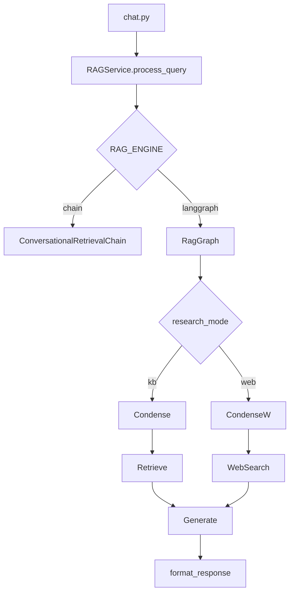

# LangGraph integration

Deterministic RAG orchestration behind `RAGService.process_query` — **not** multi-agent by default.

**Status:** In progress — see [TODAY_SPRINT.md](./TODAY_SPRINT.md).

**Order:** Phase 4 (this doc) **before** Phase 3 RAGAS gates. Web branch: [WEB_RESEARCH.md](./WEB_RESEARCH.md).

---

## Why LangGraph here

| Benefit | Notes |
|---------|--------|
| Explicit steps | condense → retrieve → generate → format |
| Web branch | `research_mode=web` → web_search tool node |
| Testability | Unit test each node |
| LangSmith | Per-node spans |
| Extensibility | Phase 5 adds rerank / multi-query as nodes |

LangChain runs **inside each node** (`llm.invoke`, `retriever.invoke`).

---

## Architecture (KB + web)



**Contract:**

```json
{ "message": "...", "metadata": { "sources": [], "document_contents": [], "source_kind": "kb" } }
```

---

## Module layout

```
backend/app/services/graph/
  state.py
  nodes.py
  graph.py
  runner.py
backend/app/services/tools/
  web_search.py
```

---

## Configuration

```bash
RAG_ENGINE=chain              # chain | langgraph (default chain)
WEB_RESEARCH_ENABLED=false
WEB_SEARCH_PROVIDER=mock      # mock | tavily
RAG_AGENTIC_ENABLED=false     # rewrite loop — later
```

---

## Today MVP scope

| In scope | Out of scope |
|----------|----------------|
| Buffered `process_query` on graph | LangGraph SSE |
| KB linear path + web branch | RAGAS ±0.02 gate |
| Mock web search | Delete chain path |
| Unit tests (mock) | Auto web without user flag |

---

## Rollout

| Step | Action |
|------|--------|
| 1 | Graph module + `RAG_ENGINE` (default `chain`) |
| 2 | Wire `process_query`; tests green |
| 3 | Web tool + `research_mode` |
| 4 | Optional: flip default to `langgraph` after spot-check |

Full RAGAS parity: Phase 3 lite (deferred).

---

## Related

- [TODAY_SPRINT.md](./TODAY_SPRINT.md)
- [WEB_RESEARCH.md](./WEB_RESEARCH.md)
- [PORTFOLIO_PHASED_ROADMAP.md](./PORTFOLIO_PHASED_ROADMAP.md)
- [EVALUATION.md](../EVALUATION.md)
