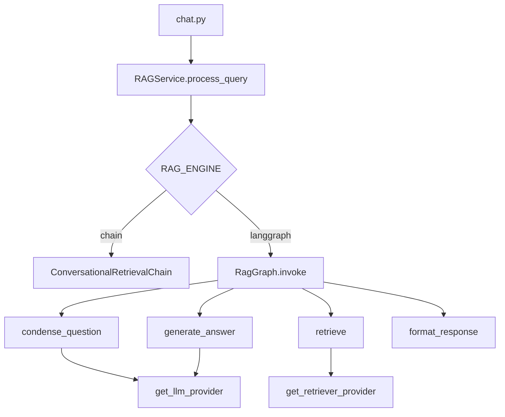

# LangGraph integration

Deterministic RAG orchestration behind `RAGService.process_query` — **not** multi-agent by default.

**Status:** Not implemented — design and rollout plan only.

**Roadmap:** Portfolio [Phase 4](./PORTFOLIO_PHASED_ROADMAP.md#phase-4--langgraph-deterministic-parity); bounded agentic in [Phase 6](./PORTFOLIO_PHASED_ROADMAP.md#phase-6--optional-streaming-and-bounded-agentic).

---

## Why LangGraph here

| Benefit | Notes |
|---------|--------|
| Explicit steps | condense → retrieve → generate → format |
| Testability | Unit test each node |
| LangSmith | Per-node spans (vs one opaque chain) |
| Extensibility | Phase 5 adds multi-query, rerank as nodes |
| Streaming | `astream_events` for SSE (Phase 6) |

**Parity graph does not improve RAGAS by itself** — same prompts/retriever, clearer structure.

LangChain still runs **inside each node** (`llm.invoke`, `retriever.invoke` via providers).

---

## Architecture



**Stable contract:**

```json
{ "message": "...", "metadata": { "sources": [], "document_contents": [] } }
```

---

## Module layout

```
backend/app/services/graph/
  state.py    # TypedDict / state schema
  nodes.py    # condense, retrieve, generate, format
  graph.py    # build_rag_graph()
  runner.py   # run_rag_graph(query, chat_history)
```

**Prerequisite:** `rag.py` uses `get_llm_provider()` and `get_retriever_provider()` (PR4a).

---

## Configuration

```bash
RAG_ENGINE=chain          # chain | langgraph
RAG_AGENTIC_ENABLED=false # Phase 6 only
```

---

## Rollout

| Step | Action |
|------|--------|
| 1 | PR4a — wire providers in `rag.py` |
| 2 | PR4b — add graph module; flag default `chain` |
| 3 | Tests + RAGAS within ±0.02 of chain |
| 4 | PR4c — default `langgraph`; remove chain when confident |

---

## Phase 6 agentic (deferred)

Conditional edges, **hard caps** (max one rewrite). **Not** multi-agent.

Org roadmap "graph-augmented retrieval" = knowledge **graph** (entities), not LangGraph the library.

---

## Related

- [EVALUATION.md](../EVALUATION.md)
- [PORTFOLIO_PHASED_ROADMAP.md](./PORTFOLIO_PHASED_ROADMAP.md)
- [changelog/PR_PLAN.md](../EXECUTION_PLAN.md)
