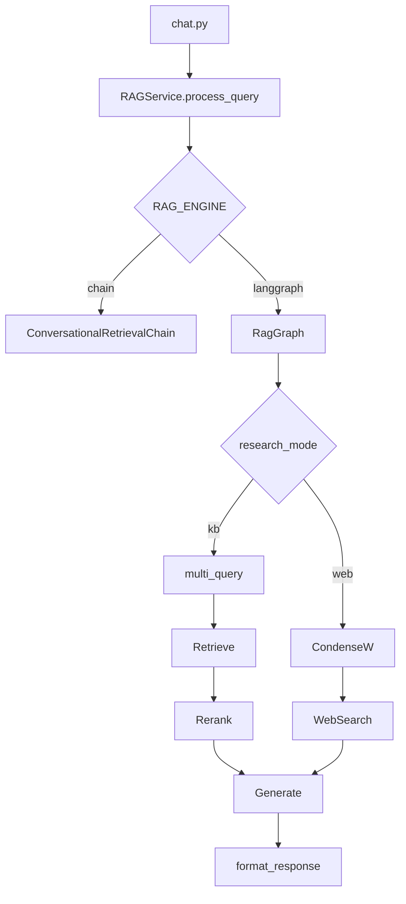

# LangGraph integration

Deterministic RAG orchestration behind `RAGService.process_query` — **not** multi-agent by default.

**Status (2026-05-19):** Shipped on live AWS KB. Retrieval stack (multi-query, metadata filters, rerank) implemented as graph nodes. Web branch: [WEB_RESEARCH.md](./WEB_RESEARCH.md).

---

## Why LangGraph here

| Benefit | Notes |
|---------|--------|
| Explicit steps | KB: condense → multi_query → retrieve → rerank → generate → format |
| Web branch | `research_mode=web` → web_search tool node |
| Testability | Unit test each node |
| LangSmith | Per-node spans |
| Extensibility | Rerank / multi-query as nodes (shipped) |

LangChain runs **inside each node** (`llm.invoke`, `retriever.invoke`).

---

## Architecture (KB + web)



**Contract:**

```json
{ "message": "...", "metadata": { "sources": [], "document_contents": [], "source_kind": "kb" } }
```

---

## Module layout

```
backend/app/services/graph/
  state.py
  nodes.py
  graph.py
  runner.py
backend/app/services/tools/
  web_search.py
```

---

## KB path (retrieval stack)

```text
condense → multi_query → retrieve → rerank → generate → format
```

| Node | Flags |
|------|--------|
| multi_query | `MULTI_QUERY_ENABLED`, `MULTI_QUERY_COUNT` |
| retrieve | `METADATA_FILTER_*`, fetches `RERANK_CANDIDATE_K` when rerank on |
| rerank | `RERANK_ENABLED`, `RERANK_BACKEND` (`flashrank` or `keyword`) |

Web branch skips rerank: `condense → web_search → generate → format`.

Tuned eval profile: `./scripts/run_eval_phase5.sh` — see [eval_baseline_2026-05-19.md](../eval_baseline_2026-05-19.md).

---

## Configuration

```bash
RAG_ENGINE=chain              # chain | langgraph (default chain)
WEB_RESEARCH_ENABLED=false
WEB_SEARCH_PROVIDER=mock      # mock | tavily
RAG_AGENTIC_ENABLED=false     # rewrite loop — optional Phase 6
```

---

## Streaming and follow-ups

- **SSE today:** status event + paced token chunks after `graph.invoke()` (simulated streaming).
- **Phase 6a (optional):** wire LangGraph `astream_events` to the same SSE shape as the chain path.
- **Latency (LangSmith):** Typical run ~4–8s — `generate` dominates; `retrieve` ~0.5s. See [PRODUCT_ROADMAP.md](./PRODUCT_ROADMAP.md).

---

## Related

- [WEB_RESEARCH.md](./WEB_RESEARCH.md)
- [PRODUCT_ROADMAP.md](./PRODUCT_ROADMAP.md)
- [EVALUATION.md](../EVALUATION.md)
- [archive/SPRINT_2026-05-18_LANGGRAPH.md](./archive/SPRINT_2026-05-18_LANGGRAPH.md) — sprint log
