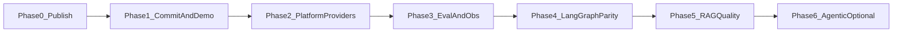

# Portfolio phased roadmap

**Last updated:** 2026-05-17  
**Audience:** Independent continuation of the RAG chatbot (portfolio edition).  
**Supersedes for portfolio work:** execution order and priorities here; campus-scale items remain in [PHASED_IMPROVEMENT_ROADMAP.md](./PHASED_IMPROVEMENT_ROADMAP.md).

This roadmap reflects: **standalone GitHub repo** (not a fork badge), **logical commits** before push, **mock-first demo**, **RAGAS quality gates**, **LangGraph as deterministic orchestration** (not multi-agent by default), and **optional bounded agentic** only after metrics are stable.

---

## Goals

| Goal | How we measure success |
|------|-------------------------|
| **Portfolio-ready demo** | Clone → mock mode → login → chat with sources in <15 min |
| **Credible AI engineering** | Providers, RAGAS harness, LangSmith traces, optional LangGraph |
| **JD alignment** | LangGraph, eval discipline, full-stack Vue — without Phase-5 agent swarms |
| **Clean repo story** | New repo or detached fork; README attribution; LICENSE retained |

---

## Phase map (high level)



| Phase | Focus | High ROI? |
|-------|--------|-----------|
| **0** | Repo hygiene, detach fork, rename, LICENSE/NOTICE | **Yes** — do first |
| **1** | Commit pending work; mock demo; README/video | **Yes** |
| **2** | Wire platform middleware; providers + `rag.py` | **Yes** |
| **3** | RAGAS golden set; LangSmith; metrics/SLOs sketch | **Yes** |
| **4** | LangGraph parity graph (`RAG_ENGINE`); per-node traces | **High** for AI-leaning roles |
| **5** | Retrieval quality nodes (multi-query, rerank, filters) | **High** for answer quality |
| **6** | Bounded agentic graph; streaming SSE | **Medium** — after RAGAS stable |

Campus production concerns (Redis HA, tenant budgets, Elastic Beanstalk) stay in [PHASED_IMPROVEMENT_ROADMAP.md](./PHASED_IMPROVEMENT_ROADMAP.md) Phases 1–4 org track.

---

## Phase 0 — Publish as standalone portfolio repo

**Goal:** No "forked from" badge; clear attribution; safe public tree.

### 0a. GitHub repository

- Create repo via **New repository** — **do not** use Fork.
- Or: existing fork → **Settings → Danger zone → Leave fork network**.
- See [PORTFOLIO.md](../PORTFOLIO.md) for copy-vs-detach steps.

### 0b. Naming and README

- Rename project in README (e.g. *Campus RAG Assistant*).
- State: built for UC Berkeley ETS; **independent portfolio continuation**; not endorsed by UC.
- Keep root `LICENSE` and Regents copyright headers in existing files.

### 0c. Hygiene (before any `git add`)

Exclude secrets and generated artifacts (see [PR_PLAN.md](../EXECUTION_PLAN.md#hygiene-before-staging)):

- `frontend-vue/.env.local`, coverage, playwright-report, test-results, `e2e/.auth/`
- Root `.env` with real keys

Commit `.env.example` / `frontend-vue/.env.test` only.

---

## Phase 1 — Land pending work and demo

**Goal:** All untracked work committed in dependency order; reviewers can run the app.

### 1a. Logical commits

Follow [EXECUTION_PLAN.md](../EXECUTION_PLAN.md) commits **1–13** (tooling → Alembic → platform+wiring → providers/RAG → eval → Vue → Streamlit → load-tests → docs).

**Critical:** Platform commit must **wire** `main.py`, `auth.py`, `chat.py`. Provider commit must **wire** `rag.py` to `get_llm_provider()` / `get_retriever_provider()`.

### 1b. Mock-first demo

- `RAG_FORCE_MOCK=true` or `LLM_PROVIDER=mock` / `RETRIEVER_PROVIDER=mock`
- One **hero question** in README with expected sources behavior
- Optional: 30–60s screen recording

### 1c. Resume / portfolio bullets

- Full-stack RAG chatbot (FastAPI, Vue 3, sessions, cited sources)
- Provider abstraction (AWS / Azure / mock)
- RAGAS evaluation harness

---

## Phase 2 — Verify platform + provider integration

**Goal:** Confirm commits 4–8 from [EXECUTION_PLAN.md](../EXECUTION_PLAN.md) are wired and green. Most work lands in **Phase 1 commits**; this phase is validation and any follow-up fixes.

| Deliverable | Paths / notes |
|-------------|----------------|
| Request context | `request_context.py` + tests + middleware |
| Metrics | `metrics.py` + Prometheus endpoint |
| Rate limiting | `rate_limit.py` on auth/chat routers |
| Dev routes | `dev_routes.py` behind env flag |
| Provider registry | `backend/app/services/providers/` |
| RAG wiring | `rag.py` uses registry, not direct Bedrock only |

**Exit criteria:** `tox` / pytest green; API tests pass with mocked RAG.

Maps to [PR_PLAN](../EXECUTION_PLAN.md) PR3 + PR4a.

---

## Phase 3 — Evaluation and observability (RAGAS + LangSmith)

**Goal:** Prove quality and debuggability — **not** interchangeable tools.

| Tool | Role |
|------|------|
| **RAGAS** | CI/release **quality gates** on golden dataset (`backend/tests/eval/`) |
| **LangSmith** | **Tracing** per request/node (`LANGCHAIN_TRACING_V2`, `@trace_rag`) |

See [EVALUATION.md](../EVALUATION.md).

### 3a. RAGAS

- Grow `golden_dataset.json` (5–20 real domain Q&A).
- Baseline scores with `tox -e eval` or `pytest backend/tests/eval/`.
- Gate defaults: faithfulness ≥ 0.85, answer_relevancy ≥ 0.80, context_recall ≥ 0.75, context_precision ≥ 0.70 (`RAGAS_QUALITY_GATE=1` on release branches).

### 3b. LangSmith

- Screenshot/trace of one chat turn in README.
- Name runs by `session_id` / `message_id` when wiring request context.

### 3c. Ops sketch

- Document `X-Request-ID`, metrics URL, mock vs live providers in `.env.example`.
- Optional: k6 smoke (login + chat) per [LOAD_TESTING.md](../LOAD_TESTING.md).

**Exit criteria:** Eval runs locally; trace visible; README "Quality" section.

---

## Phase 4 — LangGraph (deterministic parity)

**Goal:** Explicit RAG pipeline for tests, traces, and future nodes — **same** `{ message, metadata }` contract.

**Not in scope:** Multi-agent swarms; unbounded tool loops.

### 4a. Module layout

```
backend/app/services/graph/
  state.py      # question, chat_history, documents, answer, metadata
  nodes.py      # condense, retrieve, generate, format
  graph.py      # StateGraph: linear edges
  runner.py     # run_rag_graph() → process_query shape
```

Each node calls **LangChain** primitives (`llm.invoke`, `retriever.invoke`) via providers.

### 4b. Feature flag

```bash
RAG_ENGINE=chain      # default until RAGAS parity
RAG_ENGINE=langgraph
```

### 4c. Exit criteria

- Unit tests per node + graph runner tests.
- RAGAS within **±0.02** of chain on full golden set.
- LangSmith shows **condense / retrieve / generate** spans.
- Then flip default to `langgraph`; remove chain in follow-up when confident.

Detail: [LANGGRAPH.md](./LANGGRAPH.md).

Maps to PR4b–4c in [PR_PLAN](../EXECUTION_PLAN.md).

---

## Phase 5 — RAG quality (graph nodes + retrieval)

**Goal:** Measurable retrieval improvements — primary quality ROI after publish.

| Item | Graph placement | Primary RAGAS metric |
|------|-----------------|----------------------|
| Metadata filters | Before / during retrieve | context_precision |
| Multi-query + fusion | Between condense and retrieve | context_recall |
| Rerank (FlashRank / managed) | After retrieve, before generate | context_precision |
| Chunking / ingestion docs | Outside runtime | context_recall |

Add nodes to the **same** LangGraph; do not reintroduce monolithic chain.

**Exit criteria:** Primary metric improves on golden set; faithfulness guardrail holds.

Aligns with org roadmap Phase 2 in [PHASED_IMPROVEMENT_ROADMAP.md](./PHASED_IMPROVEMENT_ROADMAP.md).

---

## Phase 6 — Optional: streaming and bounded agentic

**Only after Phase 5 RAGAS stable week-over-week.**

### 6a. SSE streaming

> **Status:** `/api/chat/stream` is not in the codebase yet; org roadmap lists streaming as in-flight. Implement endpoint + Vue consumer before or with this phase.

- `graph.astream_events` + `get_streaming_llm()`
- Align Vue / E2E with `/api/chat/stream` contract

### 6b. Bounded agentic (`RAG_AGENTIC_ENABLED=false` default)

```text
route_query → condense → retrieve → grade_documents
  → (rewrite once max) → generate → format
```

- **Not** multi-agent — conditional edges with hard caps.
- Extra LLM calls: monitor p95 latency and cost.

### 6c. JD keywords without overbuilding

- One optional **tool** (e.g. `search_kb`) if needed for demos.
- README: deterministic default; agentic opt-in.

---

## Evaluation scorecard (per change)

| Field | Example |
|-------|---------|
| Change | LangGraph parity / multi-query node |
| Phase | 4 / 5 |
| Primary metric | context_recall |
| Guardrails | faithfulness ≥ 0.85; p95 < 3s |
| Command | `tox -e eval` with `RAG_ENGINE=langgraph` |
| Ship? | yes / flag-only / no |

---

## What to defer (portfolio)

| Defer | Why |
|-------|-----|
| Full multi-agent (researcher/critic/writer) | Cost, flakiness, weak demo |
| Knowledge-graph RAG | Only if hybrid RAG fails eval |
| Semantic cache | After exact cache + baselines |
| Production Redis HA / tenant budgets | Org roadmap, not portfolio v1 |
| Stripping UC LICENSE | Requires OTL permission; keep for public repo |

---

## Suggested timeline (solo, part-time)

| Weeks | Focus |
|-------|--------|
| 1 | Phase 0–1: repo + commits + mock demo README |
| 2 | Phase 2–3: verify wiring; RAGAS + LangSmith |
| 3 | Phase 4: LangGraph parity + eval gate |
| 4+ | Phase 5–6 as needed for target roles |

---

## Related docs

- [PR_PLAN.md](../EXECUTION_PLAN.md) — commit order, PR slices, remotes
- [PORTFOLIO.md](../PORTFOLIO.md) — fork detach, copy workflow
- [EVALUATION.md](../EVALUATION.md) — RAGAS vs LangSmith
- [LANGGRAPH.md](./LANGGRAPH.md) — graph design and flags
- [PHASED_IMPROVEMENT_ROADMAP.md](./PHASED_IMPROVEMENT_ROADMAP.md) — campus / scale track
