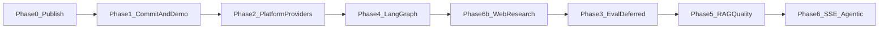

# Portfolio phased roadmap

**Last updated:** 2026-05-18  
**Audience:** Independent continuation of the RAG chatbot (portfolio edition).

**Publish and platform wiring are complete** on [`main`](https://github.com/sandeep-jay/campus-rag-assistant).

## Roadmap index

| Doc | Purpose |
|-----|---------|
| **This file** | Phases, priorities, timeline |
| [LANGGRAPH.md](./LANGGRAPH.md) | `RAG_ENGINE`, graph nodes, latency |
| [WEB_RESEARCH.md](./WEB_RESEARCH.md) | `research_mode=web` (Vue toggle + API) |
| [archive/SPRINT_2026-05-18_LANGGRAPH.md](./archive/SPRINT_2026-05-18_LANGGRAPH.md) | Completed AWS KB validation sprint |
| [archive/PHASED_IMPROVEMENT_ROADMAP.md](./archive/PHASED_IMPROVEMENT_ROADMAP.md) | Campus / production scale (Redis HA, EB) — optional |

## Quick dev commands

```bash
tox -e lint,backend,frontend-vue   # CI-style checks (mock RAG)
PIP_SYNC=0 ./scripts/run-backend-venv.sh
./scripts/run-frontend-vue.sh
```

CI: GitHub Actions on push/PR to `main` ([docs/CI.md](../CI.md)).

Live AWS / LangGraph: set `RAG_ENGINE=langgraph` in local `.env` only (not required for tox).

**Deferred:** full Phase 3 RAGAS gates (see Phase 3 below).

---

## Goals

| Goal | How we measure success |
|------|-------------------------|
| **Portfolio-ready demo** | Clone → mock mode → login → chat with sources in <15 min |
| **Credible AI engineering** | Providers, RAGAS harness, LangSmith traces, optional LangGraph |
| **JD alignment** | LangGraph, eval discipline, full-stack Vue — without Phase-5 agent swarms |
| **Clean repo story** | New repo or detached fork; README attribution; LICENSE retained |

---

## Phase map (high level)



| Phase | Focus | Status |
|-------|--------|--------|
| **0–2** | Publish repo, platform + providers + tox | **Done** |
| **4** | LangGraph KB graph (`RAG_ENGINE`); per-node traces | **Done** — live AWS KB parity; paced SSE ([LANGGRAPH.md](./LANGGRAPH.md)) |
| **6b** | Opt-in web research tool (`research_mode=web`) | **In progress** — same sprint |
| **3** | RAGAS gates; README quality section | **Deferred** — after graph + web MVP |
| **5** | Retrieval nodes (rerank, multi-query) | Planned |
| **6** | LangGraph SSE; bounded rewrite loop | Optional |

Campus production concerns (Redis HA, tenant budgets, Elastic Beanstalk) stay in [archive/PHASED_IMPROVEMENT_ROADMAP.md](./archive/PHASED_IMPROVEMENT_ROADMAP.md) Phases 1–4 org track.

---

## Completed on `main` (phases 0–2)

- **Repo:** [campus-rag-assistant](https://github.com/sandeep-jay/campus-rag-assistant); README attribution under [License](../../README.md#license); Regents `LICENSE` retained.
- **Platform:** request context, Prometheus metrics, rate limits, dev-only routes.
- **RAG:** provider registry wired in `rag.py` (AWS / Azure / mock); RAGAS harness under `backend/tests/eval/`.
- **Clients:** Vue 3 SPA, Streamlit; Alembic migrations; k6 load tests.
- **CI locally:** `tox -e lint,backend,frontend-streamlit,frontend-vue`.

---

## Phase 3 — Evaluation and observability (RAGAS + LangSmith) — **deferred**

**Goal:** Prove quality and debuggability — **not** interchangeable tools.

| Tool | Role |
|------|------|
| **RAGAS** | CI/release **quality gates** on golden dataset (`backend/tests/eval/`) |
| **LangSmith** | **Tracing** per request/node (`LANGCHAIN_TRACING_V2`, `@trace_rag`) |

See [EVALUATION.md](../EVALUATION.md).

### 3a. RAGAS

- Grow `golden_dataset.json` (5–20 real domain Q&A).
- Baseline scores with `tox -e eval` or `pytest backend/tests/eval/`.
- Gate defaults: faithfulness ≥ 0.85, answer_relevancy ≥ 0.80, context_recall ≥ 0.75, context_precision ≥ 0.70 (`RAGAS_QUALITY_GATE=1` on release branches).

### 3b. LangSmith

- Screenshot/trace of one chat turn in README.
- Name runs by `session_id` / `message_id` when wiring request context.

### 3c. Ops sketch

- Document `X-Request-ID`, metrics URL, mock vs live providers in `.env.example`.
- Optional: k6 smoke (login + chat) per [LOAD_TESTING.md](../LOAD_TESTING.md).

**Exit criteria:** Eval runs locally; trace visible; README "Quality" section.

> Run **after** Phase 4 + 6b MVP. LangSmith per-node traces ship **with LangGraph** (partial 3b).

---

## Phase 4 — LangGraph (deterministic parity)

**Goal:** Explicit RAG pipeline for tests, traces, and future nodes — **same** `{ message, metadata }` contract.

**Not in scope:** Multi-agent swarms; unbounded tool loops.

### 4a. Module layout

```
backend/app/services/graph/
  state.py      # question, chat_history, documents, answer, metadata
  nodes.py      # condense, retrieve, generate, format
  graph.py      # StateGraph: linear edges
  runner.py     # run_rag_graph() → process_query shape
```

Each node calls **LangChain** primitives (`llm.invoke`, `retriever.invoke`) via providers.

### 4b. Feature flag

```bash
RAG_ENGINE=chain      # default; flip after spot-check (RAGAS optional)
RAG_ENGINE=langgraph
```

### 4c. Exit criteria

- Unit tests per node + graph runner tests.
- RAGAS within **±0.02** of chain — **optional for portfolio sprint**; manual mock compare OK for today.
- LangSmith shows **condense / retrieve / generate** spans.
- Then flip default to `langgraph`; remove chain in follow-up when confident.

Detail: [LANGGRAPH.md](./LANGGRAPH.md).

See [LANGGRAPH.md](./LANGGRAPH.md) for rollout detail.

---

## Phase 5 — RAG quality (graph nodes + retrieval)

**Goal:** Measurable retrieval improvements — primary quality ROI after publish.

| Item | Graph placement | Primary RAGAS metric |
|------|-----------------|----------------------|
| Metadata filters | Before / during retrieve | context_precision |
| Multi-query + fusion | Between condense and retrieve | context_recall |
| Rerank (FlashRank / managed) | After retrieve, before generate | context_precision |
| Chunking / ingestion docs | Outside runtime | context_recall |

Add nodes to the **same** LangGraph; do not reintroduce monolithic chain.

**Exit criteria:** Primary metric improves on golden set; faithfulness guardrail holds.

Aligns with org roadmap Phase 2 in [archive/PHASED_IMPROVEMENT_ROADMAP.md](./archive/PHASED_IMPROVEMENT_ROADMAP.md).

---

## Phase 6b — Web research tool (opt-in) — **in today sprint**

**Goal:** User-selected public web search when KB is not the right source.

- `research_mode`: `kb` (default) | `web` on chat API + Vue toggle
- LangGraph branch: condense → `web_search` tool → generate → format
- Mock provider for demo; optional Tavily when `WEB_RESEARCH_ENABLED=true`
- Metadata: `source_kind`, `disclaimer`

Detail: [WEB_RESEARCH.md](./WEB_RESEARCH.md).

**Not:** silent auto-web; multi-agent; unbounded tool loops.

---

## Phase 6 — Optional: streaming and bounded agentic

**After Phase 5 or when SSE on graph is needed.**

### 6a. LangGraph streaming

> LangChain path already exposes `POST /api/chat/stream` (SSE). Phase 6a wires LangGraph `astream_events` to the same event shape.

### 6c. Bounded agentic (`RAG_AGENTIC_ENABLED=false` default)

```text
condense → retrieve → grade_documents → (rewrite once max) → generate → format
```

- **Not** multi-agent — conditional edges with hard caps.

---

## Evaluation scorecard (per change)

| Field | Example |
|-------|---------|
| Change | LangGraph parity / multi-query node |
| Phase | 4 / 5 |
| Primary metric | context_recall |
| Guardrails | faithfulness ≥ 0.85; p95 < 3s |
| Command | `tox -e eval` with `RAG_ENGINE=langgraph` |
| Ship? | yes / flag-only / no |

---

## What to defer (portfolio)

| Defer | Why |
|-------|-----|
| Full multi-agent (researcher/critic/writer) | Cost, flakiness, weak demo |
| Knowledge-graph RAG | Only if hybrid RAG fails eval |
| Semantic cache | After exact cache + baselines |
| Production Redis HA / tenant budgets | Org roadmap, not portfolio v1 |
| Stripping UC LICENSE | Requires OTL permission; keep for public repo |

---

## Suggested timeline

| When | Focus |
|------|--------|
| **Sprint archive** | [SPRINT_2026-05-18_LANGGRAPH.md](./archive/SPRINT_2026-05-18_LANGGRAPH.md) |
| **Next session** | Phase 3 lite — RAGAS spot-check; grow golden set |
| **Later** | Phase 5 retrieval nodes; Phase 6a SSE |

---

## Related docs

- [EVALUATION.md](../EVALUATION.md) — RAGAS vs LangSmith
- [LANGGRAPH.md](./LANGGRAPH.md) — graph design and flags
- [WEB_RESEARCH.md](./WEB_RESEARCH.md) — opt-in web tool
- [archive/PHASED_IMPROVEMENT_ROADMAP.md](./archive/PHASED_IMPROVEMENT_ROADMAP.md) — campus / scale track
- [README.md](../../README.md) — quick start and attribution
