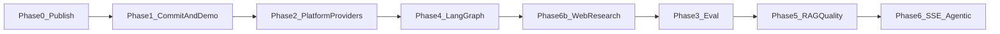

# Product phased roadmap

**Last updated:** 2026-05-19

Delivery phases for Campus RAG Assistant — what is shipped on [`main`](https://github.com/sandeep-jay/campus-rag-assistant) versus optional follow-ups. Design context: [DESIGN.md](../DESIGN.md).

## Roadmap index

| Doc | Purpose |
|-----|---------|
| **This file** | Phases, priorities, what’s next |
| [LANGGRAPH.md](./LANGGRAPH.md) | `RAG_ENGINE`, graph nodes, latency |
| [WEB_RESEARCH.md](./WEB_RESEARCH.md) | `research_mode=web` (Vue toggle + API) |
| [EVALUATION.md](../EVALUATION.md) | RAGAS vs LangSmith |
| [archive/SPRINT_2026-05-18_LANGGRAPH.md](./archive/SPRINT_2026-05-18_LANGGRAPH.md) | Completed AWS KB validation sprint (log) |
| [archive/PHASED_IMPROVEMENT_ROADMAP.md](./archive/PHASED_IMPROVEMENT_ROADMAP.md) | Campus / production scale (Redis HA, EB) — optional |

## Quick dev commands

```bash
tox -e lint,backend,frontend-vue   # CI-style checks (mock RAG)
PIP_SYNC=0 ./scripts/run-backend-venv.sh
./scripts/run-frontend-vue.sh
```

CI: GitHub Actions on push/PR to `main` ([docs/CI.md](../CI.md)). Live AWS / LangGraph: set `RAG_ENGINE=langgraph` in local `.env` only (not required for tox).

---

## Goals

| Goal | How we measure success |
|------|-------------------------|
| **Runnable without cloud** | Clone → mock mode → login → chat with sources in <15 min |
| **Credible AI engineering** | Providers, RAGAS harness, LangSmith traces, LangGraph |
| **Measurable quality** | RAGAS golden set, LangSmith traces, documented baselines |
| **Clean repo story** | README attribution; upstream `LICENSE` retained |

---

## Phase map



| Phase | Focus | Status |
|-------|--------|--------|
| **0–2** | Publish repo, platform + providers + tox | **Done** |
| **4** | LangGraph KB graph (`RAG_ENGINE`); per-node traces | **Done** — [LANGGRAPH.md](./LANGGRAPH.md) |
| **6b** | Opt-in web research (`research_mode=web`) | **Done** — [WEB_RESEARCH.md](./WEB_RESEARCH.md) |
| **3** | RAGAS baseline + README quality + LangSmith screenshots | **Done (lite)** — [EVALUATION.md](../EVALUATION.md); strict gates on release only |
| **5** | Retrieval nodes (multi-query, filters, rerank) | **Done** — re-run RAGAS for full gates ([baseline](../eval_baseline_2026-05-19.md)) |
| **6** | LangGraph SSE; bounded rewrite loop | **Optional** |

Campus production (Redis HA, tenant budgets, Elastic Beanstalk): [archive/PHASED_IMPROVEMENT_ROADMAP.md](./archive/PHASED_IMPROVEMENT_ROADMAP.md) (separate phase numbering).

---

## Completed on `main` (summary)

- **Repo:** [campus-rag-assistant](https://github.com/sandeep-jay/campus-rag-assistant); README + screenshots; [docs/assets/README.md](../assets/README.md) demo script.
- **Platform:** request context, Prometheus, rate limits, Alembic, Vue 3 + Streamlit, k6.
- **RAG:** provider registry; `RAG_ENGINE=langgraph` with condense → multi_query → retrieve → rerank → generate (KB); web branch with disclaimer.
- **Eval:** 10-row golden set, [eval_baseline_2026-05-19.md](../eval_baseline_2026-05-19.md), `tox -e eval`, LangSmith trace PNGs in README.
- **OAuth (local):** API-port OAuth + handoff to Vue — [PRODUCTION_TLS.md](../PRODUCTION_TLS.md).

---

## Phase 3 — Evaluation (done, lite)

| Tool | Role |
|------|------|
| **RAGAS** | Golden dataset + baseline; `RAGAS_QUALITY_GATE=1` on release |
| **LangSmith** | Per-node traces; screenshots in README Quality section |

Detail: [EVALUATION.md](../EVALUATION.md).

---

## Phase 4 — LangGraph (done)

Explicit RAG pipeline; same `{ message, metadata }` contract as chain. Detail: [LANGGRAPH.md](./LANGGRAPH.md). Sprint log: [archive/SPRINT_2026-05-18_LANGGRAPH.md](./archive/SPRINT_2026-05-18_LANGGRAPH.md).

---

## Phase 5 — RAG quality (done)

| Item | Status |
|------|--------|
| Multi-query + RRF fusion | Shipped |
| Metadata filters | Shipped |
| Rerank node (FlashRank + keyword) | Shipped |
| RAGAS tuned run | [eval_baseline_2026-05-19.md](../eval_baseline_2026-05-19.md) — recall passes; faithfulness/precision below gate |

**Optional next:** ingestion/chunking, stricter RAGAS gates, chain vs graph parity run.

---

## Phase 6b — Web research (done)

Opt-in `research_mode=web`, Tavily optional, disclaimer UI. [WEB_RESEARCH.md](./WEB_RESEARCH.md).

---

## Phase 6 — Optional

| Slice | Description |
|-------|-------------|
| **6a** | LangGraph `astream_events` → same SSE shape as chain |
| **6c** | Bounded `grade_documents` / rewrite loop (`RAG_AGENTIC_ENABLED`) |
| **6d** | Helpdesk agent — multi-turn, multi-tool LangGraph; ASK / AGENT mode split; intent router; HITL ticket filing. See [CONVERSATION_FLOW.md](./CONVERSATION_FLOW.md) and [HELPDESK_AGENT.md](./HELPDESK_AGENT.md). |

---

## What to defer

| Defer | Why |
|-------|-----|
| Multi-agent swarms | Cost, flakiness |
| Knowledge-graph RAG | Only if hybrid RAG fails eval |
| Semantic cache | After exact cache + baselines (campus track) |
| Production Redis HA / tenant budgets | Org roadmap |
| Stripping UC LICENSE | Requires OTL permission |

---

## What’s next

| Priority | Focus |
|----------|--------|
| **Now** | Ship product increments; optional branch protection on `main` |
| **Optional** | Phase 6a LangGraph SSE; grow golden set; faithfulness/precision via ingestion |
| **Later** | Campus scale track — [PHASED_IMPROVEMENT_ROADMAP.md](./archive/PHASED_IMPROVEMENT_ROADMAP.md) |

---

## Related docs

- [README.md](../../README.md) — quick start
- [PERFORMANCE.md](../PERFORMANCE.md) — campus perf track (Phase 0 shipped)
- [changelog/CHANGELOG.md](../../changelog/CHANGELOG.md)
