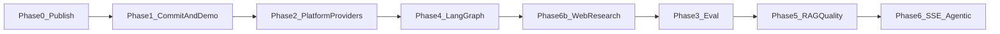

# Product phased roadmap

**Last updated:** 2026-05-31

Delivery phases for Campus RAG Assistant — what is shipped on [`main`](https://github.com/sandeep-jay/campus-rag-assistant) versus optional follow-ups. Design context: [DESIGN.md](../DESIGN.md).

## Roadmap index

| Doc | Purpose |
|-----|---------|
| **This file** | Phases, priorities, what’s next |
| [DESIGN.md — LangGraph KB path](../DESIGN.md#langgraph-kb-path-multi-query--retrieve--rerank) | `RAG_ENGINE`, graph nodes, latency, config flags |
| [DESIGN.md — Opt-in web research](../DESIGN.md#opt-in-web-research) | `research_mode=web` (Vue toggle + API), Tavily config |
| [EVALUATION.md](../EVALUATION.md) | RAGAS vs LangSmith |
| [archive/SPRINT_2026-05-18_LANGGRAPH.md](./archive/SPRINT_2026-05-18_LANGGRAPH.md) | Completed AWS KB validation sprint (log) |
| [AGENTIC_HELPDESK_REBUILD.md](./AGENTIC_HELPDESK_REBUILD.md) | LLM supervisor migration, Postgres checkpointing, trajectory eval — **live track** |
| [archive/PHASED_IMPROVEMENT_ROADMAP.md](./archive/PHASED_IMPROVEMENT_ROADMAP.md) | Campus / production scale (Redis HA, EB) — optional |

## Quick dev commands

```bash
tox -e lint,backend,frontend-vue   # CI-style checks (mock RAG)
PIP_SYNC=0 ./scripts/run-backend-venv.sh
./scripts/run-frontend-vue.sh
```

CI: GitHub Actions on push/PR to `main` ([docs/CI.md](../CI.md)). Live AWS / LangGraph: set `RAG_ENGINE=langgraph` in local `.env` only (not required for tox).

---

## Goals

| Goal | How we measure success |
|------|-------------------------|
| **Runnable without cloud** | Clone → mock mode → login → chat with sources in <15 min |
| **Credible AI engineering** | Providers, RAGAS harness, LangSmith traces, LangGraph |
| **Measurable quality** | RAGAS golden set, LangSmith traces, documented baselines |
| **Clean repo story** | README attribution; upstream `LICENSE` retained |

---

## Phase map



| Phase | Focus | Status |
|-------|--------|--------|
| **0–2** | Publish repo, platform + providers + tox | **Done** |
| **4** | LangGraph KB graph (`RAG_ENGINE`); per-node traces | **Done** — [DESIGN.md — LangGraph KB path](../DESIGN.md#langgraph-kb-path-multi-query--retrieve--rerank) |
| **6b** | Opt-in web research (`research_mode=web`) | **Done** — [DESIGN.md — Opt-in web research](../DESIGN.md#opt-in-web-research) |
| **3** | RAGAS baseline + README quality + LangSmith screenshots | **Done (lite)** — [EVALUATION.md](../EVALUATION.md); strict gates on release only |
| **5** | Retrieval nodes (multi-query, filters, rerank) | **Done** — re-run RAGAS for full gates ([baseline](../eval_baseline_v2.md)) |
| **6d** | Bounded helpdesk agent (Ask/Agent mode, tools, HITL, SQLite checkpoint) | **Done** — tagged `v3.0.0`; [helpdesk/index.md](../helpdesk/index.md) |
| **6** | LangGraph SSE (6a); bounded rewrite loop (6c) | **Optional** |

Campus production (Redis HA, tenant budgets, Elastic Beanstalk): [archive/PHASED_IMPROVEMENT_ROADMAP.md](./archive/PHASED_IMPROVEMENT_ROADMAP.md) (separate phase numbering).

---

## Completed on `main` (summary)

- **Repo:** [campus-rag-assistant](https://github.com/sandeep-jay/campus-rag-assistant); README + screenshots; [docs/assets/README.md](../assets/README.md) demo script.
- **Platform:** request context, Prometheus, rate limits, Alembic, Vue 3 + Streamlit, k6.
- **RAG:** provider registry; `RAG_ENGINE=langgraph` with condense → multi_query → retrieve → rerank → generate (KB); web branch with disclaimer.
- **Eval:** 10-row golden set, [eval_baseline_v2.md](../eval_baseline_v2.md), `tox -e eval`, LangSmith trace PNGs in README.
- **OAuth (local):** API-port OAuth + handoff to Vue — [OPERATIONS.md — OAuth and authentication](../OPERATIONS.md#oauth-and-authentication).
- **Helpdesk agent (v3.0.0):** bounded loop with Ask/Agent mode, HITL ticket filing — [helpdesk/index.md](../helpdesk/index.md); Agentic Rebuild is the live forward track — [AGENTIC_HELPDESK_REBUILD.md](./AGENTIC_HELPDESK_REBUILD.md).
- **Docs:** consolidated releases hub ([release-notes/](../release-notes/index.md)); operations + tenant + LangGraph/web research folded into [OPERATIONS.md](../OPERATIONS.md) and [DESIGN.md](../DESIGN.md); ADR-006 records helpdesk shipped-vs-target gap.

---

## Phase 3 — Evaluation (done, lite)

| Tool | Role |
|------|------|
| **RAGAS** | Golden dataset + baseline; `RAGAS_QUALITY_GATE=1` on release |
| **LangSmith** | Per-node traces; screenshots in README Quality section |

Detail: [EVALUATION.md](../EVALUATION.md).

---

## Phase 4 — LangGraph (done)

Explicit RAG pipeline; same `{ message, metadata }` contract as chain. Detail: [DESIGN.md — LangGraph KB path](../DESIGN.md#langgraph-kb-path-multi-query--retrieve--rerank). Sprint log: [archive/SPRINT_2026-05-18_LANGGRAPH.md](./archive/SPRINT_2026-05-18_LANGGRAPH.md).

---

## Phase 5 — RAG quality (done)

| Item | Status |
|------|--------|
| Multi-query + RRF fusion | Shipped |
| Metadata filters | Shipped |
| Rerank node (FlashRank + keyword) | Shipped |
| RAGAS tuned run | [eval_baseline_v2.md](../eval_baseline_v2.md) — recall passes; faithfulness/precision below gate |

**Optional next:** ingestion/chunking, stricter RAGAS gates, chain vs graph parity run.

---

## Phase 6b — Web research (done)

Opt-in `research_mode=web`, Tavily optional, disclaimer UI. [DESIGN.md — Opt-in web research](../DESIGN.md#opt-in-web-research).

---

## Phase 6d — Helpdesk agent (**shipped** — `v3.0.0`)

| Slice | Status | Description |
|-------|--------|-------------|
| **6d (shipped)** | **Done** on `main` | Bounded helpdesk loop: tools, multi-turn pause/resume, HITL gate, four outcomes, Vue Ask/Agent mode, Prometheus metrics. Supervisor is **deterministic** today — [helpdesk/index.md — Today vs target](../helpdesk/index.md#today-vs-target-state). |
| **6d (target)** | **Live track** | LLM supervisor + specialists, compiled `StateGraph`, `AsyncPostgresSaver`, enforced budgets, trajectory eval — [AGENTIC_HELPDESK_REBUILD.md](./AGENTIC_HELPDESK_REBUILD.md), [ADR-006](../adr/ADR-006-live-llm-supervisor-migration.md). |

Specs: [CONVERSATION_FLOW.md](./CONVERSATION_FLOW.md), [HELPDESK_AGENT.md](./HELPDESK_AGENT.md).

## Phase 6 — Optional (RAG path)

| Slice | Description |
|-------|-------------|
| **6a** | LangGraph `astream_events` → same SSE shape as chain |
| **6c** | Bounded `grade_documents` / rewrite loop (`RAG_AGENTIC_ENABLED`) |

---

## What to defer

| Defer | Why |
|-------|-----|
| Multi-agent swarms | Cost, flakiness |
| Knowledge-graph RAG | Only if hybrid RAG fails eval |
| Semantic cache | After exact cache + baselines (campus track) |
| Production Redis HA / tenant budgets | Org roadmap |
| Stripping UC LICENSE | Requires OTL permission |

---

## What’s next

| Priority | Focus |
|----------|--------|
| **Now** | [Agentic Helpdesk Rebuild](./AGENTIC_HELPDESK_REBUILD.md) — Phase −1 (Docker Compose Postgres) through Phase 5 (live campus router); documentation cleanup landed in PRs #50–#54 |
| **Optional** | Phase 6a LangGraph SSE; grow golden set (10 → 30–50); faithfulness/precision via ingestion/chunking |
| **Later** | Campus scale track — [PHASED_IMPROVEMENT_ROADMAP.md](./archive/PHASED_IMPROVEMENT_ROADMAP.md) (Redis HA, exact/semantic cache, tenant budgets) |

---

## Related docs

- [README.md](../../README.md) — quick start
- [OPERATIONS.md — Shipped performance guardrails](../OPERATIONS.md#shipped-performance-guardrails-campus-phase-0) — campus Phase 0 shipped
- [changelog/CHANGELOG.md](../../changelog/CHANGELOG.md)
