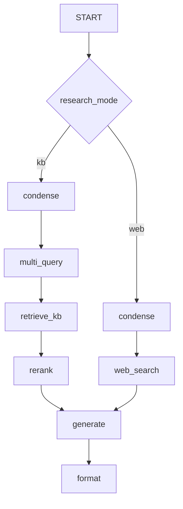

# Web research tool (opt-in)

**Status:** Shipped (API + Vue toggle + disclaimer UI) (API + Vue toggle + disclaimer UI); Tavily live optional (`tavily-python`). See [PRODUCT_ROADMAP.md](./PRODUCT_ROADMAP.md).

User chooses **KB** (default) or **web** per message. Not silent open-web mode.

---

## Flow



---

## API

```json
{ "content": "...", "research_mode": "kb" }
```

Metadata: `source_kind` (`kb`|`web`), optional `disclaimer` for web.

---

## Config

```bash
WEB_RESEARCH_ENABLED=false
WEB_SEARCH_PROVIDER=mock
TAVILY_API_KEY=
WEB_SEARCH_MAX_RESULTS=5
```

---

## Modules

- `backend/app/services/tools/web_search.py`
- Graph node `web_search` in `graph/nodes.py`

---

## Security

Opt-in only; disclaimer; rate limits; no arbitrary URL fetch in v1.

---

## Related

- [PRODUCT_ROADMAP.md](./PRODUCT_ROADMAP.md)
- [LANGGRAPH.md](./LANGGRAPH.md)
