# Campus / production scale roadmap (archived)

> **Archived.** Product roadmap: [PRODUCT_ROADMAP.md](../PRODUCT_ROADMAP.md). **Phase 5 (retrieval stack)** (multi-query, rerank on LangGraph) is already shipped on `main` — see [DESIGN.md — LangGraph KB path](../../DESIGN.md#langgraph-kb-path-multi-query--retrieve--rerank) and [eval_baseline_v2.md](../../eval_baseline_v2.md). This file is the **org / campus** scale track (Redis HA, EB, tenant budgets) with its **own** phase numbers.

**Last updated:** 2026-05-19 (archive; see product roadmap for current status)

This document captures the recommended phased roadmap for evolving the RAG-based chatbot: AWS + Azure parity, portable architecture, measurable RAG quality, scalability, reliability, observability, and cost governance.

Phase 0 lists foundations **in flight or planned** for the campus track (not all are merged or wired in `main` yet): SSE streaming for chat (implemented on LangChain path), Redis-backed sliding-window rate limiting (fakeredis locally), optional FlashRank reranking on the LangGraph rerank node (Phase 5 (retrieval) — shipped; campus track Phase 2 may add ingestion/semantic cache), provider abstraction for AWS Bedrock and Azure OpenAI / search, RAGAS harness + golden dataset, Alembic initial migration, Vue 3 SPA with Vitest, Prometheus hooks, and basic reliability hardening (health proxy, password rules, safer error responses). Adjust timelines to team capacity and release cadence.

```mermaid
flowchart LR
  subgraph done [Phase0_Done]
    stream[Streaming]
    rl[RedisRateLimit]
    rr[RerankOptIn]
    eval[RAGASHarness]
    mig[Alembic]
    ui[VueSPA]
  end
  subgraph p1 [Phase1_CacheObsCostQuick]
    cache[ExactSemanticCache]
    obs[TracingLogsSLOs]
  end
  subgraph p2 [Phase2_RAGQuality]
    mq[MultiQueryHyDE]
    chunk[ChunkingMetadata]
  end
  subgraph p3 [Phase3_ScaleReliability]
    redisProd[ManagedRedisHA]
    pool[DBProviderPooling]
  end
  subgraph p4 [Phase4_CostGovernance]
    budget[TokenBudgetsRouting]
  end
  done --> p1 --> p2 --> p3 --> p4
```

---

## Phase 0 — Baseline (maintain, do not regress)

**Performance Phase 0 (shipped):** history cap, DB pool envs, SSE first-token metric, optional stream delay, multi-worker `run_services.sh` — see [OPERATIONS.md — Shipped performance guardrails](../../OPERATIONS.md#shipped-performance-guardrails-campus-phase-0).

**Goal:** Keep what shipped stable while layering on Phase 1.

- Treat **streaming + non-streaming fallback** as a contract: keep MSW / E2E aligned with `/api/chat/stream` behaviour.
- **Document operational knobs** in `.env.example`: `REDIS_URL`, `RERANK_*`, `STREAMING_ENABLED`, provider switches, RAGAS gates — operators should not need to read code.
- **Alembic in CI / deploy:** ensure migrations run before app start in Elastic Beanstalk (or document manual step until automated).

---

## Phase 1 — Quick wins: caching, observability depth, realistic load

**Goal:** Reduce latency and cloud spend on repeated patterns; make production behaviour measurable.

### 1a. Response caching (exact + semantic sketch)

- **Exact-match cache** (cheap): hash `(tenant_id, normalized_question)` to full assistant payload in Redis with TTL + explicit invalidation on KB / doc updates (or short TTL if updates are frequent).
- **Semantic cache** (later slice of Phase 1): embeddings of queries with similarity threshold; start read-only (hits improve latency), then add write path guarded by quality checks.
- **Cache bypass flags:** admin / debug header or internal route to skip cache for support.

### 1b. Observability that drives decisions

- **Unified request correlation:** `X-Request-ID` through FastAPI, structured logs, optional LangSmith run naming by session / message id.
- **Metrics:** dashboards for provider errors, latency histograms, rate-limit `429` counts — define **SLOs** (for example p95 chat latency, error budget).
- **Synthetic probes:** periodic `/api/health` plus authenticated smoke chat against mock provider in staging.

### 1c. Load testing that matches reality

- Extend beyond login / chat ramps: **mixed workloads** (session list, new session, chat with streaming, feedback). Record **p95 / p99** and **error rates by endpoint**.
- **Seed data:** users and sessions at scale; avoid single-user caches distorting results.

---

## Phase 2 — RAG production quality pipeline

**Goal:** Move from intermittent good retrieval to **measurable, improvable** retrieval quality across AWS and Azure.

### 2a. Retrieval upgrades

- **Multi-query / query expansion:** generate N reformulations; fuse results (RRF or dedupe by doc id).
- **HyDE or lightweight synthetic passage** (optional): only if eval shows recall gains; adds latency — gate behind a feature flag.
- **Metadata filtering:** enforce tenant / course / product filters in Knowledge Base / Azure Search queries to cut noise.

### 2b. Chunking and ingestion (often highest ROI)

- Audit chunk size, overlap, and **metadata sidecars** (title, section, URL, ACL).
- Version ingestion pipelines (hash config + corpora version in traces).

### 2c. Evaluation discipline

- Grow `backend/tests/eval/` golden set from placeholder domain to **real corpora samples**.
- **CI strategy:** nightly or weekly RAGAS on staging with secrets; optional PR gate only on `eval/` or release branches (cost control).
- Track scores over time (CSV or LangSmith dataset snapshots).

### 2d. Reranking strategy

- Keep **FlashRank** for dev and zero-cost experiments.
- Add **optional managed rerank** (for example Cohere / SageMaker cross-encoder) behind the same interface for Azure / AWS parity tests.

---

## Phase 3 — Scale and reliability (multi-instance truth)

**Goal:** Behaviour matches under load and across many workers / regions.

- **Redis in production:** dedicated cluster / ElastiCache; TLS; auth; key prefix per environment.
- **Connection limits:** HTTP pools to Bedrock / Azure; SQLAlchemy pool sizing documented per instance size.
- **Idempotency:** chat POST optionally keyed by client message id to survive retries (mobile / flaky networks).
- **Graceful degradation:** explicit fallback path when Redis is unavailable (fail-open patterns already used for rate limiting — extend and document).
- **Horizontal scaling:** ensure cookie / session + CSRF behaviour behind ALB; document sticky sessions versus stateless JWT trade-offs if patterns change.

---

## Phase 4 — Cost governance and model routing

**Goal:** Predictable bills and safe scaling.

- **Per-tenant / per-user budgets:** soft caps (warnings) then hard caps (`429` or truncated responses).
- **Model routing:** cheaper model for condense / classification; premium only for final answer; cache condense outputs where safe.
- **Prompt caching** where providers support it (document provider-specific savings).
- **Alerting:** anomaly detection on token usage and retrieval volume.

---

## Phase 5 — Advanced RAG (when quality and scale are stable)

**Goal:** Invest here only after Phase 1–3 metrics are healthy week over week.

- **Agentic retrieval** (tool loops with caps): query rewriter, retrieve, verify, optional second retrieve.
- **Domain-specific:** table-aware RAG, code / doc split pipelines, or graph-augmented retrieval **only if** evaluation proves standard hybrid RAG underperforms.

---

## Cross-cutting themes (every phase)

| Theme | Actions |
|-------|---------|
| **Security** | Rate limits, input length limits, SSRF-safe patterns if adding URL fetch tools, secret rotation runbooks, dependency updates |
| **Multi-cloud parity** | Same abstractions for LLM, retriever, and rerank; parity integration tests with mocks plus periodic live smoke |
| **Documentation** | Keep `docs/` architecture, operations, and load testing in sync with tox / env names |
| **Portability** | Keep provider boundaries thin; avoid AWS-only imports in core RAG paths |

---

## Suggested prioritisation

**Do next (Phase 1):** exact-response Redis cache, dashboards / SLOs, realistic k6 scenarios.

**Then (Phase 2):** metadata filters, multi-query retrieval, grow golden eval set.

**Then (Phase 3–4):** production Redis HA, pool tuning, idempotency, budgets / routing.

**Defer (Phase 5):** agentic / graph RAG until retrieval precision / recall baselines are stable week over week.

---

## Related docs

- [PRODUCT_ROADMAP.md](../PRODUCT_ROADMAP.md) — product roadmap
- [ARCHITECTURE.md](../../ARCHITECTURE.md)
- [OPERATIONS.md](../../OPERATIONS.md)
- [LOAD_TESTING.md](../../LOAD_TESTING.md)
- [OPERATIONS.md — Playwright E2E](../../OPERATIONS.md#playwright-e2e-frontend-vue)
